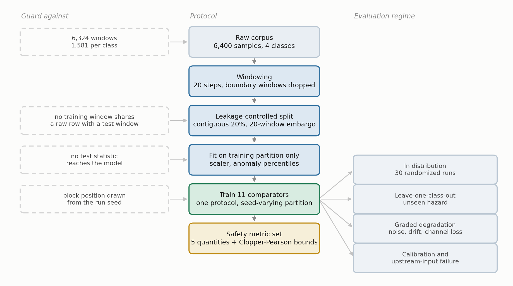
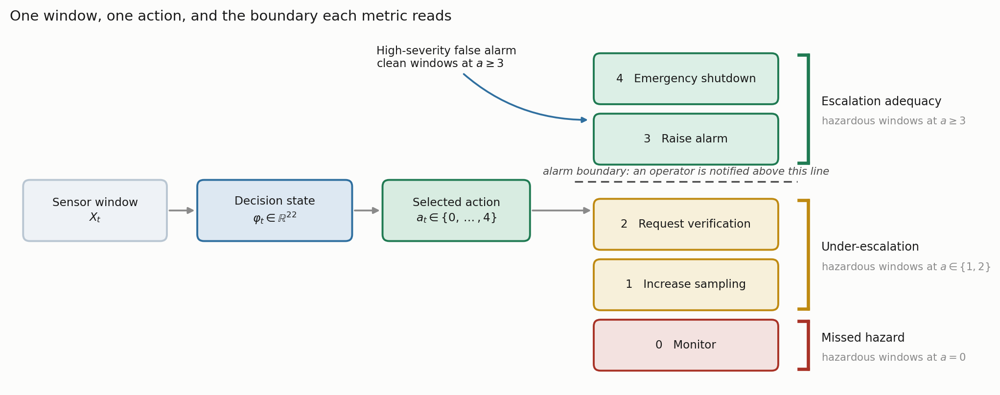
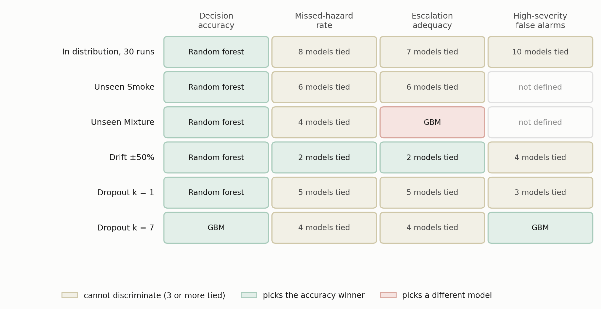

# A Safety-Oriented Evaluation Protocol for Learned Gas-Monitoring Models: Leakage-Controlled Class Exclusion and Synthetic Sensor Perturbation on a Laboratory MOX Benchmark

**Benjamin C. Nweke**^1,2,\*, **Gholamreza Ramezan**^2, **Soheil Saraji**^1

^1 Subsurface Energy and Digital Innovation Center, University of Wyoming
^2 Fides Innova Labs

\* Corresponding author; email: bnweke@uwyo.edu

*Prepared for submission to SPE Journal, Data Science and Engineering Analytics.*

**Keywords:** MOX gas sensors; safety-oriented evaluation; temporal data leakage; class-disjoint evaluation; synthetic sensor perturbation

---

## Summary

Fixed gas detectors at wellpads, tank batteries and compressor stations can generate sustained streams of abnormal indications that contribute to operator alarm burden (EEMUA 2024; ISA 2016), and the machine-learning literature that interprets those indications is ranked almost entirely by classification accuracy. Accuracy is silent on two quantities any installation decision has to weigh: how often a hazard draws no response at all, and how often clean air draws a high-severity one.

This paper develops a safety-relevant evaluation methodology for learned gas-monitoring decision models, motivated by petroleum-facility monitoring and demonstrated on a public laboratory metal-oxide benchmark used as a controlled methodological testbed. The contribution is a pre-deployment evaluation framework that separates recognition correctness, passive hazard miss, operator-notification adequacy and alarm burden, and measures all four under leakage-controlled partitioning, class exclusion and graded perturbation. The evaluated object is the sensor-policy core of a five-component pipeline, not the complete system.

Three findings are methodological implications supported by this corpus. First, the partitioning protocol moves reported accuracy by more than the choice of model does: a random split over overlapping sliding windows adds 3.23 to 5.57 accuracy points to every model that reads temporal features, which exceeds the 2.42-point spread separating those models from one another. Second, in-distribution safety metrics are weakly discriminative: ten comparators sit inside 4.43 accuracy points and almost none records an observed missed hazard. Withholding one hazardous class then separates those same models by a factor of about 86 in the worst-partition bound on missed hazards, and the model ranked third of ten on accuracy turns out to be the worst of those evaluated on the held-out class. Third, a low miss rate is not sufficient on its own. Eight of eleven comparators keep worst-partition miss bounds at or below 3.3% on a held-out hazardous class, yet their escalation adequacy spans a factor of about 200. A review conducted on miss rate alone would favor a model that notifies an operator about one hazardous window in two hundred.

Three scope limits hold throughout and are not incidental. The analytes are incense smoke, alcohol-based vapor and a mixture of the two, not hydrocarbons. The action ladder against which every metric is defined is a constructed evaluation target, not a facility alarm philosophy or a safety-instrumented specification. And the stress regimes are class exclusion within one acquisition session and synthetic perturbation of standardized features, not demonstrated domain shift or physical sensor failure. A fourth limit is quantitative: because consecutive windows overlap by 19 of 20 raw readings, an observed zero missed-hazard rate on this corpus is compatible with true rates as high as about one in eleven. That figure is an upper bound on what these data can exclude, not an estimate of the rate.

The engineering implication is that missed-hazard rate with an honest interval, escalation adequacy, alarm burden in eventized units, and the degradation of all three under sensor loss should be reported together rather than singly, because each of them alone clears a different model.

---

## Introduction

Many process-safety incidents involve warning indications that do not result in timely intervention. The evidence is often present, spread across several indications, and not converted into action in time. In the eleven minutes before the Milford Haven refinery explosion the control-room operator received 275 alarms (Goel et al. 2017). Sensing was not the failure. Turning what was sensed into a decision was.

The same shape of problem appears at upstream and midstream facilities. Wellpads, tank batteries, compressor stations and gas plants carry fixed point-gas detectors, often low-cost metal-oxide-semiconductor (MOX) elements. These feed alarm systems that in many installations already run at or above the long-term average rates industry guidance treats as manageable for a single operator (EEMUA 2024; ISA 2016). Added to that is the growing obligation to find and act on fugitive hydrocarbon release, where the response is at once a safety action and an emissions action. In both settings the operational question is what to do in the next minute, and with what confidence.

Machine learning has been applied far more heavily to the first question than to the second. Gas-detection models are ranked by classification accuracy, and published results are high, closely spaced, and not directly comparable: studies differ in dataset, modality, task definition and partitioning protocol, so a single quoted range across them misleads more than it informs. Table 1 sets them out with those columns attached. Reported accuracy on this benchmark lineage is uniformly high and sensitive to evaluation design in ways the headline numbers do not expose. Small differences between leading methods therefore carry little information about deployment.

**A Symmetric Metric on an Asymmetric Problem.** Monitoring errors are not interchangeable, and no single scalar orders them sensibly. A hazard that draws no response gives up the whole intervention window. A hazard that draws a sub-alarm response keeps part of that window but notifies nobody, and a miss metric scores it as a success. A clean condition that draws a high-severity response spends operator attention and, at sufficient rate, degrades the alarm system later hazards depend on (Laberge et al. 2014). A hazard that draws a high-severity response of the wrong kind at least reaches an operator, though the wrong response can itself upset the process or conflict with another protection layer, so it is not a neutral outcome. A model ranked first on accuracy can be ranked last on any of these, and the accuracy table gives no hint of which.

**What Is Settled and What Is Not.** Little of the component technology is new. Reconstruction-based sequence models for multivariate sensor anomaly detection are well established (Malhotra et al. 2016; Liang et al. 2023), as are vision models small enough to run on embedded hardware (Korjani et al. 2024; Jocher et al. 2023) and gas-detection networks optimized for the same constraint (Dehnaw et al. 2024). Unequal error costs have a formal account going back decades (Elkan 2001). Thermal and MOX fusion has been demonstrated on this very corpus (Narkhede et al. 2021, 2022), and compact language models now run locally on site hardware (Gemma Team 2025). Safety-critical and alarm-management work increasingly looks past accuracy as well. What appears less developed, at least in learned gas monitoring, is the downstream disposition of a hazardous observation: whether it draws silence, a sub-alarm response, or something an operator actually receives. And whether that disposition holds when the hazard is one the model was not trained on and the sensing is degraded. Five questions follow.

**RQ0.** Does the choice of partitioning protocol change what a comparison reports?

**RQ1.** Does accuracy-ranked model selection survive a missed-hazard criterion?

**RQ2.** Do models that agree in distribution still agree when the hazard is one they were never trained on? A detector in service will eventually meet a hazardous condition outside its training classes.

**RQ3.** Is missed-hazard rate itself sufficient, or can it be satisfied by under-response that a miss count never registers?

**RQ4.** Do any of these behaviors survive synthetic sensor-fault perturbations of the decision state, or do they hold only on clean inputs? Physical sensor failures are not tested here, and the question is deliberately posed at the level the experiment can answer.

The contributions of this study are as follows.

- **An evaluation protocol for safety-relevant comparison.** A leakage-controlled block-wise holdout with a two-sided embargo and a seed-varying block position; a graded action target that keeps missed hazard, under-escalation and high-severity false alarm apart; class-disjoint evaluation against a held-out hazardous class; a graded perturbation suite over noise, drift and channel loss; and, on every zero count, both an independence-reference binomial bound and a disjoint-support correction that widens it by about twenty times. We did not find a prior study combining these elements on a MOX gas-detection benchmark.
- **Quantification of the leakage the protocol exists to prevent.** The argument that a random split over overlapping sliding windows inflates accuracy is standard but unmeasured on this corpus. Among models that read temporal features, the protocol effect exceeds the spread between the models themselves.
- **Evidence that accuracy ranking carries little information about safety behavior.** Ten models spanning very different inductive biases span 4.43 accuracy points in distribution, are nearly indistinguishable there on every safety metric reported, and then separate by a factor of about 86 in the worst-partition independence-reference bound on missed hazards, 0.19% against 16.35%, once the hazardous class is held out of training.
- **Evidence that missed-hazard rate is necessary and not sufficient.** On a held-out hazardous class, the eight comparators whose worst-partition miss bounds sit at or below 3.3% span the full range of escalation adequacy, and that group holds both the best escalator and among the worst.
- **Two negative results.** Scalar class-level cost ratios from 1:1 to 20:1 produced no measurable change in missed-hazard rate or escalation adequacy, and degraded accuracy past 6:1. Separately, a deterministic label-function reference reaches the accuracy ceiling by construction. Nothing about it is deployable, since it consumes the label it is meant to infer. What its existence means is that no advantage over it can be demonstrated under nominal conditions, so whatever value a learned policy has on this corpus shows up only once the inputs are imperfect.
- **Interpretable and conventional process-monitoring comparators.** A depth-3 decision tree on seven raw sensor channels and a CUSUM sequential detector run under the identical protocol.

This study does not aim to advance classification accuracy on this benchmark. It asks what a model does when the accuracy column cannot distinguish candidates, which on this corpus is most of the time.

---

## Prior Research Review

**Detection, and the Gap Between an Indication and a Decision.** Gas-hazard detection rests on a well-developed base of hardware and software methods (Murvay and Silea 2012; Adegboye et al. 2019), from distributed acoustic and fiber-optic sensing to real-time transient modeling, mass balance and model-based diagnostics (Zhang et al. 2013; Bustnes et al. 2011), including deep-learning electronic-nose approaches to pollutant classification (Faleh and Kachouri 2023). Their weak spot is usually uneven performance under real operating conditions rather than any absence of capability (Han and Kim 2014).

For the present argument a different limitation matters more. All of them stop at a leak indication, a location estimate or a concentration estimate. Those outputs are necessary for loss prevention, but they are not response decisions, and the literature evaluating them does not ask whether the downstream response would have been adequate. Detection quality is being reported as though it settled the response question, which it does not reach.

**Anomaly Scores as Evidence Rather Than Verdicts.** Since Malhotra et al. (2016), reconstruction-based sequence models trained only on normal operation have been a widely used unsupervised route to multivariate sensor anomaly detection, with field validation in pipeline monitoring (Liang et al. 2023), and they need no labeled examples of every hazardous condition. An anomaly score is nevertheless an intermediate quantity: it says behavior has departed from baseline, not what to do, and nothing in the training procedure calibrates it to hazard severity. Any use of such a score inside a safety path carries an obligation to show that it ranks hazard monotonically, and the literature rarely discharges it. We test it directly below.

**A Saturated Benchmark.** MultimodalGasData pairs thermal frames with a seven-channel MOX array, and the original work showed that fusing the two beats either alone: 96% for the fused model against 82% for the MOX channels alone and 93% for thermal images alone (Narkhede et al. 2021, 2022). It has since become a reference corpus, and later results are high but not mutually comparable. Sharma et al. (2024) report 99.7% validation accuracy for a multimodal federated model on the same four-class corpus. El Barkani et al. (2024) report 91.7% test accuracy, but on the thermal images alone and on embedded hardware. Zhang and Zhang (2025) report 98.9% accuracy, and that figure belongs to a simulated pipeline test set of their own collection rather than to this corpus, which they use only for initial training of a binary leak classifier. On real field data from a methane emissions test facility the same system reports 95.4%. Quoting those four numbers as a single range would compare a four-class multimodal task, a single-modality embedded task and a binary leak task across three different test sets.

Two features of that literature bear on what follows. First, those figures appear to be computed on random splits over overlapping sliding windows drawn from a single recording session. Dennler et al. (2022) demonstrated analogous drift-related evaluation problems in a widely used MOX benchmark, where recording time is confounded with class identity, and flagged a sizeable body of published work for re-evaluation. Vergara et al. (2012) had already documented how far MOX response drifts over long horizons. Second, and more to the point, the cited studies emphasize classification or detection performance rather than the action-level safety quantities evaluated here: missed-hazard rate, escalation adequacy, false-alarm burden and behavior under sensor loss. On this corpus, and under the protocols those studies appear to use, reported accuracy no longer discriminates between methods in a way that carries deployment information. Whether the underlying task is saturated is a different and larger claim, and not one this study tests.

**Unknown Gases Are Not a New Problem.** A recognition system that meets a gas outside its training set is the subject of an established open-set literature, and the class-disjoint experiment below is not the first work to pose that question. Qu et al. (2022) formalized open-set gas recognition on an electronic-nose corpus and showed that closed-set classifiers assign unknown analytes to known classes with high confidence. Ma et al. (2024) pursued the same problem with a multi-scale temporal convolutional network. A parallel line treats the unknown class jointly with drift, adapting across domains so that an aged array still rejects what it has not seen (Yao et al. 2024; Vergara et al. 2012 supplies the drift evidence those methods answer to). That combination is established rather than open, which is one reason no part of the recognition problem is claimed as new here. That literature has settled a good deal about *recognizing* that a reading is unfamiliar.

What that work is scored on is recognition: rejection accuracy, unknown-class detection, retained closed-set accuracy. Among the gas-recognition studies reviewed here we did not find one that maps an unfamiliar hazardous class onto a graded operator-response ladder and then separates passive silence from sub-alarm routing from alarm-grade notification. That is the gap the experiment below occupies, and it is a narrow one. The experiment is not an open-set method and does not try to be: it withholds a class, lets ordinary closed-set models do whatever they do, and records the action. A proper open-set detector would probably reject those windows. Which action a rejection ought to map to is a question the recognition literature leaves open, and one a facility would have to answer for itself.

**Alarm Analytics Is Also an Established Field.** Industrial alarm systems have their own analytics literature, which long predates this work: Wang, J. et al. (2016) survey the causes of alarm overloading and the methods proposed against it, and EEMUA (2024) and ISA (2016) codify the performance envelopes those methods target. Alarm rationalization, deadband and delay design, flood analysis and root-cause diagnosis are mature topics there.

That work starts from an alarm system that already exists and asks how to improve its configuration. The question here runs the other way: given a learned model a facility is considering installing, what should be measured *before* it becomes a source of alarms. The contribution is not that alarms matter, nor that unknown gases exist, but the joint action-level screen applied under class exclusion and graded degradation to a model not yet in service.

**Cost-Sensitive Learning.** That error costs are unequal, and that classifiers ought to be trained accordingly, has had a clean formal treatment since Elkan (2001), and cost-sensitive reweighting is now routine practice. What gets reported far less often is whether a given asymmetry actually moved the specific error it was introduced to suppress. We run that test and return a negative answer, one we suspect generalizes to any saturated, well-separated benchmark. The follow-up question, whether an objective that prices direction along a graded response ladder does better than a scalar weight, is one the evidence here points toward, and we test that too.

**Coordination Layers and Operator-Facing Explanation.** Systems coordinating several specialized models have been applied in the energy sector to well-construction assistance, completions optimization and enterprise modeling (Sabbagh et al. 2024; Santiago et al. 2025; Jessen and Roshchin 2025), in analytical and advisory settings rather than real-time monitoring. Explanation matters for operator-facing systems because trust, review and post-incident accountability depend on it, and it brings a hazard of its own: a fluent explanation that does not match the decision it claims to explain is worse in a control room than offering nothing. The response here is architectural rather than empirical.

**Where This Study Sits.** **Table 1** lists representative prior work with the evaluation gap each leaves open, and states our own limitation in the same column so the comparison is symmetric.

| Study | Dataset | Modality and task | Validation protocol | Reported result | Evaluation gap |
|---|---|---|---|---|---|
| Narkhede et al. (2021, 2022) | MultimodalGasData | MOX + thermal, 4-class | reported test split over a single session | 96% fused, 82% MOX only, 93% thermal only | Classification accuracy only; random split over overlapping windows |
| Sharma et al. (2024) | MultimodalGasData | MOX + thermal, 4-class, federated | reported validation split | 99.7% validation | No missed-hazard, escalation, false-alarm or degradation reporting |
| El Barkani et al. (2024) | MultimodalGasData, thermal subset | thermal only, 4-class, embedded | reported test split | 91.7% | Single modality; no action-level or degraded-sensing metric |
| Zhang and Zhang (2025) | own simulated set; this corpus for pretraining | MOX + thermal, binary leak | simulated test set; separate field set | 98.9% simulated, 95.4% field | Different task and test set; not comparable to four-class results here |
| Dennler et al. (2022) | a different MOX benchmark | drift analysis | re-partitioned | not applicable | Demonstrates the leakage mechanism; supplies no safety metric |
| Liang et al. (2023) | pipeline flow data | normal-only anomaly detection | field validated | not applicable | Stops at detection; downstream response unevaluated |
| Korjani et al. (2024) | optical gas imaging | vision detection | field imagery | not applicable | Degraded-sensing behavior not treated as a safety metric |
| Elkan (2001) | not applicable | cost-sensitive learning theory | not applicable | not applicable | Effectiveness on a saturated benchmark untested |
| **This study** | **MultimodalGasData** | **decision from MOX and anomaly state; thermal in the perception branch only** | **block-wise holdout, 20-window embargo, seed-varying block** | **see Tables 8 and 10** | **Laboratory surrogate analytes; single session and device; perception path not held to the same partitioning standard** |

**Table 1—Representative prior work with dataset, task and validation protocol.** The columns are present because the reported results are not comparable without them.

The contribution lives in that right-hand column: a pre-deployment evaluation protocol for learned gas-monitoring components that separates recognition correctness, passive hazard miss, operator-notification adequacy and alarm burden, and measures all four under controlled class exclusion and perturbation. No new architecture is proposed. What we offer is a benchmarked evaluation template, one that might suggest how a facility could structure a pre-deployment review once it has substituted its own hazard definitions, alarm philosophy, response thresholds and fault models for the ones used here.

---

## Proposed Method

The method has two halves. The monitoring pipeline combines established components; the methodological contribution lies in the evaluation protocol and metric set the pipeline exists to be measured by. **Fig. 1** gives the whole workflow: what is guarded against at each stage, what the protocol does, and which evaluation regimes the trained models are then put through.

**Fig. 1—Workflow of the evaluation protocol, from raw corpus to the reported metric set.** Left column, the failure each stage prevents; right column, the four evaluation regimes.

**Corpus and Preprocessing.** The public MultimodalGasData corpus (Narkhede et al. 2022; Mendeley Data, CC BY 4.0) pairs a seven-channel MQ-series MOX array with synchronized 206 by 156 thermal frames from a Seek Compact camera, logged at 2 s intervals. MOX elements respond broadly and cross-sensitively, so a reading on MQ-2 is evidence of a reducing-gas response rather than of methane specifically. The array is informative because the seven responses differ in relative magnitude, not because any one channel is selective. There are 6,400 labeled samples in four classes of 1,600: clean air (NoGas), incense smoke (Smoke), alcohol-based deodorant vapor (Perfume), and a smoke and vapor mixture (Mixture). Smoke and Mixture are treated throughout as hazardous surrogate conditions rather than as hazardous petroleum-gas releases, and a window of either is a hazardous window in the metric definitions, not a facility hazard. **Table 2** lists the array.

| Sensor | Commonly associated target gases (nominal sensitivity) |
|---|---|
| MQ-2 | LPG, butane, methane, smoke |
| MQ-3 | Alcohol, ethanol, organic vapors |
| MQ-5 | LPG, natural gas |
| MQ-6 | LPG, butane, iso-butane |
| MQ-7 | Carbon monoxide |
| MQ-8 | Hydrogen |
| MQ-135 | Air-quality indicators including NH₃, benzene, NOₓ and CO₂ |

**Table 2—Composition of the MOX array,** with the gases each element is nominally marketed as sensitive to.

Two properties of the corpus shaped what follows. The analytes are surrogates. Incense smoke and alcohol-based vapor exercise the MOX transduction mechanism, the cross-sensitivity structure of the array and its baseline drift, all of which a facility detector meets in service, but they do not establish detection performance for methane or anything heavier. And the four classes were recorded as four contiguous blocks inside a single session of roughly 90 minutes, so within-session baseline drift is confounded with class identity. This is the structure Dennler et al. (2022) showed inflates reported accuracy on a MOX benchmark under a randomized split, which motivates leakage-controlled evaluation here rather than establishing the same magnitude on this corpus.

**Leakage-Controlled Partitioning.** Seven-channel readings were formed into sliding windows of length 20, each labeled by its final reading, with windows spanning a class boundary discarded so that no window mixes two classes. That leaves 6,324 windows, 1,581 per class.

Consecutive windows share 19 of 20 raw rows, so a random split drops near-duplicates into both partitions, and a plain sequential split is no better because the corpus is block-ordered by class. The protocol is a block-wise holdout: inside each class block a contiguous 20% forms the test partition, separated from the training segments by an embargo of *G* = 20 windows on each side, so no training window shares a raw row with any test window (**Fig. 2**). The embargo removes overlap across the partition boundary but not the temporal dependence among windows within each partition, which the uncertainty treatment below accounts for rather than assumes away. The held-out block's position moves with the run seed, so the reported dispersion includes partition variance and not only model-initialization variance (Bouthillier et al. 2021). The result is 4,900 training and 1,264 test windows, 316 per class. Feature scaling and anomaly normalization are fitted on the training partition only, then applied without refitting.

**Fig. 2—Corpus layout and the leakage-controlled split.** Each class occupies a contiguous block of 1,581 windows. A contiguous 20% is held out, with a 20-window embargo on each side, and the position of that block is drawn from the run seed.

**Monitoring Pipeline.** The ARXIS system has five parts. At each cycle it takes a thermal image *I*ₜ and a sensor window **X**ₜ ∈ ℝ^(20×7) and returns a safety action *a*ₜ ∈ {0, …, 4} with an explanation *E*ₜ. A perception component classifies the thermal image. It is an architectural component of the runtime system and is deliberately outside the evaluated sensor-policy core, for the reason given below; the word multimodal describes the system, not the object these experiments characterize. An anomaly component scores the sensor window by reconstruction error against a normal-only model. A coordination component assembles the decision state. A decision component maps that state to an action. A reasoning component writes the operator-facing explanation. **Fig. 3** shows how the five connect, and in particular which paths the thermal evidence does and does not reach.

The pipeline is advisory. It actuates nothing: *Recommend ESD assessment* refers a condition for assessment under the facility procedure and does not command a trip. IEC 61511 (IEC 2016) sets out the lifecycle and independence expectations for safety instrumented systems in the process sector, and this component sits in the operator-support layer under that framework rather than inside a safety instrumented function. The standard does not mandate the arrangement. The narrower point is that one learned component selecting across both the alarm and the shutdown layer would collapse two protection layers into a single common-cause element.

**Fig. 3—The monitoring pipeline.** Thermal evidence reaches the perception and explanation paths but never the decision state, and the language model sits downstream of an action it cannot alter.

**What Is Evaluated, and What Is Not.** Every number in this paper is produced by one object, which we name the **ARXIS sensor-policy core**: the anomaly component, the coordination component and the decision component, taking the 22-dimensional sensor state of Eq. 1 and emitting an action. That is the object Tables 8 through 12 characterize.

The running ARXIS implementation is larger. It wraps the learned policy in deterministic guardrails, among them an anomaly-threshold override and a promotion rule that raises the final action when the thermal classifier reports a hazardous class, which is why the thermal path appears in Fig. 3 at all. They are also, by construction, not what is measured here: a guardrail that raises actions would lift escalation adequacy and missed-hazard rate toward their best attainable values on every comparator at once, which is the saturation this evaluation exists to break out of. Measuring the bare policy is what makes the models separable.

That boundary holds throughout. No result below describes end-to-end behavior of the deployed system, and evaluating the full runtime logic with its guardrails against this same metric set is an experiment the paper does not contain.

**Component Models.** *Perception.* Thermal images are classified with YOLOv8n-cls (Jocher et al. 2023) under a randomized 80/20 stratified split over the 6,400 frames, with training detail in Supplementary Section S1. The sensor-side partitioning discipline was not carried across to the images, so that split is exposed to the leakage mechanism the block-wise holdout exists to avoid, and the perception figure is an optimistic upper bound rather than an independent estimate. No claim in this paper rests on it, because the decision state carries no visual term and every safety result is computed from actions the sensor path selected. The multimodal system as a whole, however, has not been validated to the standard applied to the sensor path.

*Anomaly Detection.* An LSTM autoencoder with a single-layer encoder and decoder, hidden dimension 32 and a linear output, trained on NoGas windows only, following Malhotra et al. (2016). The mean reconstruction error over the full 20-step window is the anomaly score. The threshold τ is the 95th percentile of reconstruction error on NoGas training windows only, and evaluation is on held-out windows, a distinction Experiment 1's component results quantify.

*Coordination.* The 22-dimensional decision state is

&nbsp;&nbsp;&nbsp;&nbsp;φₜ = [ ρ̃ₜ , **X**ₜ[−1,:] , **δ**ₜ , **σ**ₜ ] ∈ ℝ²²  ............ (1)

with ρ̃ₜ the normalized anomaly score, **X**ₜ[−1,:] the current seven-channel reading, **δ**ₜ the per-sensor change across the window, and **σ**ₜ the per-sensor standard deviation. There is no visual term in the state.

*Decision.* A feedforward network with a dueling value and advantage head (Wang et al. 2016), mapping φₜ to five action scores, trained by cost-weighted cross-entropy. Not by reinforcement learning, despite the architecture's provenance. Training targets come from the deterministic single-valued map *y*(·) of Eq. 2a; evaluation scores against the acceptable set *A*(·) of Eq. 2b.

> **The action labels in Eq. 2a and Eq. 2b are constructed evaluation targets. They are not facility alarm requirements, not a safety instrumented function specification, and not derived from any concentration, release rate, lower-explosive-limit fraction, toxic-exposure limit or consequence model. No such quantity exists in this corpus. Every metric defined on this ladder measures agreement with the constructed target, not consequence avoided.**

With that stated,

Two objects are needed here and they are not the same object, so they are given separate names. The **training target** *y*(*g*) is single-valued, one action per class, and it is what the loss is computed against. The **acceptable set** *A*(*g*) is what evaluation scores against, and for one class it holds two actions:

&nbsp;&nbsp;&nbsp;&nbsp;*y*(NoGas) = 0, *y*(Smoke) = 3, *y*(Mixture) = 4, *y*(Perfume) = 1;  ............ (2a)

&nbsp;&nbsp;&nbsp;&nbsp;*A*(NoGas) = {0}, *A*(Smoke) = {3}, *A*(Mixture) = {4}, *A*(Perfume) = {1, 2}.  ............ (2b)

Perfume is the only class where the two differ. It is a nuisance odorant, and either raising the sampling rate or requesting verification seems defensible, so both count as acceptable; training still has to pick one and picks the lower. One side effect: action 2 is never a positive training target for any class, so nothing here is trained to emit it. It is an admissible evaluation response and a rung a model can land on by accident, not one any of them learned to reach.

Each sample carries a loss weight *w*(*g*ₜ) equal to *c*~miss~ for hazardous classes and *c*~false~ otherwise, with *C* = *c*~miss~ / *c*~false~. The objective is

&nbsp;&nbsp;&nbsp;&nbsp;*L*(θ) = − (1/*N*) Σₜ *w*(*g*ₜ) · log *p*~θ~( *y*(*g*ₜ) | φₜ )  ............ (3)

where *p*~θ~ is the softmax over the five action scores and *p*~θ~(*y* | φ) is the probability it assigns to the single target action. We retain *C* = 8:1 as the reference configuration from the original experiment design, and sweep the rest below. It is called a reference rather than a deployed setting because, as Experiment 4 shows, it was not selected by a defensible validation procedure.

Two consequences bound what can be claimed. Because *y*(·) is a deterministic function of the class label, decision accuracy is four-class classification accuracy composed with a fixed map; what changes between the decision and classification framings is the error metric rather than the task. And a rule applying *y*(·) to the true label hits 100% by construction. It consumes the label it is meant to infer, so it appears below as a label-function reference and never as a baseline.

*Reasoning.* Explanations are generated locally with Gemma 3 1B (Gemma Team 2025) and sit off the safety-critical path. The action is fixed by the decision component and the generated text cannot change it. A fluent explanation inconsistent with the decision it claims to explain is a hazard in a control room rather than an aid. The component is evaluated nowhere in this paper and no result depends on it. Prompt and serving detail are in Supplementary Section S2.

**Comparators.** Eleven comparators run under one protocol:

- the cost-weighted policy of Eq. 3, and an unweighted network of identical topology;
- a multilayer perceptron (256-256-128);
- cost-sensitive gradient boosting (300 trees) and a random forest (300 trees);
- an RBF support-vector classifier and k-nearest neighbors with *k* = 5;
- a recurrent network over *K* = 10 consecutive states;
- conservative Q-learning with a TD(0) bootstrap and a conservative penalty on non-behavior actions;
- a shallow decision tree of depth 3 restricted to the seven raw current-sensor channels, interpretable and auditable in a way the learned networks are not;
- CUSUM (Page 1954), a one-sided cumulative-sum detector on the anomaly score, with μ₀ and σ estimated from NoGas training windows and the threshold set on the training partition.

Two of those are not plain supervised classifiers. Conservative Q-learning is offline and single-step, with the deterministic target map *y*(·) of Eq. 2a as the behavior policy, a TD(0) bootstrap at γ = 0.99 and the standard CQL(H) penalty at α = 1.0, which over a one-step bootstrap makes it close to a myopic cost minimizer. CUSUM is a one-sided cumulative sum on the anomaly score with μ₀, σ and the threshold all set on the training partition, and its statistic resets at every change of class block, so it is never carried across a block boundary, the embargo band, or between partitions. Reward definition, coverage, episode construction, slack and threshold selection and the full reset semantics are in Supplementary Section S5.

CUSUM is also two-class by construction, emitting only *Monitor* and *Raise alarm*, so it cannot separate Smoke from Mixture. Its 0.4535 ± 0.1010 decision accuracy over five seeds is an artifact of scoring a two-state output against a four-class target map, not evidence that the detector failed. Its missed-hazard rate of 0.0000, escalation adequacy of 1.0000 and high-severity false-alarm rate of 0.1861 are all directly comparable, because those definitions do not depend on how many classes a model expresses. The last is the cost of the first two: one threshold and no class structure buys full escalation by alarming on roughly one clean window in five.

Twelve models appear in total: the eleven comparators above plus the ordinal cost objective introduced in Experiment 4, which is a variant of the decision component rather than an independent method. Subsets differ between experiments, and **Table 3** states which model appears where so no reader has to infer it. Calibration uses only the cost-weighted policy, because the four estimators compared there are properties of a single model's confidence rather than of the model inventory, and the ablation likewise holds the architecture fixed so the feature set is the only thing varying.

| Model | In distribution (Exp. 2) | Leave-one-class-out (Exp. 3) | Degradation (Exp. 6) | Action matrix and input probe (Exps. 2, 5) |
|---|---|---|---|---|
| Cost-weighted policy | ✓ | ✓ | ✓ | ✓ |
| Unweighted network | ✓ | ✓ | ✓ | |
| Multilayer perceptron | ✓ | ✓ | ✓ | ✓ |
| Gradient boosting | ✓ | ✓ | ✓ | ✓ |
| Random forest | ✓ | ✓ | ✓ | ✓ |
| Support-vector classifier | ✓ | ✓ | | ✓ |
| Recurrent (LSTM) | ✓ | ✓ | | |
| Conservative Q-learning | ✓ | ✓ | | |
| k-nearest neighbors | ✓ | ✓ | | ✓ |
| Shallow decision tree | ✓ | ✓ | ✓ | ✓ |
| CUSUM | | | | |
| Ordinal cost objective | ✓ | ✓ | | |
| **Total** | **11** | **11** | **6** | **7** |

**Table 3—Which model appears in which experiment.** CUSUM is reported in the text above rather than in any table, for the reason given there.

**The Safety Metric Set.** Five quantities rather than one. This set is the methodological proposal. **Table 4** gives the action space it is defined over, and **Fig. 4** shows where each quantity reads that ladder.

The ladder itself is a constructed instrument, as the box above says. *Smoke* maps to *Raise alarm* and *Mixture* to *Recommend ESD assessment* because the two have to be separable for the metrics to measure anything, not because a consequence model put them there. Another facility, or a real analyte with a real consequence model, would build a different ladder and get different numbers from every table here.

The argument does not rest on the particular rungs. What the metric set needs is a graded response space with an alarm boundary somewhere inside it, so a response can be inadequate without being absent, and any ladder with that shape makes the dissociation between missed-hazard rate and escalation adequacy visible. Rungs set the numbers; structure sets the finding. How much the boundary's position matters is measured in Experiment 3 rather than assumed away.

| Action | Label | Operational response |
|---|---|---|
| 0 | Monitor | Routine monitoring, no operator notification |
| 1 | Increase sampling | Elevated scan frequency and event logging |
| 2 | Request verification | Secondary sensor check and event logging; no alarm is raised |
| 3 | Raise alarm | Automated alarm, incident logging, field dispatch |
| 4 | Recommend ESD assessment | Refer the condition for emergency-shutdown assessment under the facility procedure |

**Table 4—Safety-action space and its alarm boundary.** Actions 3 and 4 are alarm-grade; actions 1 and 2 place nothing in front of an operator. The ladder has five levels, but *y*(·) in Eq. 2a never assigns action 2, so nothing here is trained to emit it and the empirical decision space is a four-action one throughout.

Every metric below follows that boundary exactly, counting escalation as *a* ≥ 3 and under-escalation as *a* ∈ {1, 2}. The boundary is a modeling choice about this implementation rather than a claim about how a verification request must be handled in general, and Experiment 3 measures what moving it would do.

**Fig. 4—One window, one action, and the boundary each metric reads.** Three quantities partition the hazardous windows; the fourth counts clean windows reaching the alarm-grade rungs.

Let the test partition be windows *t* = 1 … *N*~test~ with true classes *g*ₜ and selected actions *a*ₜ. Write *H* = {*t* : *g*ₜ ∈ {Smoke, Mixture}} for the hazardous-surrogate windows and *Z* = {*t* : *g*ₜ = NoGas} for the clean ones, and let 1[·] be the indicator function.

*Decision accuracy* is the share of test windows assigned an action in the acceptable set,

&nbsp;&nbsp;&nbsp;&nbsp;Acc = (1/*N*~test~) Σₜ 1[ *a*ₜ ∈ *A*(*g*ₜ) ].  ............ (4)

Decision accuracy is reported for continuity with prior work. It is not a safety metric and is not treated as one here.

*Missed-hazard rate* is the share of hazardous windows assigned the passive *Monitor* action,

&nbsp;&nbsp;&nbsp;&nbsp;*R*~miss~ = (1/|*H*|) Σ~t∈H~ 1[ *a*ₜ = 0 ].  ............ (5)

Only *a* = 0 counts. Assigning a hazardous window to *Raise alarm* when *Recommend ESD assessment* was the target is not a miss, because an operator is still notified. The limitation is that assigning a hazardous window to *Increase sampling* or *Request verification* is also not a miss, even though neither action places anything in front of an operator, which is why the next two quantities exist.

*Escalation adequacy* is the share of hazardous windows assigned an alarm-grade action, and *under-escalation* the share receiving a sub-alarm one,

&nbsp;&nbsp;&nbsp;&nbsp;*R*~esc~ = (1/|*H*|) Σ~t∈H~ 1[ *a*ₜ ≥ 3 ],  ............ (6)

&nbsp;&nbsp;&nbsp;&nbsp;*R*~under~ = (1/|*H*|) Σ~t∈H~ 1[ *a*ₜ ∈ {1, 2} ].  ............ (7)

By construction *R*~miss~ + *R*~under~ + *R*~esc~ = 1, so the three partition the hazardous windows and no response is counted twice or left out. It is precisely this partition that a miss metric alone collapses.

*High-severity false-alarm rate* is the share of clean windows assigned an alarm-grade action, and the corresponding alarm burden is that rate expressed per 1,000 clean windows,

&nbsp;&nbsp;&nbsp;&nbsp;*R*~fa~ = (1/|*Z*|) Σ~t∈Z~ 1[ *a*ₜ ≥ 3 ],  ............ (8)

&nbsp;&nbsp;&nbsp;&nbsp;*B* = 1000 · *R*~fa~.  ............ (9)

Eq. 9 is what makes the quantity comparable with an alarm budget. Dividing instead by the number of alerts raised gives a number that cannot be placed against one.

*Three levels, announced in advance.* Alarm quantities here sit at three levels and conflating them is the commonest way to overstate an alarm result. **Alarm-grade indication density** is *B* itself, alarm-grade windows per 1,000 clean windows, a property of the model. **Eventized alarm rate** collapses contiguous alarm-grade windows into annunciated episodes under a stated persistence rule. **Operator burden** would then compare that episode rate against a facility's own alarm philosophy, which this study cannot do and does not attempt. The first two differ by between 5 and 316 times on these data and order the models differently, so any statement about operator load rests on the second.

*Bounds on every zero.* An observed zero is not a demonstrated zero. All zero-count claims carry a one-sided 95% upper bound computed by the Clopper-Pearson construction (Clopper and Pearson 1934), called here an **independence-reference binomial upper bound** rather than an exact bound. The distinction is substantive: Clopper-Pearson is exact under the binomial model, which requires *N*~opp~ independent Bernoulli trials, and this corpus is one continuous recording decomposed into windows overlapping by 19 of 20 raw rows. The quantity is reported because it fixes a reference point any reader can recompute and compare across models, not because it is a valid confidence statement about an operational failure rate. Every number it produces is optimistic. For *k* observed failures in *N*~opp~ opportunities at confidence *c*,

&nbsp;&nbsp;&nbsp;&nbsp;*U*(*k*, *N*~opp~) = BetaInv( *c*; *k* + 1, *N*~opp~ − *k* ),  ............ (10)

which for *k* = 0 reduces to *U* = 1 − (1 − *c*)^(1/*N*~opp~).

The unit that goes into *N*~opp~ matters more than the formula. It is tempting to pool every test window across seeds, which would give 3,160 hazardous and 1,580 clean windows in the five-seed protocol and a bound of 0.095% on a zero. We do not do that, because this design does not deliver that many independent trials. Consecutive windows share 19 of 20 raw rows, and because the held-out block position moves with the seed, the same underlying window is evaluated in more than one partition. Pooling would claim more independent information than the experiment produced.

We therefore evaluate Eq. 10 with the partition as the unit and report the worst case across partitions. A single test partition carries 632 hazardous and 316 clean windows, so an observed zero supports at most 0.47% and at most 0.94% respectively, roughly five times the pooled figure. Reaching below 10⁻³ on a zero count would need about 2,995 independent observations, which puts the usual 0.0000 in a table into perspective.

*How much that optimism is worth.* Rather than leave this as a caveat, we measured it. Two treatments are reported beside the binomial reference.

The first is a moving-block bootstrap inside each test partition, resampling contiguous runs of windows so that dependence up to the block length survives resampling. Block lengths of 20, 100 and 316 windows are swept, the last being a single contiguous block per class. A block bootstrap over *episodes* would be the textbook choice and this corpus cannot support one: each class was acquired in a single continuous run, so there is one episode per class and nothing to resample at that level. That limitation is the corpus's, and it bounds what any reanalysis of these data can establish.

The second is more useful for the zero counts that dominate these tables, where a bootstrap interval is degenerate. Windows overlap by 19 of 20 raw rows, so within a test partition only every twentieth window is free of shared readings with its neighbors: **31 of the 632 hazardous windows and 15 of the 316 clean windows have pairwise-disjoint raw support**. Evaluating Eq. 10 on those counts rather than the nominal ones changes the bound on an observed zero from 0.47% to **9.21%** on hazardous windows, and from 0.94% to **18.10%** on clean windows. The alarm burden a clean-condition zero supports moves from 9.4 to **181 alarm-grade indications per 1,000 clean windows**. On the class-disjoint evaluation the bound on a zero moves from 0.19% to 3.72%.

About a factor of twenty separates the binomial reference from the disjoint-support figure, and the second is still optimistic: 31 windows drawn from one acquisition episode on one device are not 31 independent trials in any physical sense. Every bound in this paper is labelled an independence-reference quantity for that reason, and the disjoint-support counts are conservative reference counts rather than an effective sample size. The practical consequence: **on this corpus an observed zero missed-hazard rate is compatible with true rates as high as about one in eleven.** No experiment here can tell a genuinely safe model from a lucky one at the resolution the window counts suggest. Read that as what the data fail to exclude, not as an estimate. Nothing here puts the missed-hazard rate at 9.21%, or anywhere else. It is a limit of the data rather than of the metric set, and the strongest argument in this paper for collecting more sessions.

**Table 5** states the proposed metric set in the form proposed for adoption, including what each quantity does not catch, since a reporting standard that omits its own blind spots is the problem this paper is about.

| Quantity | Symbol | Reads | Catches | Does not catch | Report with |
|---|---|---|---|---|---|
| Decision accuracy | Acc, Eq. 4 | all windows | overall correctness | any asymmetry between error types | SD across seed-varying partitions |
| Missed-hazard rate | *R*~miss~, Eq. 5 | hazardous windows at *a* = 0 | the fully passive response to a hazard | sub-alarm responses that notify nobody | independence-reference upper bound and disjoint-support sensitivity, Eq. 10 |
| Escalation adequacy | *R*~esc~, Eq. 6 | hazardous windows at *a* ≥ 3 | whether an operator is notified | which alarm-grade action was chosen | SD across partitions, and the boundary assumed |
| Under-escalation | *R*~under~, Eq. 7 | hazardous windows at *a* ∈ {1, 2} | the gap a miss metric hides | how severe the under-served hazard was | beside *R*~esc~, since the two sum with *R*~miss~ to 1 |
| High-severity false-alarm rate | *R*~fa~, Eq. 8 | clean windows at *a* ≥ 3 | operator attention spent on clean air | nuisance actions below the alarm boundary | burden per 1,000 windows, Eq. 9, and a bound on a zero |

**Table 5—The proposed metric set,** with the blind spot of each quantity stated alongside it.

**Protocol and Statistics.** Two protocols are used, and the distinction matters for how the results should be read. The five-seed protocol (42, 1337, 7, 2024, 99), each seed carrying its own block position, is used for experiments that vary something other than the model: the leave-one-class-out grid, the perturbation suite, the ablation, the calibration study and the anomaly-input probe. Its job there is a descriptive robustness check across conditions, not a basis for ranking models, and we make no power claim for it.

The model comparison itself is run 30 times, with seed, held-out block position and a hyperparameter draw all varying per run (Bouthillier et al. 2021). Five paired observations cannot support a model ranking: the two-sided Wilcoxon signed-rank test has a minimum attainable *p*-value of 2^(1−*N*~run~) = 0.0625 at *N*~run~ = 5, so no comparison can reach α = 0.05 at any effect size. Reporting one would be reporting the design rather than the data. With 30 runs we use the Bayesian correlated *t*-test of Benavoli et al. (2017). For a vector of paired differences *d* with mean *d̄* and sample variance *s*², the posterior is a Student *t* with *N*~run~ − 1 degrees of freedom, mean *d̄*, and scale

&nbsp;&nbsp;&nbsp;&nbsp;*s*~post~ = sqrt( *s*² · ( 1/*N*~run~ + ρ/(1 − ρ) ) ),  ............ (11)

with the correlation ρ = *n*~test~/(*n*~train~ + *n*~test~) = 1,264/(4,900 + 1,264) = 0.2051, computed from the partition the pipeline builds rather than fixed by hand. Integrating that posterior over a region of practical equivalence of ± 1 accuracy point returns three probabilities per comparison: that one model is practically better, that the other is, and that the two are practically equivalent. The one-point region is a study-specific choice, not a derived quantity: no economic model, site requirement or engineering tolerance was analyzed to produce it. We state it so the sweep in Table S5 can show how much any conclusion depends on it. The third probability is a positive statement, which a null hypothesis test cannot give.

One assumption there deserves stating. Benavoli et al. (2017) derive the correlation term for *k*-fold cross-validation, where ρ = *n*~test~/*n*~total~ is itself a working approximation. This design is not *k*-fold: seed, block position and a hyperparameter draw all vary per run, the fuller variance accounting Bouthillier et al. (2021) argue for. Training partitions still overlap by roughly 80% of their windows, so a positive correlation is present and treating runs as independent would be anti-conservative. The value is carried across from a design that is not quite this one. So the comparison is reported over a range of ρ, and over a range of equivalence widths besides. Read it as a sensitivity analysis over an assumed dependence structure rather than a calibrated posterior. Determinism guards are on and execution is single-threaded.

---

## Experimental Results and Discussion

This section reports seven experiments under the protocol above. We describe the component behavior first, then take the evaluation protocol itself as the subject of the first experiment, because every number after it depends on that protocol being defensible. **Table 6** maps the research questions onto the experiments that answer them. The three experiments carrying no research question are supporting evidence rather than answers.

| Question | Answered by | Answer |
|---|---|---|
| RQ0. Does the partitioning protocol matter? | Experiment 1 | Yes, and among temporal models by more than the model choice does |
| RQ1. Does accuracy-ranked selection survive a missed-hazard criterion? | Experiments 2 and 3 | In distribution the question is moot, since no metric discriminates; under the class-disjoint shift, no |
| RQ2. Do models that agree in distribution agree on a held-out hazardous class? | Experiment 3 | No: the worst worst-partition missed-hazard bound is about 86 times the best, and escalation adequacy spans a factor of about 200 |
| RQ3. Is missed-hazard rate sufficient on its own? | Experiment 3 | No, under-escalation satisfies it while notifying nobody |
| RQ4. Do these behaviors survive synthetic perturbation of the decision state? | Experiment 6 | No, and three distinct failure modes appear |
| Supporting evidence | Experiments 4, 5 and 7 | Cost asymmetry, decision-state contribution and confidence calibration |

**Table 6—Research questions and the experiments that address them.** RQ0 is added here because the protocol result conditions every number that follows it.

**Component Behavior.** *Perception.* The thermal classifier reached 98.8% top-1 accuracy on 1,280 held-out validation images, with all 15 misclassifications falling on the NoGas and Perfume boundary, so neither hazardous class was confused with a non-hazardous one. Per-class scores and the confusion matrix are in Supplementary Section S1. The figure is obtained under a randomized image split and is comparable to the published accuracies on this corpus for that reason, and comparably optimistic.

*Anomaly Detection.* Two questions decide how much weight this component can carry, and the answer to the second changed once the component stopped seeing the test period.

Does the score track hazard? Under an autoencoder fitted on the training partition's nominal windows alone, mean reconstruction error on held-out windows is 0.023 for clean air and 0.107 for the vapor class against 164.7 for smoke and 80.6 for the mixture (**Fig. 5a**), a separation of three orders of magnitude, so the score is usable as a hazard indicator. It is not monotone in target severity: Mixture carries the higher target action yet scores well below Smoke, so it is evidence of abnormality rather than a severity estimate, and no result here leans on it being the latter.

Does the partition used to fit the model matter? Considerably, and more than the previous version of this study reported. Fitting the autoencoder and its input scaler on the whole corpus, as an earlier implementation did, yields a held-out ROC-AUC of 0.9928 ± 0.0053 with no observed false positive. Fitting both inside the training partition, which is what every number in this paper now uses, yields ROC-AUC 0.9251 ± 0.0618, TPR 0.8015 ± 0.1205 and FPR 0.1101 ± 0.0992 across five seeds (**Fig. 5b**, **Fig. 6**). Seven points of discrimination and the entire zero false-positive claim were artifacts of the anomaly model having seen the nominal windows it was later scored on. The spread across seeds is also much wider, from 0.8228 to 0.9898, which the pooled figure concealed.

That correction matters beyond this component, because the anomaly score is one of the twenty-two inputs to every learned comparator. It is reported here rather than absorbed quietly into the tables, and it is the clearest single illustration of this paper's own argument: the leakage was not in the classifier, it was upstream of it, and no accuracy table anywhere in the pipeline would have shown it.

**Fig. 5—Anomaly component.** (a) Mean reconstruction error by class, log scale. (b) Operating point with the threshold fitted on its own sample, against the threshold fitted on training windows and evaluated on held-out windows.

**Fig. 6—Anomaly detector in detail.** (a) ROC curves, one per seed held out, against the in-sample curve, with both operating points marked. (b) Score distributions by class, log axis.

**Experiment 1: Sensitivity of Reported Accuracy to the Partitioning Protocol.** The block-wise split is justified above on the grounds that a random split over overlapping sliding windows places near-duplicates in both partitions. That argument is standard (Dennler et al. 2022) but it has been demonstrated on a different MOX benchmark, not this one, so it is measured here rather than assumed. Six models were trained under four partitioning protocols (**Table 7**, **Fig. 7**). The first is a uniformly random 80/20 split over all windows. The second is a contiguous per-class block with no separation band, and the third is that same block with the 20-window embargo used everywhere else here. The fourth is a stricter temporal protocol that trains on the first 60% of each class block, tests on the last 20%, and discards the middle 20% entirely.

| Model | Random split | Blocked, no embargo | Blocked + embargo | Train early, test late |
|---|---|---|---|---|
| Cost-weighted policy | 0.9956 | 0.9669 | 0.9625 | 0.9462 |
| Multilayer perceptron | 0.9945 | 0.9638 | 0.9622 | 0.9724 |
| Gradient boosting | 0.9940 | 0.9296 | 0.9383 | 0.5598 |
| Random forest | 0.9927 | 0.9549 | 0.9525 | 0.5409 |
| k-nearest neighbors | 0.9929 | 0.9525 | 0.9521 | 0.9566 |
| Shallow decision tree | 0.9223 | 0.9294 | 0.9297 | 0.6349 |
| **Mean** | **0.9820** | **0.9495** | **0.9496** | **0.7685** |

**Table 7—Decision accuracy under four partitioning protocols,** mean over five runs, each with its own seed-varying partition and model initialization.

On this corpus, randomized splitting increased reported decision accuracy by between 3.23 and 5.57 percentage points for every model that reads temporal features, 4.04 points on average across the five of them and 3.24 points averaged over all six including the shallow decision tree. Reported at four significant figures on a saturated benchmark, that is the difference between 0.99 and 0.95, which is wider than the spread separating published results on this corpus from one another. This does not explain any particular published number, and no other method was re-run here. The comparison the claim rests on is stated explicitly, so that it can be checked. Among the five models that read temporal features, switching protocol moves accuracy by 4.04 points on average, while those same five span 2.42 points between them under the blocked protocol. The choice of partitioning moves the reported number by more than the choice of model does, by a factor of about 1.7. Adding the shallow decision tree, which the protocol barely touches, brings the two quantities to 3.24 against 3.28 points, so on the full set of six the effect is a tie rather than a win, and the claim is stated for temporal models. Either way, comparisons across studies using different protocols carry little information about relative merit.

The embargo contributes almost nothing, 0.9495 without it against 0.9496 with it: the block structure does the work, and the 20-window gap on each side is within run-to-run noise. This is worth stating precisely, because it is easy to misread as a licence to drop the embargo. It is not. The embargo is what makes the *claim* of no shared readings true, and that claim costs little to honor; what the measurement shows is that on this corpus the near-duplication a random split exploits is not concentrated at the block edges. The shallow decision tree is the one model a random split does not help, losing 0.74 points instead of gaining, because it reads only the seven current sensor values and has no capacity to exploit near-duplication. The last column is a harsher test: training early and testing late costs the random forest 41.2 points, gradient boosting 37.9 and the shallow decision tree 29.5, while the perceptron and k-nearest neighbors barely move and the cost-weighted policy loses 1.6. Within-session drift is confounded with position in each class block, so this protocol asks a question closer to deployment than anything else here, and the models disagree about it sharply.

**Fig. 7—Protocol sensitivity.** (a) Decision accuracy for six models under four partitioning protocols, mean ± 1 SD over five runs. (b) Accuracy points added by a random split relative to the blocked, embargoed split used throughout. Only the decision tree, which reads no temporal features, fails to benefit.

**Experiment 2: In-Distribution Model Comparison.** Every comparator was trained 30 times under the protocol above and evaluated on the corresponding held-out partition (**Table 8**, **Fig. 8**). This addresses RQ1.

| Model | Decision accuracy | SD | Missed-hazard | Escalation | High-severity FA | Study-defined expected cost | P(equivalent) |
|---|---|---|---|---|---|---|---|
| Random forest | **0.9625** | 0.0346 | 0.0000 | 1.000 | 0.0000 | **0.0510** | 0.539 |
| Recurrent (LSTM) | 0.9618 | 0.0308 | 0.0000 | 0.999 | 0.0000 | 0.0680 | 0.779 |
| Multilayer perceptron | 0.9615 | 0.0202 | 0.0002 | 1.000 | 0.0000 | 0.0637 | 0.691 |
| Unweighted network | 0.9578 | 0.0293 | 0.0000 | 1.000 | 0.0000 | 0.0670 | 0.992 |
| **Cost-weighted policy** | 0.9573 | 0.0318 | 0.0000 | 1.000 | 0.0000 | 0.0690 | reference |
| Gradient boosting | 0.9529 | 0.0325 | 0.0033 | 0.993 | 0.0000 | 0.0903 | 0.586 |
| Conservative Q-learning | 0.9519 | 0.0354 | 0.0000 | 1.000 | 0.0000 | 0.0857 | 0.756 |
| Support-vector classifier | 0.9472 | 0.0274 | 0.0000 | 1.000 | 0.0000 | 0.0946 | 0.445 |
| k-nearest neighbors | 0.9443 | 0.0196 | 0.0000 | 1.000 | 0.0000 | 0.0939 | 0.367 |
| Shallow decision tree | 0.9183 | 0.0445 | 0.0000 | 1.000 | 0.0000 | 0.1233 | 0.027 |
| Ordinal cost objective | 0.7470 | 0.0057 | 0.0000 | 1.000 | 0.0000 | 0.2590 | 0.000 |

**Table 8—Model comparison over 30 randomized runs,** mean ± SD across runs varying block position, initialization and a hyperparameter draw. Study-defined expected cost is the mean of the hand-designed, untuned ordinal matrix of Supplementary Section S3, reported so the comparison is not carried entirely by accuracy. It is a study-internal quantity, not a deployment-derived cost. The final column is the posterior probability of practical equivalence to the cost-weighted policy under Eq. 11 with a region of practical equivalence of ± 1 accuracy point.

Measured by Eq. 4, the ten comparators other than the ordinal objective span 4.43 accuracy points, from 0.9183 to 0.9625. The highest accuracy and lowest expected cost belong to the random forest, and the cost-weighted policy places fifth. The shallow decision tree on seven raw sensor values sits 4.4 points behind the best learned model.

The safety metrics are weakly discriminative here, because almost every model produces the same safety outcome under the nominal distribution. Every comparator except gradient boosting, the perceptron and the recurrent network records no observed missed hazard and escalation adequacy of 1.000, and even those three miss at most 0.33% of hazardous windows. No comparator in Table 8 produces an observed high-severity false alarm across 30 runs. CUSUM, which is reported in the text rather than in that table, does, and the reason is given where it appears. Each run contributes 632 hazardous and 316 clean windows, so those observed zeros bound the underlying rates at 0.47% and 0.94% on the worst partition, not at the far smaller figure a pooled count would suggest.

With 30 runs the comparison can state something positive rather than merely decline to rank. The cost-weighted policy is practically equivalent to the unweighted network with posterior probability 0.992, so removing the cost weighting is very likely to make no difference that matters on this corpus. It is the only comparison in this table that stays equivalent across the whole of the evaluated ρ and equivalence-width ranges. Equivalence to the recurrent network (0.779), conservative Q-learning (0.756), the multilayer perceptron (0.691), gradient boosting (0.586) and the random forest (0.539) is weaker, though still the most probable outcome in each case. It is weaker in a specific way. Each of those five changes its answer once the region of practical equivalence is narrowed, as Table S5 shows. Two comparisons resolve and stay resolved. Against the shallow decision tree the posterior splits 0.973 that the reference is practically better against 0.026 equivalent, and against the ordinal objective it is 1.000. Table 8 prints the equivalence column alone, so the complementary mass is stated here. That is a more useful statement than "no significant difference was detected", and it is available only because the run count was raised.

**Fig. 8—Model comparison over 30 randomized runs.** (a) Decision accuracy, mean ± 1 SD, with the cost-weighted policy highlighted and the ordinal cost objective of Experiment 4 in green. (b) Posterior probabilities from the Bayesian correlated *t*-test against the cost-weighted policy.

*How much of that depends on the correlation term.* The deployed ρ = 0.2051 is borrowed from a cross-validation setting rather than derived for this one. So we swept it from 0, which treats the runs as independent, to 0.5, which assumes far more correlation than 30 randomized partitions plausibly carry (**Table S4**).

Two sensitivity analyses bound how much of that reading depends on choices rather than on the models, and both are reported in full in Supplementary Section S6. The assumed run correlation ρ matters less than it might: eight of the ten comparisons keep their most probable outcome from ρ = 0 to ρ = 0.5, with the random forest and gradient boosting changing only at the top of that range. The width of the equivalence region matters considerably more. Seven of the ten comparisons change their most probable outcome between ±0.5 and ±2 accuracy points, so most equivalence statements here are statements at a stated threshold rather than properties of the models. Two survive the whole sweep: the unweighted network is equivalent at every width, and the decision tree and the ordinal objective are worse at every width. A paired bootstrap over the 30 runs agrees with the correlated *t*-test on the most probable outcome in all ten comparisons and at all three widths. Worth being exact about what that bootstrap does and does not do. It preserves within-run pairing and makes no parametric assumption about the shape of the paired-difference distribution. It does not remove the dependence that comes from reusing one physical recording thirty times. So the agreement is robustness to the analysis choice, not independent confirmation: the two analyses share every observation they are computed from.

Where the actions land makes the saturation concrete (**Fig. 9**): every comparator sends essentially all Smoke windows to *Raise alarm* and all Mixture windows to *Recommend ESD assessment*, and the only visible spread is on the NoGas and Perfume boundary. One detail there belongs to the action space rather than to any model. Action 2, *Request verification*, is never selected by any of the seven comparators in Fig. 9, on any run, and the reason is structural. The target map sends Perfume to action 1, so action 2 is never a positive training target and cannot be scored correct under any model trained against that map. Nothing here therefore measures how a model would use an intermediate verification step. That is an unresolved question in the action design rather than a failure of the models, and a verification action triggered by predictive uncertainty rather than class identity is the obvious candidate.

Decision accuracy pools the four classes, which makes the spread in Table 8's first column hard to place. Resolving it by class shows where the disagreement lives (**Table 9**). The inventory is the seven models of Fig. 9 over five seed-varying partitions rather than the eleven of Table 8 over 30 runs, so the two are not directly comparable row by row. The pattern, however, is not subtle.

| Model | NoGas | Smoke | Mixture | Perfume |
|---|---|---|---|---|
| Gradient boosting | **0.9703** | 0.9804 | 1.0000 | 0.9032 |
| Random forest | 0.9627 | 1.0000 | 1.0000 | **0.9449** |
| Support-vector classifier | 0.9532 | 1.0000 | 1.0000 | 0.8513 |
| Multilayer perceptron | 0.9500 | 1.0000 | 1.0000 | 0.8949 |
| k-nearest neighbors | 0.9386 | 1.0000 | 1.0000 | 0.8696 |
| Cost-weighted policy | 0.9342 | 1.0000 | 1.0000 | 0.9152 |
| Shallow decision tree | 0.8728 | 0.9994 | 1.0000 | 0.8468 |
| **Range** | **0.873 to 0.970** | **0.980 to 1.000** | **1.000** | **0.847 to 0.945** |

**Table 9—Per-class share of windows assigned an acceptable action, in distribution,** averaged over five seed-varying partitions.

Every model assigns the correct action to every Mixture window and to at least 98.0% of Smoke windows. The whole of the between-model spread sits on NoGas and Perfume, which each span 9.8 points across the seven models. Accuracy on this corpus is therefore very largely a measure of how a model resolves the boundary between clean air and a volatile organic compound, and not a measure of hazardous-class performance at all. That is worth knowing before reading a single accuracy figure on this benchmark as evidence about hazard handling.

**Fig. 9—Action-selection matrices in distribution,** averaged over five seed-varying partitions. Rows are gas classes, columns are actions.

**Experiment 3: Class-Disjoint Hazard Evaluation.** One hazardous surrogate class is withheld from training and the model is evaluated on that class after being trained on the remaining three. This is class exclusion within a single acquisition session, not demonstrated domain shift. The withheld analyte was recorded on the same device, in the same session, under the same ambient conditions as the training classes. What is withheld is the label and the feature region it occupies, not a new chemistry or a new operating environment. The experiment is a controlled stress test of what a model does with a hazardous condition it was not trained to name, and no claim about deployment-time distribution shift follows from it. Each hazardous class was withheld in turn, models retrained on the remaining three, then evaluated on every window of the withheld class. Scaling and anomaly normalization were fitted on the three training classes only, so no statistic of the withheld class leaks into training. Held-out decision accuracy is zero by construction, since withholding a class removes its target action from the training label set, so what the model does instead is the interesting part. This addresses RQ2 and RQ3 (**Table 10**, **Figs. 10** to **13**).

One structural property of this design governs how every number in it should be read. **No comparator has a reject option.** Each is an ordinary closed-set classifier over the three retained labels. On every window of the withheld class it must emit one of the actions its training vocabulary contains. It cannot answer "unknown," and nothing in the protocol offers it that answer. The experiment therefore measures how a closed-set policy *routes* an unfamiliar hazardous condition through its existing decision space, which is a different question from whether a detector can *recognize* the condition as unfamiliar. Class exclusion with forced classification is what it is. Calling it open-set detection would be wrong in both directions. It neither implements an open-set method nor scores one. A comparator that scored well here might do so by mapping the unknown analyte onto a conveniently alarming neighbor, rather than through any competence a facility would want to buy. An open-set baseline carrying an explicit reject option, and a decision as to which action a rejection should map to, would be the natural extension; neither is attempted here.

| Held-out | Model | Missed-hazard | Misses per partition | 95% bound, worst partition | **Escalation (a ≥ 3)** | **Under-escalation (a ∈ {1,2})** |
|---|---|---|---|---|---|---|
| Smoke | Cost-weighted policy | 0.0000 | 0 in all five | ≤0.19% | 1.000 ± 0.000 | 0.000 |
| Smoke | Unweighted network | 0.0000 | 0 in all five | ≤0.19% | 1.000 ± 0.000 | 0.000 |
| Smoke | Conservative Q-learning | 0.0000 | 0 in all five | ≤0.19% | 1.000 ± 0.000 | 0.000 |
| Smoke | Gradient boosting | 0.0000 | 0 in all five | ≤0.19% | 1.000 ± 0.000 | 0.000 |
| Smoke | Ordinal cost objective | 0.0000 | 0 in all five | ≤0.19% | 0.983 ± 0.005 | 0.017 |
| Smoke | Random forest | 0.0000 | 0 in all five | ≤0.19% | 1.000 ± 0.000 | 0.000 |
| Smoke | Shallow decision tree | 0.0000 | 0 in all five | ≤0.19% | 1.000 ± 0.000 | 0.000 |
| Smoke | Support-vector classifier | 0.0023 | 0, 2, 4, 5, 7 | ≤0.83% | 0.928 ± 0.024 | 0.070 |
| Smoke | Recurrent (LSTM) | 0.0073 | 0, 0, 0, 27, 31 | ≤2.64% | 0.992 ± 0.011 | 0.000 |
| Smoke | k-nearest neighbors | 0.0120 | 8, 12, 15, 17, 43 | ≤3.49% | 0.943 ± 0.005 | 0.045 |
| Smoke | **Multilayer perceptron** | **0.0641** | 4, 23, 30, 216, 234 | **≤16.35%** | 0.932 ± 0.071 | 0.004 |
| Mixture | Conservative Q-learning | 0.0000 | 0 in all five | ≤0.19% | **0.469 ± 0.259** | 0.531 |
| Mixture | Gradient boosting | 0.0000 | 0 in all five | ≤0.19% | **1.000 ± 0.000** | 0.000 |
| Mixture | Ordinal cost objective | 0.0000 | 0 in all five | ≤0.19% | **0.386 ± 0.192** | 0.614 |
| Mixture | Random forest | 0.0000 | 0 in all five | ≤0.19% | **0.983 ± 0.016** | 0.017 |
| Mixture | Support-vector classifier | 0.0003 | 0, 0, 0, 1, 1 | ≤0.30% | **0.0049 ± 0.0080** | **0.995** |
| Mixture | Cost-weighted policy | 0.0003 | 0, 0, 0, 0, 2 | ≤0.40% | **0.259 ± 0.188** | 0.740 |
| Mixture | Unweighted network | 0.0008 | 0, 0, 0, 0, 6 | ≤0.75% | **0.268 ± 0.195** | 0.731 |
| Mixture | Recurrent (LSTM) | 0.0076 | 0, 0, 11, 17, 32 | ≤2.71% | **0.674 ± 0.116** | 0.318 |
| Mixture | Multilayer perceptron | 0.0099 | 0, 0, 0, 24, 54 | ≤4.27% | **0.217 ± 0.117** | 0.773 |
| Mixture | k-nearest neighbors | 0.0254 | 24, 28, 31, 38, 80 | ≤6.06% | **0.202 ± 0.071** | 0.773 |
| Mixture | **Shallow decision tree** | **0.2487** | 0, 0, 489, 489, 988 | **≤64.51%** | **0.567 ± 0.395** | 0.184 |

**Table 10—Class-disjoint hazard evaluation.** *N*~opp~ = 1,581 windows of the held-out class in each of five partitions. The fourth column gives the integer miss count each partition actually produced, in ascending order; the fifth is the 95% independence-reference binomial upper bound at the largest of those five counts, which is the worst-partition rule stated under Proposed Method. Bounds are computed from the counts, never from the averaged rate, and they treat 1,581 overlapping windows from one class episode as independent trials, so they remain optimistic. Scaling fitted on the three training classes only. Rows are ordered by the bound.

*In-distribution accuracy does not order held-out-class missed-hazard rate.* On the held-out Smoke class the multilayer perceptron, which sat third of eleven by point accuracy in Table 8 and was practically equivalent to the reference there with posterior probability 0.691, misses 6.41% of held-out-class hazardous windows on average. The average is the least informative thing about it. Its five partitions produce 4, 23, 30, 216 and 234 misses, so two of the five are an order of magnitude worse than the other three, and the worst supports a 95% independence-reference upper bound of 16.35%. Seven models record no miss on any partition and are bounded at 0.19%, which puts the bound on the worst at about 86 times the bound on the best. None of that is visible in Table 8, where the same model sits near the top. The rank reversal is the evidence: a model in the upper third of the accuracy table is the worst of those evaluated on the quantity that matters, so no accuracy-based selection procedure would have steered a team away from it. That answers RQ2 in the negative.

That result is not converted into a correlation coefficient. Over the ten comparators the Pearson correlation between in-distribution accuracy and held-out-class missed-hazard rate is *r* = +0.26, and for escalation on the held-out Mixture class it is *r* = +0.10 (**Fig. 10**). Fisher-transform intervals accompany those coefficients, [−0.44, +0.76] and [−0.56, +0.69], and they are reported as **exploratory reference intervals rather than confidence intervals**. The usual interpretation requires the ten comparators to be a sample of independent observational units drawn from a population of models. They are not. We chose them to span inductive biases, they share one training corpus and one partitioning protocol, and there is no population from which an eleventh would be drawn. The interval is a width, useful for seeing that ten points resolve very little, and it carries no population-sampling guarantee. Both widths comfortably contain a strong positive association, so at ten comparators the correlation is unresolved rather than absent, and reporting the point estimate as evidence of absence would be the same error this paper spends Experiment 2 warning against. What the data do support is the ordering claim above, which needs no coefficient.

**Fig. 10—In-distribution accuracy against held-out-class safety behavior,** for the ten comparators of Table 8 at their 30-run decision accuracy. The ordinal cost objective is excluded.

*Missed-hazard rate is not enough on its own.* On the held-out Mixture class, eight of eleven comparators have worst-partition bounds at or below 3.3% on missed hazards, a threshold picked here only to have something to sort on and carrying no engineering authority. Their escalation adequacy runs from 0.0049 to 1.000, a factor of about 200. A review conducted on the miss column alone would treat those eight as interchangeable. The support-vector classifier misses 0.03% of held-out-class hazardous windows while escalating 0.5% of them, answering roughly 99.5% of the class carrying the highest target action with *Increase sampling*, the only sub-alarm action any model here emits. The miss metric records that as a clean sheet. The cost-weighted policy escalates 25.9% and, by Eq. 7, under-escalates 74.0%. Gradient boosting, carrying none of the pipeline's safety machinery, escalates all of them. Which metric is chosen, rather than which model, is what decides which model a review would favor: a metric set reporting missed-hazard rate alone would rank the support-vector classifier above gradient boosting, while on escalation adequacy the ordering reverses completely. That answers RQ3.

A limitation of this experiment should be stated. Withholding Mixture removes action 4 from the training label set, so escalation adequacy on that class is arithmetically a question about which of the three remaining classes a model assigns those windows to: route them to Smoke and it escalates, route them to Perfume and it under-escalates. The metric is a re-expression of a classification decision rather than an independent measurement. That is the point. Held-out decision accuracy is zero for every model by construction, so the accuracy column cannot distinguish a model that routes a held-out hazardous class to *Raise alarm* from one that routes it to *Increase sampling*. The escalation column makes that distinction visible, and it is the distinction an operator experiences. Cross-sensitivity to interferents outside the training set is routine for MOX arrays in service (Vergara et al. 2012), so the situation is not contrived.

*How much of that depends on where the alarm boundary sits.* Table 4 places the boundary at *a* ≥ 3 on the grounds that actions 1 and 2 place nothing in front of an operator, and that is a modeling choice about this implementation. That choice is also what the 200-fold spread depends on, so we tested it rather than leaving it as a caveat. Because *R*~miss~, *R*~under~ and *R*~esc~ partition the hazardous windows, escalation under a boundary at *a* ≥ 1 is exactly 1 − *R*~miss~, which the stored results already contain. Moving the boundary down one rung collapses the spread: on the held-out Mixture class, escalation adequacy runs from 0.0049 to 1.000 at *a* ≥ 3 and from 0.751 to 1.000 at *a* ≥ 1, a factor of about 200 against a factor of 1.3. On the held-out Smoke class the two boundaries agree, 0.928 to 1.000 against 0.936 to 1.000, because almost nothing lands in the sub-alarm band there.

The boundary matters here, and it is worth saying which way. The whole disagreement on the held-out Mixture class lives in the sub-alarm band, so a facility that implements action 1 differently would report different numbers. What does not move with the boundary is that most of these models route most of a held-out hazardous class to actions 1 or 2 rather than 3 or 4, and that a miss metric scores every one of those routings as a success. Whether that is acceptable is a question about the facility's implementation of *Increase sampling*, and it is not a question a miss metric can be asked at all.

Two further patterns are worth noting. Among the evaluated models the strongest escalators across both held-out classes are the two tree ensembles, at 1.000 and 0.983 on the held-out Mixture class, but the ordering in between is not a simple split between trees and networks. The recurrent network reaches 0.674 on the held-out Mixture class and conservative Q-learning 0.469, both well above the cost-weighted policy at 0.259 and the perceptron at 0.217. And the shallow decision tree escalates fully on the held-out Smoke class while failing badly on the held-out Mixture class: 24.87% missed on average, but the per-partition counts are 0, 0, 489, 489 and 988, so it is flawless on two partitions and catastrophic on three. Its worst partition supports a bound of 64.51%. An average is a poor summary of a model that behaves like that, which is why the counts are printed. No comparator is uniformly best, which is itself an argument for reporting the full set. **Fig. 11** puts the two panels side by side on a logarithmic axis, which the three-decade spread requires: on a linear axis a 6.41% failure and a 0.03% one sit at indistinguishable heights. **Fig. 12** decomposes the same responses into alarm-grade, sub-alarm and passive shares. That is where the support-vector column becomes hard to defend, since almost the whole bar is sub-alarm.

**Fig. 11—Behavior on a hazardous class withheld from training,** eleven comparators, mean over five seed-varying partitions. (a) Missed-hazard rate, logarithmic axis, bars at the floor line being observed zeros bounded at 0.19% per partition. (b) Escalation adequacy, mean ± 1 SD.

**Fig. 12—Disposition of hazardous windows from a held-out class,** decomposed into alarm-grade, sub-alarm and passive shares.

**Experiment 4: Cost Asymmetry and an Ordinal Alternative.** The loss-weight ratio *C* from Eq. 3 was swept across nine values with everything else fixed, and the result is a clean negative. Missed-hazard rate is zero and escalation adequacy is 1.000 at every ratio, the symmetric 1:1 configuration included. Accuracy peaks at the symmetric 1:1 setting (0.9646) and falls away past 12:1, reaching 0.9090 at 20:1 with variance up roughly fourfold. The asymmetry produced no measurable safety benefit at any setting, for a structural reason: the target action is a deterministic function of a well-separated class label, and a miss requires assigning a hazardous window to the class furthest from it in feature space. The miss rate is already on the floor before any weighting is applied, so there is nothing for the asymmetry to reshape. This is not evidence against cost-sensitive learning, which is well founded where the error surface is non-trivial (Elkan 2001). It is evidence that this benchmark does not present such a surface.

The reference *C* = 8:1 is not the accuracy optimum and was originally chosen on test-partition dispersion, which is not a defensible criterion. Re-selecting it on a validation band carved contiguously from the end of each class block, with the same embargo, selects *C* = 6:1 (validation 0.9584, test 0.9397), with 1:1 second at 0.9580. A uniformly random validation subset cannot discriminate at all, because it inherits exactly the window overlap Experiment 1 measures. Under either criterion the reference 8:1 is not selected. We retain it as a reference, not as a tuned setting.

*An ordinal objective.* Eq. 3 prices all wrong actions alike, so under-escalating and over-escalating a hazardous window cost the same. Replacing the sample-weighted cross-entropy with direct minimization of expected cost, under a matrix that prices distance and direction along the action ladder, moves the quantity it targets. Escalation on the held-out Mixture class rises from 0.245 ± 0.199 to 0.393 ± 0.235 with no observed miss (Table 10). That is the only change to the objective anywhere in this study that moved escalation adequacy at all. It also costs 21 accuracy points in distribution, because the model stops emitting *Monitor* for clean air. The matrix is a single untuned draw, so this is evidence about that matrix under this training procedure rather than about ordinal objectives in general, and the row it occupies in Tables 8 and 10 is a mechanism result, not a deployable policy. The full sweep, the objective, the cost matrix and the action-distribution analysis are in Supplementary Section S3.

**Experiment 5: Decision-State Ablation and Upstream-Input Sensitivity.** The decision state was ablated by feature group with the architecture and protocol held fixed, and the anomaly input was then swept across its range with the other twenty-one features held at their observed values. Two results carry. The 22-dimensional state is not minimal: removing the anomaly score costs 0.43 accuracy points and removing the per-sensor standard deviations *improves* accuracy by 0.40, both inside the seed-to-seed spread. And no feature group changes the in-distribution safety metrics at all, so an ablation reported on accuracy alone would appear to identify which features drive safety behavior when it is measuring which features drive the decision metrics.

The sensitivity probe is the more consequential of the two. Dependence on the anomaly channel varies enormously across models, from 0.00% of windows for the decision tree to 64.22 ± 7.65% for gradient boosting. For that one model the dependence is load-bearing. Forcing the anomaly score to zero, which is what a failed or unconnected autoencoder would supply, leaves every other comparator's missed-hazard rate at zero. Gradient boosting moves from 0.0092 to 0.4203, and its escalation adequacy falls from 0.992 to 0.497. A model that answers essentially every hazardous window with an alarm-grade action answers half of them with silence once one upstream input fails, and nothing in the accuracy column or the ablation table shows it. Full results are in Supplementary Section S7.

**Experiment 6: Graded Sensor Degradation.** Six models were put through synthetically imposed degradation designed to probe robustness: additive noise (σₙ = 0.1 to 0.5), calibration drift (gain and baseline shift of ±10% to ±50%) and channel dropout (*k* = 1 to 7 of 7 sensors) at graded severity. All three safety metrics are reported. Selected perturbation results appear in **Table 11** and the full sweep in **Fig. 13**. This addresses RQ4.

Where the perturbation is applied changes what it means. All three families act on the *standardized* decision state of Eq. 1, downstream of the training-partition scaler, not on raw readings. So σₙ = 0.5 is half a training standard deviation on every channel, the drift gain and offset multiply and shift standardized values, and channel dropout places the dropped channel at its *training-set mean* rather than at an electrical zero. A real dead channel reading 0 mV would present as a large negative standardized value and look very different to the models, so this is the milder of the two channel-loss faults and the electrical-zero case is untested. The anomaly feature is not perturbed in any condition; Experiment 5 probes it separately.

| Condition | Model | Decision acc. | Missed-hazard | Escalation | High-severity FA | Indications per 1,000 windows |
|---|---|---|---|---|---|---|
| Clean | Cost-weighted | 0.963 | 0.0000 | 1.000 | 0.0000 | ≤ 9.4\* |
| Clean | Random forest | 0.950 | 0.0000 | 1.000 | 0.0000 | ≤ 9.4\* |
| Clean | Shallow decision tree | 0.929 | 0.0000 | 1.000 | 0.0000 | ≤ 9.4\* |
| Drift ±50% | Cost-weighted | 0.908 | 0.0000 | 1.000 | 0.0006 | 0.6 |
| Drift ±50% | Multilayer perceptron | 0.932 | 0.0006 | 0.999 | 0.0000 | 0 |
| Drift ±50% | Gradient boosting | 0.866 | 0.0111 | 0.902 | 0.0000 | 0 |
| Noise σₙ = 0.5 | Cost-weighted | 0.839 | 0.0000 | 1.000 | 0.1373 | **137** |
| Noise σₙ = 0.5 | Random forest | 0.866 | 0.0000 | 1.000 | 0.0070 | 7.0 |
| Dropout *k* = 1 | Cost-weighted | 0.885 | 0.0000 | 1.000 | 0.1285 | **128** |
| Dropout *k* = 1 | Shallow decision tree | 0.722 | 0.0000 | 1.000 | 0.2000 | **200** |
| Dropout *k* = 1 | Random forest | 0.942 | 0.0000 | 1.000 | 0.0070 | 7.0 |
| Dropout *k* = 3 | Cost-weighted | 0.811 | 0.0000 | 0.992 | 0.1411 | **141** |
| Dropout *k* = 3 | Multilayer perceptron | 0.863 | 0.0047 | 0.994 | 0.0158 | 16 |
| Dropout *k* = 7 | Cost-weighted | 0.350 | 0.0000 | 1.000 | **1.0000** | **1,000** |
| Dropout *k* = 7 | Shallow decision tree | 0.250 | 0.0000 | 1.000 | **1.0000** | **1,000** |
| Dropout *k* = 7 | Gradient boosting | 0.440 | **0.1953** | 0.605 | 0.0000 | 0 |

**Table 11—Selected perturbation results**, with the full sweep in Fig. 13. Alarm burden is the high-severity false-alarm rate expressed per 1,000 clean windows, per detector, which keeps it independent of any particular duty cycle. \*The clean-condition burden is the independence-reference binomial upper bound a single partition supports on an observed zero, not a point estimate.

Three failure modes separate cleanly, and no single metric tells them apart. The three are named here as study-specific behavioral patterns, not as functional-safety categories: none of these models is a validated safety function and none of these labels carries IEC 61511 meaning. *Alarm-biased failure:* the cost-weighted policy, the unweighted network and the decision tree record no observed missed hazards and full escalation right through complete sensor loss, and they do it by escalating everything. False-alarm rate reaches 1.000, meaning every clean window raises a high-severity indication. On the missed-hazard metric alone that is a perfect score. *Silent failure:* gradient boosting records no false alarm under Eq. 8 at any severity and misses 19.5% of hazards at *k* = 7, escalation falling to 0.605. On the false-alarm metric alone, also a perfect score. *Graceful, then brittle:* the random forest holds zero observed misses, full escalation and a false-alarm rate at or below 6.3% out to *k* = 5, then rises to 25.7% at *k* = 6 and 51.9% at *k* = 7. A fourth pattern appears once, in the perceptron, which at total sensor loss does both at once: half the hazardous windows missed and 20% of clean windows alarmed.

Drift is the mildest of the three families on the false-alarm side. Across every model and every severity the peak high-severity false-alarm rate under drift is 0.19%, reached by the unweighted network at ±50%, so the damage drift does shows up as missed hazards rather than as indication load. Noise and channel loss behave in the opposite direction.

The number that matters operationally is the first onset rather than the endpoint. Losing one sensor of seven takes the cost-weighted policy from zero to 128 alarm-grade indications per 1,000 clean windows and the decision tree to 200, while the random forest moves only to 7.0. Against the numerical EEMUA reference drawn in **Fig. 14**, several models exceed it at a single lost channel once their per-detector indication rate is hypothetically converted to the same time basis, and gradient boosting never does at any severity because it fails in the other direction. That is a contextual comparison and not a compliance test, for the reason given under Model Application.

Converting a rate into a burden needs a duty cycle. The corpus carries no timestamp column, but the acquisition protocol is documented at 2 s intervals (Narkhede et al. 2022), putting a detector at *f* = 1,800 windows per hour, so the hourly indication rate is

&nbsp;&nbsp;&nbsp;&nbsp;*A* = *B* · *f* / 1000.  ............ (12)

We report *B* from Eq. 9 as the primary quantity, because that is a property of the model while the hourly figure is a property of the deployment. One more thing about the hourly figures before any of them is quoted: each clean test segment holds 316 windows, which at 2 s is about 10.5 minutes. Every per-hour number in this paper is that short segment scaled up by a factor of roughly six, not a rate observed over an hour of operation, and it should be read as an illustrative conversion. On that basis Eq. 12 puts the single-sensor-loss figure at about 231 alarm-grade indications per hour from one instrument, against the EEMUA (2024) treatment of roughly six alarms per hour as the limit of what an entire operator position can absorb. The comparison is not an estimate of plant alarm-system loading, and the gap between the two figures is not the gap an operator would experience. Indications are not annunciated alarms: collapsing contiguous alarm-grade windows into episodes under the persistence rule used below reduces this condition to under six annunciations per hour, a figure that itself moves with the rule and reaches about ten under shorter delays. The exercise is carried out under Model Application below and its sensitivity to the rule in Supplementary Section S9. What survives the conversion is the ordering and the magnitude: neither an accuracy table nor a missed-hazard table would have predicted that one lost channel separates these models by two orders of magnitude in indication production.

The arithmetic cuts the other way on the clean-condition rows. A zero across the 316 clean windows of one partition bounds the burden at 9.4 alarm-grade indications per 1,000 clean windows, roughly 17 per hour under the same illustrative duty cycle. That is several times the EEMUA figure for a whole operator position rather than a fraction of it, even before any of it is annunciated. An observed zero false-alarm rate is therefore not yet evidence of an acceptable indication load, and the earlier pooled arithmetic understated how far short of that evidence the experiment falls. And below roughly 60% accuracy none of these models is behaving usefully on this benchmark: zero missed hazards at 31.8% accuracy describes a failure mode, not fitness. Whether any model is fit for service is a process-safety qualification decision made against a facility's own criteria, and no benchmark result of this kind settles it.

**Fig. 13—Graded perturbation suite,** rows sharing a scale so the panels can be compared.

**Fig. 14—False-alarm rate expressed as indication burden,** per 1,000 clean windows. The dashed line marks the EEMUA 191 envelope for a whole operator position at one window every 2 s. The quantity is indication pressure, not an annunciated alarm rate; Table 13 gives the eventized figures.

**Experiment 7: Confidence Calibration.** Confidence matters here because any escalation threshold, and any deferral rule, would be set against it. Four estimators were compared under equal-mass bins: the raw softmax, MC dropout, temperature scaling, and a five-member deep ensemble. Temperature is fitted on a calibration split carved out of training, never on the training logits themselves. Two results carry outside the experiment. The four estimators are not separated: every block-bootstrap interval overlaps every other, so no ordering should be read from the point estimates. And the pooled expected calibration error is driven almost entirely by the non-hazardous classes. The observed hazardous-window calibration error was below 0.05% for three of the four estimators. That figure inherits the same window dependence as everything else here and is not a population-level guarantee. The miscalibration lives on the NoGas and Perfume boundary, the same place the perception errors and the anomaly-score overlap live. A single pooled calibration number hides that split, which matters for a system whose escalation threshold would be set on hazardous-class confidence.

This experiment also produced the clearest instance of the paper's own argument applying to the paper. The calibration split was originally a uniformly random subset of the training partition, over windows overlapping by 19 of 20 raw rows, and under it the fitted temperature came out below 1 and the previous version of this study concluded the network was under-confident. Carving the calibration band contiguously with the same embargo used everywhere else reverses that conclusion: the temperature is 1.423 ± 0.202 and never below 1.20, so the network is over-confident. Supplementary Section S4 gives the full results.

**Discussion.** The central result is a dissociation between accuracy and safety-relevant behavior. Every conventional comparator in Table 8 looks like a defensible choice on in-distribution evidence, the ordinal objective excepted since Experiment 4 shows it is an untuned mechanism rather than a candidate. The orderings they receive under class exclusion do not carry across. The model that escalates fully on one held-out hazardous class under-escalates on the other. Among the evaluated models the strongest escalators across both are the two tree ensembles, which carry none of the pipeline's safety machinery. The interpretable decision-tree comparator reaches 1.000 on one held-out class and sits among the worst on the other.

A limitation of this reading should be noted. Leave-one-class-out could be called an unfairly severe test, since no fielded system is asked to classify a gas absent from its training set. The objection is reasonable. Class exclusion is one controlled form of unfamiliar-condition stress rather than a model of service conditions, though a MOX array in service does meet cross-sensitivities and interferent mixtures that were in nobody's training set (Vergara et al. 2012). A reader who weights the objection heavily would draw a narrower conclusion than we do.

Why missed-hazard rate is not enough is the most transferable point here, and it is not specific to gas monitoring. Wherever a graded response hierarchy is learned, a metric defined on the most extreme failure can be satisfied by systematic under-response one rung above it, which is exactly what Eqs. 6 and 7 make visible and a miss metric alone collapses. The fix is to define the metric at the operationally meaningful threshold, which here is whether an operator is notified, rather than at the worst conceivable outcome. Experiment 6 shows the mirror-image trap: under complete sensor loss the cost-weighted policy and the decision tree reach 0.0000 on missed hazard and 1.000 on escalation by escalating everything, while gradient boosting reaches 0.0000 on false alarms by missing 60% of hazards. Each of the three metrics, taken alone, would favor a different model.

What the learned policy contributes is narrow. In nominal conditions it matches the safety behavior of a shallow decision tree that scores 4.3 accuracy points lower, and its advantages are specific. It escalates fully on the held-out Smoke class, where the perceptron misses 9.49%, and records no observed missed hazard under 50% calibration drift, where gradient boosting misses 7.75%. Each is bought with a false-alarm cost under sensor loss that the tree ensembles do not pay.

Finally, on standing relative to prior work on this corpus, published classification accuracies run from 91.7% to 99.7% and the decision accuracies here sit below most of them. Our evaluation uses a block-wise holdout with an explicit embargo, discards boundary-straddling windows, moves the partition with the seed and fits all scaling on the training partition, whereas the published comparisons appear to use randomized splits over overlapping windows from a single session. Experiment 1 quantifies what that difference is worth. In our favor, the quantities differ, since a classification error and an action error do not carry the same operational weight. For a like-for-like recognition comparison the relevant number is the thermal classifier's 98.8%, which was obtained under the same kind of randomized split those published figures use. That makes it comparable to them, and it makes all of them comparably optimistic. We are not claiming an accuracy advantage and nothing in the contribution rests on one.

---

## Model Application

The results above are measurements. This section sets out their operational implications. It is written as a proposal rather than as a deployment recommendation, because no deployment was carried out and nothing here has been through an acceptance process on a real installation. Three uses follow from the evidence, and each of them is an activity that the accuracy-only evaluation in the current literature cannot support.

**Selecting a Model When the Metrics Disagree.** The first use is negative and is the most immediately actionable. **Fig. 15** collapses every experiment above into one view: for each evaluation condition, which model does each metric crown, and can that metric choose at all.

**Fig. 15—Which model each metric selects, condition by condition.** Cells are shaded by whether the metric discriminates at all, agrees with the accuracy winner, or names a different model.

Two patterns matter for procurement. In distribution, accuracy names a winner in every row while the three safety metrics tie between seven and ten models, so a selection made on in-distribution evidence is a selection made on accuracy whether or not the other columns are printed. Under the conditions that do separate models the columns stop agreeing. Escalation adequacy on the held-out Mixture class crowns gradient boosting, which accuracy ranks third, and at total sensor loss the false-alarm column crowns that same model for the opposite reason, because it has stopped alarming at all. The practical rule is that a selection defended on a single column is not defensible, and that the burden falls on the evaluator to show the columns agree rather than to assume it.

**A Proposed Evaluation Screen for Sensor Loss.** The second use is an illustrative qualification screen derived from the failure modes observed here, not a validated industry acceptance standard. Single-channel loss is a plausible and operationally relevant fault mode for a fixed sensor array, and Experiment 6 shows it separates models that are identical on every clean-condition metric. An acceptance test built only on clean data would pass all of them. **Table 12** sets out the screen we would propose, with each criterion stated alongside the measurement that motivates it.

| Screen | Criterion | Motivating measurement |
|---|---|---|
| Clean-condition indication burden | Report the upper bound a single evaluation partition supports, not the observed zero, and refer the bound to site-specific alarm-management review rather than to any universal threshold | A zero over one partition's 316 clean windows bounds the burden only at 9.4 per 1,000 windows |
| Single-channel loss | Re-measure all three safety metrics with *k* = 1 of 7 channels zeroed | One lost channel moved alarm burden from 0 to 128 and 200 per 1,000 windows for two of six models, and left a third untouched |
| Failure-mode declaration | Require the supplier to state whether the model is alarm-biased or silent under total sensor loss, and to show it | At *k* = 7 two models alarm on every clean window while one raises no alarm and misses 60% of hazards |
| Held-out-class response | Evaluate on a hazardous class withheld from training, reporting escalation adequacy beside missed-hazard rate | Eight of eleven models hold worst-partition miss bounds at or below 3.3% on the held-out Mixture class while escalation adequacy across them runs from 0.0049 to 1.000 |
| Upstream-input failure | Force each upstream input to a failure value and re-measure | One model's missed-hazard rate moved from 0.0092 to 0.4203, a factor of about 46, when a single input read zero |

**Table 12—A proposed evaluation screen for a learned gas-monitoring component,** with the measurement that motivates each criterion. The screen is illustrative, derived from the failure modes observed here, and is not proposed as a substitute for site-specific functional-safety or alarm-management requirements.

The screen is deliberately inexpensive to run. Every row but the fourth is a re-evaluation of an already-trained model on already-collected data. The held-out-class row costs one retrain per withheld class, which is the only retraining the screen requires. None of it needs a new data campaign, and each row corresponds to a failure this study observed rather than to one we imagined.

**Expressing False Alarms in Reviewable Units.** The third use concerns how a result is reported rather than what is measured. A false-alarm rate expressed as a fraction cannot be placed against the envelopes an operator works inside. The conversion has two steps and both belong in the report: a rate per clean window becomes a count per 1,000 clean windows, a property of the model, and then a count per hour under an assumed duty cycle, a property of the deployment. Reporting only the second hides an assumption. Reporting only the first leaves the reader without any external point of reference at all. That reference is contextual rather than a compliance test: EEMUA (2024) and ISA (2016) describe what an entire operator position can absorb, whereas *B* is a property of one detector, and the two are not commensurable. The comparison is made to establish an order of magnitude, and the eventized figures below are the operational quantity. Both are reported here, and both belong in any proposal of a monitoring model to a facility.

What this does not license is a claim about a complete alarm system. A learned component contributes indications to an alarm system that already has a budget, and the comparison in Experiment 6 is between one instrument's output and the envelope for an entire operator position. The right use of that comparison is as an order-of-magnitude screen, which is how a single lost channel producing roughly 231 indications per hour should be read. It is not a prediction of operator load, but a signal that the model's degraded behavior belongs in the alarm-management review rather than in the model-selection spreadsheet.

**Alarm Indications Are Not Alarm Events.** The fourth use corrects an overstatement the third invites. Every false-alarm number above is a rate per clean *window*, and windows advance every 2 s, so one sustained condition produces hundreds of consecutive positive windows. Real alarm systems interpose persistence, deadband, latching, suppression and shelving before a condition is annunciated, and an operator does not receive a new alarm every 2 s. Reading Fig. 14 as a plant alarm rate therefore overstates operator load, and by a factor that is neither small nor constant.

To put a number on it, contiguous runs of alarm-grade windows on clean test windows were collapsed into annunciated episodes under an explicit rule. An episode begins after an on-delay of three consecutive windows, 6 s of persistence, and ends after an off-delay of fifteen windows, 30 s of quiet. The rule is stated rather than tuned. No claim is made that these particular delays match any facility's practice; they are chosen to be long enough that a single flickering window cannot annunciate. Because the rule is a convention and the eventized view is used below to reorder the models, the same flag sequences were re-eventized at twenty-five on-delay and off-delay settings with nothing refitted, and the results are in Supplementary Section S9. The outcome is mixed and is used below to qualify each claim separately.

| Condition | Model | Indications per hour | Episodes per hour | Compression |
|---|---|---|---|---|
| Clean | all six | 0.0 | 0.00 | n/a |
| One channel lost | Cost-weighted | 231.3 | 5.70 | 41× |
| One channel lost | Unweighted | 256.3 | 3.42 | 75× |
| One channel lost | Random forest | 12.5 | 2.28 | 6× |
| One channel lost | Shallow tree | 360.0 | 1.14 | 316× |
| Four channels lost | Cost-weighted | 374.8 | 10.25 | 37× |
| Four channels lost | Unweighted | 377.1 | 6.84 | 55× |
| Four channels lost | Random forest | 113.9 | 6.84 | 17× |
| Four channels lost | Shallow tree | 720.0 | 2.28 | 316× |
| Four channels lost | MLP | 12.5 | 1.14 | 11× |
| Total sensor loss | Random forest | 934.2 | 7.97 | 117× |
| Total sensor loss | Cost-weighted | 1800.0 | 5.70 | 316× |
| Total sensor loss | Unweighted | 1800.0 | 5.70 | 316× |
| Total sensor loss | Shallow tree | 1800.0 | 5.70 | 316× |
| Total sensor loss | MLP | 360.0 | 1.14 | 316× |
| Noise σ = 0.5 | Unweighted | 216.5 | 5.70 | 38× |
| Noise σ = 0.5 | Cost-weighted | 247.2 | 4.56 | 54× |
| Noise σ = 0.5 | Shallow tree | 185.7 | 3.42 | 54× |
| Noise σ = 0.5 | MLP | 10.3 | 0.00 | n/a |
| Noise σ = 0.5 | GBM | 30.8 | 0.00 | n/a |
| Noise σ = 0.5 | Random forest | 12.5 | 0.00 | n/a |

**Table 13—Alarm-grade indication density against eventized alarm rate on clean windows,** under an on-delay of 3 windows and an off-delay of 15. Both columns are normalizations of counts observed on a 316-window clean segment, about 10.5 minutes of acquisition at the 2 s cadence, so the hourly figures are illustrative conversions and not rates measured over hours of operation. Compression is indications divided by episodes; "n/a" marks a condition producing indications but no episode that survives the persistence rule. Rows with neither are omitted.

Three things follow, and the first two weaken claims made earlier in this paper. Compression is large, between 5 and 316 indications per episode, so the hourly indication figures sit one to two orders of magnitude above the rate at which an operator would be interrupted. Under this persistence rule every condition tested falls within or near the EEMUA (2024) reference, where on indications several sat far above it. Fig. 14 is an indication-pressure screen and should be read as one.

That second statement is a property of the rule as much as of the models, and it does not survive the rule being varied. Re-eventizing the same flag sequences across twenty-five persistence settings (Supplementary Section S9, **Table S7**) holds the EEMUA comparison only at the longer on-delays. At the shortest, the noise conditions reach 109 annunciated episodes per hour. At σ = 0.3 the deployed rule reports none at all from any comparator, while a shorter on-delay reports up to 50 per hour. A convention chosen by an evaluator decided whether that condition looked benign or looked like an alarm flood, so the compliance reading is not a property of the models and should not be quoted as one.

The third thing survives the sweep, and it is the useful one. Compression is not a constant, so the eventized view reorders the models. At single-channel loss the shallow tree produces 360 indications per hour against the cost-weighted policy's 231, making the tree the worse of the two by half again on that metric. On episodes the ordering reverses: 1.14 annunciations per hour against 5.70. That reversal is not an artifact of the chosen delays; across all twenty-five settings the tree annunciates no more often than the policy, strictly less at twenty of them, and never more. The tree fails into one standing alarm, which an operator acknowledges once; the policy chatters. The same distinction separates partial from total failure within one model, where the cost-weighted policy produces more episodes at four lost channels than at seven despite five times fewer indications, though that secondary observation reverses at the two settings requiring two minutes of quiet before an episode clears. No other metric in this paper distinguishes a standing alarm from a chattering one, and for alarm management that is the distinction that matters.

**Hazards Are Events, Not Windows.** The fifth use closes an asymmetry in the metric set itself. False alarms above are eventized; hazards are not. A single physical hazardous episode in this corpus produces hundreds of overlapping windows, and the missed-hazard rate counts each as a separate opportunity, when operationally there is one event that either reaches an operator or does not. Treating the numerator that way while eventizing the denominator elsewhere is not defensible, so the same treatment is applied to both.

Each contiguous run of same-class windows in a test partition is one hazard episode (**Table 14**). An episode is *detected* if any window in it draws an alarm-grade action, and *sustained* if three consecutive windows do, so that a single flickering window does not count. Detection latency is measured from episode onset to the first alarm-grade action.

The denominator governs what may be read out of that table, and it is smaller than it looks. Ten is five runs times two hazardous classes, not ten physical hazard episodes. Each class was acquired once, so repeating the partition with a new seed re-evaluates the same recording rather than sampling a new event. The entries are run-by-class stress-test counts and nothing more. We do not attach a binomial interval to them and no episode-detection probability is inferred, because there is no population of episodes here to infer one about. What the table is good for is the disagreement it exposes with the window-level column, which needs no fine resolution of the counts.

| Condition | Model | Hazard episodes detected | Sustained | Window-level missed-hazard rate |
|---|---|---|---|---|
| Clean | Cost-weighted | 10/10 | 10/10 | 0.0000 |
| Clean | Unweighted | 10/10 | 10/10 | 0.0000 |
| Clean | Random forest | 10/10 | 10/10 | 0.0000 |
| Clean | Shallow tree | 10/10 | 10/10 | 0.0000 |
| Clean | GBM | 10/10 | 10/10 | 0.0092 |
| Clean | MLP | 10/10 | 10/10 | 0.0000 |
| One channel lost | Cost-weighted | 10/10 | 10/10 | 0.0000 |
| One channel lost | Unweighted | 10/10 | 10/10 | 0.0000 |
| One channel lost | Random forest | 10/10 | 10/10 | 0.0000 |
| One channel lost | Shallow tree | 10/10 | 10/10 | 0.0000 |
| One channel lost | GBM | **9/10** | 9/10 | 0.0516 |
| One channel lost | MLP | 10/10 | 10/10 | 0.0000 |
| Four channels lost | Cost-weighted | 10/10 | 10/10 | 0.0000 |
| Four channels lost | Unweighted | 10/10 | 10/10 | 0.0000 |
| Four channels lost | Random forest | 10/10 | 10/10 | 0.0000 |
| Four channels lost | Shallow tree | 10/10 | 10/10 | 0.0000 |
| Four channels lost | GBM | 10/10 | 9/10 | 0.1047 |
| Four channels lost | MLP | 10/10 | 10/10 | 0.0320 |
| Total sensor loss | Cost-weighted | 10/10 | 10/10 | 0.0000 |
| Total sensor loss | Unweighted | 10/10 | 10/10 | 0.0000 |
| Total sensor loss | Random forest | 10/10 | 10/10 | 0.0000 |
| Total sensor loss | Shallow tree | 10/10 | 10/10 | 0.0000 |
| Total sensor loss | GBM | **7/10** | 7/10 | 0.1953 |
| Total sensor loss | MLP | **5/10** | 5/10 | 0.5000 |

**Table 14—Hazard episodes detected against window-level missed-hazard rate,** five runs times two hazardous classes, so ten run-by-class evaluations of two underlying acquisitions. Counts are descriptive; no interval is attached to them and no detection probability is inferred. Bold marks conditions where a hazard episode went entirely undetected. Window-level rates are the corresponding entries from the perturbation sweep.

Three things follow, and the first is a null result worth stating plainly. **In distribution, and under drift and noise at every severity tested, every model detects every hazard episode, and every detection latency is zero.** The episode-level metric cannot discriminate at all there. That is a property of the corpus rather than of the models: each class was recorded as one continuous steady-state run with no onset transient, so the first window of an episode already carries the full hazardous signature and there is nothing to be late for. **No claim about detection latency can be made from this corpus, and none is made.** A dataset with instrumented release onsets is required, and that is a substantive gap rather than a formality.

Under channel loss the metric does discriminate, and it disagrees with the window-level column in a way that matters. At total sensor loss the perceptron's window-level missed-hazard rate is 0.5000, which reads as half the hazardous windows going unanswered; at the episode level it is five of ten hazard episodes never drawing any response at all. Those are different statements, and the second is the one a facility cares about. Gradient boosting is the sharper case: its window-level rate of 0.1953 sounds like a partial degradation, but three of ten hazard episodes go entirely undetected, so the window rate understates how many distinct events pass unnoticed. It already loses one episode at a single lost channel, where its window-level rate is 0.0516 and would not obviously fail a review.

The general point is the one this paper keeps arriving at from different directions. A rate computed over oversampled windows and a count of events that got a response are not interchangeable, and where they disagree the event count is the operationally meaningful one. Reporting both costs nothing, since both come from the same predictions.

**Future Work.** Four directions follow, in order of priority. Cross-session and cross-device validation is the first experiment we would run next: everything here comes from one acquisition session on one device, so sensor ageing, device-to-device variability and long-horizon drift are absent, and so is any basis for a detection-latency claim. Evaluation on a corpus containing a controlled hydrocarbon release would replace the surrogate analytes and is the most direct route to hydrocarbon-specific validity. That is not the only route to external validity. Cross-device, cross-session, multi-site and independent-laboratory replication would each extend the claim in a different direction. A tuned version of the ordinal cost matrix is the obvious follow-up to Experiment 4, since the untuned matrix establishes the mechanism and buys escalation at a price we would not pay. And class-conditional conformal prediction (Angelopoulos and Bates 2023) could provide distribution-free coverage guarantees on the hazardous class, under the exchangeability assumptions the chosen conformal procedure requires. Those assumptions are precisely what the dependence structure documented above puts in question, so the extension is less automatic here than the general result suggests. Beyond those, a systematic treatment of upstream-component failure is warranted: Experiment 5 found one comparator whose missed-hazard rate moves from 0.0092 to 0.4203, a factor of about 46, when a single input is wrong, and we tested only one such input.

---

## Limitations and Threats to Validity

**Analyte and Acquisition Validity.** Incense smoke, alcohol-based vapor and a mixture of the two are surrogates, so nothing here establishes detection performance for methane or heavier hydrocarbons. External validity to petroleum facility monitoring is argued from the shared MOX transduction mechanism rather than shown. All 6,400 samples come from one acquisition session on one device, so sensor ageing, device-to-device variability, seasonal ambient swings and long-term drift are absent.

**Dependence Between Repeated Partitions.** Repeated blocked partitions share underlying observations: consecutive windows overlap by 19 of 20 raw rows, and because the held-out block position moves with the seed, the same window is evaluated in more than one partition. Uncertainty estimates therefore treat the partition, not the window, as the unit. Overlap inside a partition is quantified rather than left as a caveat: only 31 of 632 hazardous and 15 of 316 clean windows have disjoint raw support, which widens the bound on an observed zero from 0.47% to 9.21% and from 0.94% to 18.10% respectively. Even those figures are optimistic, because windows from one acquisition episode on one device are not independent trials whatever their raw support. The partition is the right unit for *this* analysis; it is not the right unit for a physical inference about a detector in service, and no unit available in this corpus is.

**Statistical Power and the Correlation Assumption.** The model comparison uses 30 randomized runs and a Bayesian correlated *t*-test, which resolves two of the ten comparisons. Every other experiment runs on five seeds, where a Wilcoxon signed-rank test cannot reach α = 0.05 at any effect size, so no ranking should be read into the five-seed tables. The correlation term in Eq. 11 is carried across from a cross-validation setting. Eight of the ten comparisons in Table S4 keep their most probable outcome from ρ = 0 to ρ = 0.5; the random forest and gradient boosting do not, each changing at the top of that range. The strength of every equivalence claim is conditional on ρ, and Table S5 shows the width of the equivalence region matters more still. Two consequences should be carried forward rather than filed as caveats. Because ρ is imported rather than identified by this design, the correlated *t*-test is offered here as a sensitivity analysis over an assumed dependence structure, not as a calibrated posterior. Its agreement with the paired bootstrap shows the conclusion survives the choice of analysis. It does not show the conclusion has been confirmed by independent evidence. The two analyses share every observation. And the run-level standard deviations reported throughout quantify computational variability across seeds, block positions and initializations; they are not device-to-device or session-to-session sampling uncertainty, because there is one device and one session.

**No Latency Evidence.** Detection latency is reported and is uniformly zero, in distribution and under every perturbation tested. That is not a performance result. Each class in this corpus was recorded as one continuous steady-state run, so a hazardous episode has no onset transient and the first window already carries the full signature. Nothing here establishes how quickly any of these models would respond to a developing release, and a corpus with instrumented onsets is needed before any time-to-alarm claim can be made. The same structure is why episode-level detection is saturated in distribution and only discriminates under channel loss.

**Metric Scope and the Alarm Boundary.** Missed-hazard rate counts only the fully passive action, which is why escalation adequacy is reported beside it. Escalation adequacy in turn depends on placing the alarm boundary at *a* ≥ 3, and Experiment 3 shows the spread on the held-out Mixture class collapses from a factor of about 200 to a factor of 1.3 if the boundary moves to *a* ≥ 1. The boundary is defensible for this implementation, in which actions 1 and 2 place nothing in front of an operator, and a facility that implements them differently would report different numbers. 

**The Persistence Rule Is a Convention.** Eventized alarm burden is reported under an on-delay of three windows and an off-delay of fifteen, and that rule was chosen by the authors rather than taken from a facility's alarm specification. Its influence is measured rather than assumed. Re-eventizing the same flag sequences across twenty-five settings leaves the channel-loss ordering and the single-channel reordering intact, but not the compliance reading: the noise conditions run from no annunciated episodes at all to about 109 per hour depending on the delays (Supplementary Section S9). Any operator-load number in this paper is therefore conditional on a convention, and a facility would have to substitute its own persistence, deadband, latching and shelving behavior before the figures meant anything for its control room.

**The Action Ladder Is a Construct.** The threat this poses to construct validity is worth naming on its own, because it conditions every safety number in the paper. The class-to-action map of Eq. 2a and Eq. 2b was imposed, not derived: no concentration, release rate, lower-explosive-limit fraction, toxic-exposure limit or consequence model is available in this corpus, and none was used. Every quantity built on that ladder, missed-hazard rate and escalation adequacy included, is therefore a measurement of agreement with a constructed target rather than of consequence avoided. The action names carry engineering connotations the data cannot support, which is why action 4 is labeled *Recommend ESD assessment* rather than *Emergency shutdown*. The methodological claim survives this, since it concerns the relationship between the metrics rather than the absolute value of any one of them. A facility adopting the screen would still have to build its own ladder from its own alarm philosophy first, and its numbers would not be comparable with these.

**The Ordinal Objective Is Untuned.** The expected-cost formulation, given as Eq. S1 in the supporting information, is a first attempt and not a finished one. The matrix entries were chosen by hand for their structure and never optimized, so the accuracy they cost is a consequence of that choice rather than of the formulation.

**Perception Split, and the Asymmetry It Creates.** The thermal images were collected and used, and the classifier trained on them is part of the pipeline that produced every result here, but its split is randomized over consecutive frames from one session. The two paths through the pipeline are therefore held to different evidential standards. No conclusion rests on the perception number, since the decision state carries no visual term, but the multimodal system as a whole should not be read as validated to the standard applied to the sensor path.

**Perturbation and Probe Realism.** Drift is modeled as a per-channel gain and baseline shift applied at test time, and dropout by setting the standardized channel features to zero, which under a training-partition standard scaler is exactly the training mean and not an electrical zero. Neither reproduces the temporal character of real MOX ageing. Only one fault mode per family is tested. A fixed detector in service also meets stuck-at-last-value, fixed bias, saturation or out-of-range readings, missing values that reach the model as NaN, and slow drift accumulating over months rather than imposed in one step. None of those is covered here, and the dropout case tested is the milder of the two obvious channel-loss variants, as noted under Experiment 6. The upstream-input probe forces the anomaly feature to fixed values while the other twenty-one are held at their observed values, so it isolates a dependence rather than reproducing a realistic failure.

**No Hardware Evaluation, and an Unevaluated Component.** Nothing here establishes that the pipeline runs inside any particular latency, memory or power budget, because no deployment was carried out. The explanation component is described but never timed, never inspected and never evaluated. It supports no result in this paper and is apparatus rather than a contribution.

---

## Conclusion

This study evaluated a gas-monitoring pipeline against a broader metric set than accuracy alone, on a public MOX benchmark of surrogate analytes, under a leakage-controlled block-wise holdout. Four findings follow.

First, the partitioning protocol materially changes reported accuracy. On this corpus a random split over overlapping sliding windows raised decision accuracy by 3.23 to 5.57 percentage points for every model that reads temporal features, and among those five models that effect exceeded the 2.42-point spread separating the models themselves. A stricter early-train, late-test protocol cost three of six models between 29.5 and 41.2 points: the random forest 41.2, gradient boosting 37.9, the shallow tree 29.5. Comparisons across studies using different protocols carry little information about relative merit.

Second, in-distribution accuracy does not reliably predict safety behavior under a class-disjoint shift. Across 30 randomized runs ten comparators lie within 4.43 accuracy points, almost all record no observed missed hazards and escalation adequacy of 1.000, and no comparator in that table produces an observed high-severity false alarm, so the safety metrics are weakly discriminative under the nominal distribution. Removing the cost weighting is practically equivalent to keeping it at every equivalence width tested, under both analyses reported. Withholding one hazardous surrogate class then separates those same models by a factor of about 86 in the worst-partition independence-reference bound on missed hazards, 0.19% for seven of them against 16.35% for the worst, and that worst model ranks third of ten by accuracy.

Third, missed-hazard rate alone can reward under-escalation. On a second held-out hazardous class, eight of eleven comparators hold worst-partition bounds at or below 3.3% on missed hazards while escalation adequacy across them runs from 0.0049 to 1.000, a factor of about 200. The spread lives entirely in the sub-alarm band: move the alarm boundary down one rung and escalation runs from 0.751 to 1.000, with the models hard to tell apart. The disagreement is about how a facility implements a sub-alarm response, which a miss metric cannot be asked.

Fourth, synthetically imposed sensor degradation produces distinct failure modes that are invisible in nominal accuracy. Alarm-biased models raise an alarm-grade indication on every clean window while recording no observed missed hazard; silent-failure models record no false alarm while missing a large share of hazardous windows; a third pattern degrades gracefully to a threshold and then abruptly. Losing one channel of seven moved the cost-weighted policy from zero to 128 alarm-grade indications per 1,000 clean windows and left the random forest untouched.

Safety-relevant evaluation should therefore report accuracy together with missed-hazard rate and its independence-reference bound, escalation adequacy, false-alarm burden in alarm-management units, and the degradation of all three under sensor loss and drift. The benefit is that model-selection decisions reverse: an evaluation reporting accuracy alone would have said nothing useful about any of these behaviors, and each safety metric taken on its own would have selected a different model.

One scope statement belongs at the end, where over-reading is likeliest. This is a controlled methodological benchmark, not a field validation or safety qualification. The bounds are independence-reference quantities because the windows are dependent; the run-level spreads are computational rather than physical replication; the held-out-class tests are class exclusion with no reject option; and the degradation regimes are dimensionless perturbations of standardized features. What the results establish is a difference in learned action behavior on this corpus.

---

## Nomenclature

| Symbol | Definition |
|---|---|
| *A* | indication rate per hour under an assumed duty cycle, Eq. 12 |
| Acc | decision accuracy, Eq. 4 |
| *a* | safety action, *a* ∈ {0, 1, 2, 3, 4} |
| *y*(·) | single-valued training-target map from gas class to action, Eq. 2a |
| *A*(·) | acceptable-action set per gas class, used for scoring, Eq. 2b |
| *B* | alarm burden, high-severity false alarm-grade indications per 1,000 clean windows, Eq. 9 |
| *C* | cost ratio, *C* = *c*~miss~ / *c*~false~ |
| *c* | confidence level in the independence-reference binomial bound, Eq. 10 |
| *c*~miss~, *c*~false~ | loss weights for hazardous and non-hazardous training samples |
| *d* | dimension of the decision state in the ablation |
| *E*ₜ | operator-facing explanation at cycle *t* |
| *f* | windows per hour under the assumed duty cycle, Eq. 12 |
| *G* | embargo length between training and test partitions, in windows |
| *g*ₜ | ground-truth gas class for window *t* |
| *H* | index set of hazardous test windows, Smoke and Mixture |
| *I*ₜ | thermal image at cycle *t* |
| *k* | sensor channels removed in the dropout sweep, or observed failures in Eq. 10 |
| *L*(θ) | cost-weighted cross-entropy objective, Eq. 3 |
| *L*~ord~(θ) | expected-cost objective under the ordinal matrix, Eq. S1 |
| *M* | ordinal cost matrix over (class, action) pairs |
| *N* | number of training samples |
| *N*~test~ | number of test windows, Eqs. 4 to 9 |
| *N*~opp~ | binomial opportunities, Eq. 10; *N*~opp~ is the nominal window count, and the disjoint-support count is reported beside it |
| *N*~run~ | paired runs, Eq. 11 |
| *p*~θ~ | action probability distribution under parameters θ |
| *R*~esc~ | escalation adequacy, hazardous windows at *a* ≥ 3, Eq. 6 |
| *R*~fa~ | high-severity false-alarm rate, clean windows at *a* ≥ 3, Eq. 8 |
| *R*~miss~ | missed-hazard rate, hazardous windows at *a* = 0, Eq. 5 |
| *R*~under~ | under-escalation, hazardous windows at *a* ∈ {1, 2}, Eq. 7 |
| *s*~post~ | posterior scale in the correlated *t*-test, Eq. 11 |
| *U* | one-sided independence-reference binomial upper bound on a rate, Eq. 10 |
| **X**ₜ | seven-channel sensor window, **X**ₜ ∈ ℝ^(20×7) |
| *Z* | index set of clean test windows, NoGas |
| **δ**ₜ | per-sensor change across the window |
| θ | model parameters |
| ρ | assumed correlation between runs in the Bayesian *t*-test |
| ρ̃ₜ | normalized reconstruction-error anomaly score |
| **σ**ₜ | per-sensor standard deviation across the window |
| σₙ | additive-noise standard deviation in the perturbation suite |
| τ | anomaly detection threshold |
| φₜ | 22-dimensional decision state, Eq. 1 |

**Subscript.** *t*, inference cycle or window index.

**Abbreviations.** CP, Clopper-Pearson (construction used for the independence-reference bound); ECE, expected calibration error; FA, false alarm; MOX, metal-oxide semiconductor; ROC-AUC, area under the receiver operating characteristic curve; SD, standard deviation.

## Acknowledgments

This work was supported by the Subsurface Energy and Digital Innovation Center at the University of Wyoming. The MultimodalGasData corpus is used under CC BY 4.0, and we thank Narkhede et al. for placing it in the public domain.

## Author Contributions

**B. C. Nweke:** conceptualization, methodology, software, investigation, formal analysis, data curation, visualization, writing of the original draft. **G. Ramezan:** conceptualization, methodology, writing, review and editing. **S. Saraji:** conceptualization, supervision, project administration, resources, writing, review and editing.

## Declaration of Competing Interest

The authors declare no known competing financial interests or personal relationships that could have appeared to influence the work reported here.

## Data and Code Availability

The MultimodalGasData corpus is publicly available (Narkhede et al. 2022) under CC BY 4.0. Every artifact needed to reproduce the paper is released together. That means the experiment drivers, the pipeline and safety-metric modules, the additional baselines, the model checkpoints, and the result files behind **every table and figure in the manuscript and the supporting information**, Tables 13 and 14 and the episode-level and block-bootstrap analyses included. The release also carries a `Makefile` with one target per reported object, a run manifest recording commit, host and package versions, and `verify_v13.py`, which re-checks every quoted value against the stored results. See Appendix A for the file-by-file listing.

---

## References

Adegboye, M. A., Fung, W. K., and Karnik, A. 2019. Recent Advances in Pipeline Monitoring and Oil Leakage Detection Technologies: Principles and Approaches. *Sensors* 19 (11): 2548. https://doi.org/10.3390/s19112548.

Angelopoulos, A. N. and Bates, S. 2023. Conformal Prediction: A Gentle Introduction. *Foundations and Trends in Machine Learning* 16 (4): 494–591. https://doi.org/10.1561/2200000101.

Benavoli, A., Corani, G., Demšar, J. et al. 2017. Time for a Change: A Tutorial for Comparing Multiple Classifiers Through Bayesian Analysis. *Journal of Machine Learning Research* 18 (77): 1–36.

Bouthillier, X., Delaunay, P., Bronzi, M. et al. 2021. Accounting for Variance in Machine Learning Benchmarks. *Proc., Machine Learning and Systems (MLSys)* 3: 747–769.

Bustnes, T. E., Rousselet, M., and Berland, S. 2011. Leak Detection Performance of a Commercial Real-Time Transient Model. Paper presented at the PSIG Annual Meeting, Napa Valley, California, 24–27 May. PSIG-1114.

Clopper, C. J. and Pearson, E. S. 1934. The Use of Confidence or Fiducial Limits Illustrated in the Case of the Binomial. *Biometrika* 26 (4): 404–413. https://doi.org/10.1093/biomet/26.4.404.

Dehnaw, A. M., Lu, Y.-J., Shih, J.-H. et al. 2024. Deep Neural Network Optimization for Efficient Gas Detection Systems in Edge Intelligence Environments. *Processes* 12 (12): 2638. https://doi.org/10.3390/pr12122638.

Dennler, N., Rastogi, S., Fonollosa, J. et al. 2022. Drift in a Popular Metal Oxide Sensor Dataset Reveals Limitations for Gas Classification Benchmarks. *Sensors and Actuators B: Chemical* 361: 131668. https://doi.org/10.1016/j.snb.2022.131668.

EEMUA. 2024. *Alarm Systems: A Guide to Design, Management and Procurement*, revised fourth edition. EEMUA Publication 191. London: Engineering Equipment and Materials Users Association.

El Barkani, M., Benamar, N., Talei, H. et al. 2024. Gas Leakage Detection Using Tiny Machine Learning. *Electronics* 13 (23): 4768. https://doi.org/10.3390/electronics13234768.

Elkan, C. 2001. The Foundations of Cost-Sensitive Learning. *Proc., 17th International Joint Conference on Artificial Intelligence (IJCAI)*, Seattle, Washington, 4–10 August, 973–978.

Faleh, R. and Kachouri, A. 2023. A Hybrid Deep Convolutional Neural Network-Based Electronic Nose for Pollution Detection. *Chemometrics and Intelligent Laboratory Systems* 237: 104825. https://doi.org/10.1016/j.chemolab.2023.104825.

Gemma Team, Google DeepMind. 2025. Gemma 3 Technical Report. arXiv:2503.19786 (preprint, submitted 25 March 2025).

Goel, P., Datta, A., and Mannan, M. S. 2017. Industrial Alarm Systems: Challenges and Opportunities. *Journal of Loss Prevention in the Process Industries* 50: 23–36. https://doi.org/10.1016/j.jlp.2017.09.001.

Han, P. and Kim, M. 2014. Optimizing Leak Detection Performance. Paper presented at the PSIG Annual Meeting, Baltimore, Maryland, 6–9 May. PSIG-1407.

IEC. 2016. *Functional Safety: Safety Instrumented Systems for the Process Industry Sector, Part 1: Framework, Definitions, System, Hardware and Application Programming Requirements*, IEC 61511-1:2016 with Amendment 1:2017. Geneva: International Electrotechnical Commission.

ISA. 2016. *Management of Alarm Systems for the Process Industries*, ANSI/ISA-18.2-2016. Research Triangle Park, North Carolina: International Society of Automation.

Jessen, H. and Roshchin, M. 2025. Agentic AI Revolution Across O&G Value Streams: New Strategy Through ENERGYai Examples. Paper SPE-229240-MS presented at the Abu Dhabi International Petroleum Exhibition and Conference, Abu Dhabi, UAE, 3–6 November.

Jocher, G., Chaurasia, A., and Qiu, J. 2023. YOLOv8 by Ultralytics. https://github.com/ultralytics/ultralytics.

Korjani, M., Conley, D., and Smith, M. 2024. Temporal Deep Learning Image Processing Model for Natural Gas Leak Detection Using OGI Camera. Paper OTC-34756-MS presented at the Offshore Technology Conference Asia, Kuala Lumpur, Malaysia, 27 February–1 March.

Laberge, J. C., Bullemer, P., Tolsma, M. et al. 2014. Addressing Alarm Flood Situations in the Process Industries Through Alarm Summary Display Design and Alarm Response Strategy. *International Journal of Industrial Ergonomics* 44 (3): 395–406. https://doi.org/10.1016/j.ergon.2013.11.008.

Liang, J., Liang, S., Zhang, H. et al. 2023. Leak Detection in Natural Gas Pipelines Based on Unsupervised Reconstruction of Healthy Flow Data. *SPE Prod & Oper* 38 (3): 513–526. SPE-214686-PA. https://doi.org/10.2118/214686-PA.

Ma, X., Wu, F., Yue, J. et al. 2024. MSE-TCN: Multi-Scale Temporal Convolutional Network with Channel Attention for Open-Set Gas Classification. *Microchemical Journal* 207: 111814. https://doi.org/10.1016/j.microc.2024.111814.

Malhotra, P., Ramakrishnan, A., Anand, G. et al. 2016. LSTM-Based Encoder-Decoder for Multi-Sensor Anomaly Detection. arXiv:1607.00148 (preprint, submitted 1 July 2016).

Murvay, P.-S. and Silea, I. 2012. A Survey on Gas Leak Detection and Localization Techniques. *Journal of Loss Prevention in the Process Industries* 25 (6): 966–973. https://doi.org/10.1016/j.jlp.2012.05.010.

Narkhede, P., Walambe, R., Mandaokar, S. et al. 2021. Gas Detection and Identification Using Multimodal Artificial Intelligence Based Sensor Fusion. *Applied System Innovation* 4 (1): 3. https://doi.org/10.3390/asi4010003.

Narkhede, P., Walambe, R., Chandel, P. et al. 2022. MultimodalGasData: Multimodal Dataset for Gas Detection and Classification. *Data* 7 (8): 112. https://doi.org/10.3390/data7080112.

Page, E. S. 1954. Continuous Inspection Schemes. *Biometrika* 41 (1/2): 100–115. https://doi.org/10.1093/biomet/41.1-2.100.

Qu, C., Liu, C., Gu, Y. et al. 2022. Open-Set Gas Recognition: A Case-Study Based on an Electronic Nose Dataset. *Sensors and Actuators B: Chemical* 360: 131652. https://doi.org/10.1016/j.snb.2022.131652.

Sabbagh, V. B., Lima, C. B. C., and Xexéo, G. 2024. Comparative Analysis of Single and Multiagent Large Language Model Architectures for Domain-Specific Tasks in Well Construction. *SPE J.* 29 (12): 6869–6882. SPE-223612-PA. https://doi.org/10.2118/223612-PA.

Santiago, C. J. S., Shumaker, N., and Weir, A. 2025. Integrating Data-Driven Insights with Domain Expertise Using Agentic Conversational Analytics for Well Completions Optimization. Paper SPE-228143-MS presented at the SPE Annual Technical Conference and Exhibition, Houston, Texas, 20–22 October.

Sharma, A., Khullar, V., Kansal, I. et al. 2024. Gas Detection and Classification Using Multimodal Data Based on Federated Learning. *Sensors* 24 (18): 5904. https://doi.org/10.3390/s24185904.

Vergara, A., Vembu, S., Ayhan, T. et al. 2012. Chemical Gas Sensor Drift Compensation Using Classifier Ensembles. *Sensors and Actuators B: Chemical* 166–167: 320–329. https://doi.org/10.1016/j.snb.2012.01.074.

Wang, J., Yang, F., Chen, T. et al. 2016. An Overview of Industrial Alarm Systems: Main Causes for Alarm Overloading, Research Status, and Open Problems. *IEEE Transactions on Automation Science and Engineering* 13 (2): 1045–1061. https://doi.org/10.1109/TASE.2015.2464234.

Wang, Z., Schaul, T., Hessel, M. et al. 2016. Dueling Network Architectures for Deep Reinforcement Learning. *Proc., 33rd International Conference on Machine Learning (ICML)*, New York City, New York, 19–24 June 2016, 1995–2003.

Yao, Y., Chen, B., Feng, C. et al. 2024. Open-Set Adversarial Domain Match for Electronic Nose Drift Compensation and Unknown Gas Recognition. *Expert Systems with Applications*, article 123757. https://doi.org/10.1016/j.eswa.2024.123757.

Zhang, Eddie and Zhang, Evan. 2025. Gas Pipeline Leakage Detection Based on Multiple Multimodal Deep Feature Selections and Optimized Deep Forest Classifier. *Frontiers in Environmental Science* 13: 1569621. https://doi.org/10.3389/fenvs.2025.1569621.

Zhang, J., Hoffman, A., Murphy, K. et al. 2013. Review of Pipeline Leak Detection Technologies. Paper presented at the PSIG Annual Meeting, Prague, Czech Republic, 16–19 April. PSIG-1303.

---

## Appendix A—Reproducibility

**Pipeline.** Windows of length 20 formed over the raw corpus, with windows spanning a class boundary discarded, giving 6,324 windows at 1,581 per class. The anomaly feature is the mean reconstruction error of the full 20-step window under the pretrained NoGas autoencoder. The block-wise holdout reserves a contiguous 20% of each class block for test, separated from both training segments by a 20-window embargo, with the held-out block's position drawn from the run seed. Feature standardization and anomaly-percentile normalization are fitted on the training partition only. In the leave-one-class-out experiment they are fitted on the three training classes only, so no statistic of the withheld class enters training.

**Protocol.** Two protocols, as set out under Proposed Method. The model comparison uses 30 randomized runs (seeds 1000 to 1029) varying block position, initialization and a hyperparameter draw. Everything else uses five seeds (42, 1337, 7, 2024, 99), each with its own partition. PyTorch determinism guards enabled, single-threaded execution. The reported runs used Python 3.11.15, PyTorch 2.14.0, scikit-learn 1.8.0, NumPy 2.4.4, SciPy 1.17.1 and pandas 3.0.2 on CPU. The thermal classifier was trained separately with Ultralytics YOLOv8n-cls, version ⟨ULTRALYTICS_VERSION⟩, on the same host and Python build as the sensor-side experiments. Each of the seven experiments was executed in a single uninterrupted run.

**Provenance.** Every reported object is traceable to the script that produced it, the stored result file it was read from, and the protocol it was run under. The table below is that map; nothing in this paper is quoted from a source not listed in it.

| Reported object | Driver | Result file | Protocol | Make target |
|---|---|---|---|---|
| Table 7, Fig. 7 | `retrain/run_leakage.py` | `v3_leakage.csv`, `v3_cost_blocked_validation.csv` | five seeds | `leakage` |
| Table 8, Fig. 8 | `retrain/run_final.py`, `retrain/run_bayes_recompute.py` | `v3_powered.csv`, `v3_powered_bayes.json` | 30 runs | `final`, `bayes` |
| Correlation term ρ of Eq. 11 | `retrain/run_split_counts.py` | `v3_split_counts.json` | both protocols | `splitcounts` |
| Table 9, Fig. 9 | `retrain/run_calib_actions_v2.py` | `v2_action_matrix.csv` | five seeds | `calibration` |
| Table 10, Figs. 10 to 12 | `retrain/run_loco_v3.py`, `retrain/run_final.py` | `v2_loco.csv`, `v3_loco_all.csv`, `v3_loco_perseed.csv` | five seeds; 30 runs | `classdisjoint`, `final` |
| Table 11, Figs. 13 and 14 | `retrain/run_all_v2.py` | `v2_perturb.csv` | five seeds | `comparison` |
| Table 12, Fig. 15 | none; synthesis of the rows above | derived | n/a | n/a |
| Table 13 | `retrain/run_alarm_episodes.py` | `v3_alarm_episodes.csv` | five seeds | `episodes` |
| Table 14 | `retrain/run_episode_metrics.py` | `v3_episode_metrics.csv` | five seeds | `hazardepisodes` |
| In-distribution comparator set | `retrain/run_all_v2.py` | `v2_zoo.csv`, `v2_zoo_sig.json` | five seeds | `comparison` |
| Anomaly component, Figs. 5 and 6 | `retrain/run_all_v2.py`, `retrain/run_anomaly_by_class.py` | `v2_anomaly.json` | five seeds | `comparison`, `anomalyclass` |
| ROC curves | `retrain/run_calib_actions_v2.py` | `v2_roc.json` | five seeds | `calibration` |
| Every independence-reference bound | `retrain/run_block_bootstrap.py`, `retrain/run_partition_bounds.py` | `v3_block_bootstrap.json`, `v3_partition_bounds.json`, `v3_loco_perseed.csv` | five seeds | `blockboot`, `bounds` |
| Paired bootstrap over runs | `retrain/run_paired_bootstrap.py` | `v3_paired_bootstrap.json` | 30 runs | `bootstrap` |
| Table S1, Fig. S1 | Ultralytics, trained outside this pipeline | not released as a result file | randomized image split | n/a |
| Table S2, Fig. S2 | `retrain/run_all_v2.py`, `retrain/run_final.py` | `v2_costsweep.csv`, `v3_cost_validation.csv` | five seeds | `comparison`, `final` |
| Table S3, Fig. S3 | `retrain/run_calib_actions_v2.py` | `v2_calibration.csv`, `v2_calibration_perseed.csv`, `v2_calibration_binsweep.csv` | five seeds | `calibration` |
| Table S4 | `retrain/run_rho_sensitivity.py` | `v3_rho_sensitivity.json` | 30 runs | `rho` |
| Table S5 | `retrain/run_rope_sensitivity.py` | `v3_rope_sensitivity.json` | 30 runs | `rope` |
| Table S6, Fig. S4 | `retrain/run_all_v2.py` | `v2_ablation.csv` | five seeds | `comparison` |
| Fig. S5 | `retrain/run_anomaly_influence.py` | `v2_anomaly_influence.csv` | five seeds | `anomaly` |
| Section S8 | `retrain/run_metric_cost.py` | `v3_metric_cost.json` | seed 42 | `metriccost` |
| Table S7 | `retrain/run_persistence_sweep.py` | `v3_persistence_sweep.csv`, `v3_persistence_rank.json` | five seeds | `persistence` |
| Figs. 1 to 15 | `retrain/make_figs_v2.py` | from the files above | n/a | `figures` |

**Table A-1—Provenance of every reported object.** Result files sit in `retrain/results_v2/`. Protocol is the seed set of Table 6: five seeds means 42, 1337, 7, 2024 and 99, each with its own partition; 30 runs means seeds 1000 to 1029 with block position, initialization and a hyperparameter draw all varying. The commit and package versions that produced each file are recorded in `RUN_MANIFEST.json`, which `make_manifest.py` writes from the live interpreter rather than from this table, so a disagreement between the two is a real disagreement.

**Supporting modules.** `retrain/raw_pipeline.py` (windowing, the two-sided embargo, the partition-local anomaly path, scaling); `retrain/safety_metrics.py` (metric set and the independence-reference bounds); `retrain/new_baselines.py` (k-NN, decision tree, CUSUM); `retrain/rewards.py`, `retrain/metrics.py`, `retrain/calibration.py`, `retrain/comparators.py`, `retrain/zoo.py`, `retrain/agent_rl.py`.

**Checks.** Three scripts, answering three different questions, and `make check` runs all of them. `verify_v13.py` parses the tables in this manuscript and in the supporting information and checks every quoted value against the result files above. `self_audit.py` checks the document against itself: that no value a previous revision replaced survives anywhere, that every figure quoted in the Summary, the research-question table or the Conclusion is checkable elsewhere, that cross-references and notation resolve in both directions, and that the vocabulary is consistent. `test_safety_metrics.py` tests the metric module the tables run through, including the identity that missed-hazard, under-escalation and escalation rates sum to one on the hazardous windows, that the false-alarm denominator admits no Perfume window, and that the embargo is two-sided on every seed and class. `audit_release.py` then checks the release in both directions: that every file this appendix names exists, and that every result file the drivers produce is named here. A `Makefile` provides one target per row of Table A-1.

**Deprecated paths.** Four earlier drivers remain in the repository for provenance and produce no number in this paper: `retrain/run_exp1_real.py`, `retrain/run_exp3_loco.py`, `retrain/run_exp4_calibration.py` and `retrain/run_expzoo.py`. They are superseded by the drivers in Table A-1 and differ from them in ways that matter to anyone who runs them by mistake. Their headers describe the decision network in reinforcement-learning terms, as a Dueling DQN, although it is trained by cost-weighted cross-entropy and always was; that is the wording corrected under Proposed Method. One of them fixes the anomaly-refit seed at zero rather than varying it with the run seed. None writes a result file listed in Table A-1. Each now carries a deprecation notice in its header saying so, and no number in this paper or in the supporting information can be traced to any of them.

**Corrections made during verification.** Two defects surfaced while the results were being audited against the stored files, and both were corrected before the runs reported here. One was a false-alarm denominator dividing by the number of alerts rather than by the number of clean windows. The other was a leave-one-class-out scaler fitted on all four classes rather than on the three training classes. Both are fixed in the released code, and every number in this manuscript comes from the corrected runs.

**Figure palette.** Categorical colors were checked against colorblind-separation, chroma, lightness and contrast criteria. The green and orange pair sits in the marginal separation band, so every categorical mark also carries a direct value label as a second channel of encoding.
