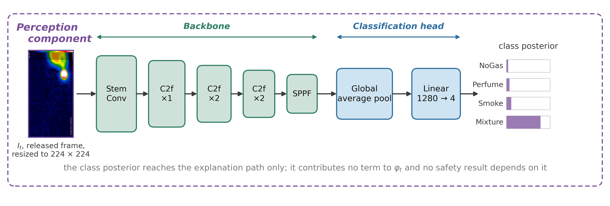
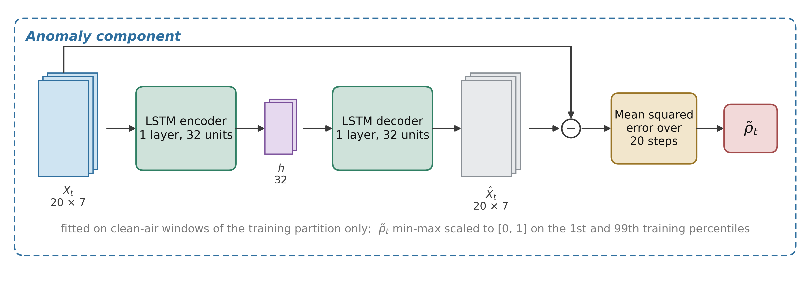
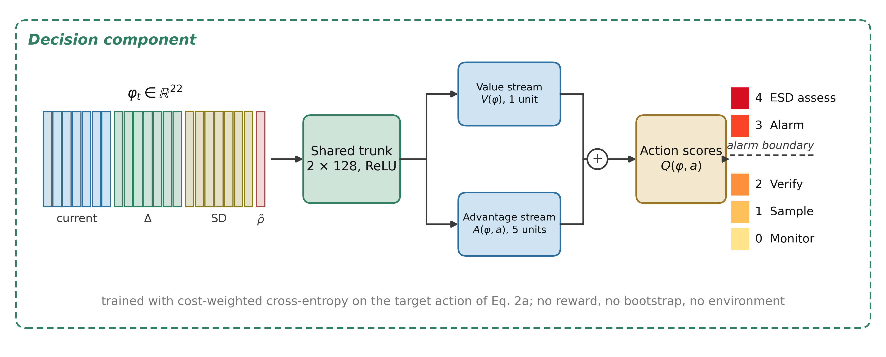

# A Safety-Oriented Benchmark for Learned Gas-Monitoring Models Under Class Exclusion and Sensor Degradation

Benjamin C. Nweke^1,2,\*^, Gholamreza Ramezan^2^, Soheil Saraji^1^

^1^ Subsurface Energy and Digital Innovation Center, University of Wyoming\
^2^ Fides Innova Labs

^\*^ Corresponding author; email: bnweke@uwyo.edu

*Prepared for submission to SPE Journal, Data Science and Engineering Analytics.*

Keywords: benchmarking; MOX gas sensors; safety-oriented evaluation; temporal data leakage; class-disjoint evaluation

---

## Summary

Fixed gas detectors generate sustained streams of abnormal indications that add to operator alarm burden, and the literature interpreting them is ranked almost entirely by classification accuracy. Accuracy is silent on two quantities an installation decision must weigh: how often a hazard draws no response, and how often clean air draws a high-severity one. This paper is a benchmark study of learned gas-monitoring decision models on a public metal-oxide corpus, scoring eleven comparators on a five-quantity evaluation set, decision accuracy beside four safety-relevant rates separating passive hazard miss, notification adequacy, under-response and high-severity false alarm, under leakage-controlled partitioning, class exclusion and graded sensor degradation. No new detector is proposed; the object under test is the sensor-policy core. Three findings follow. First, the partitioning protocol moves reported accuracy by more than the choice of model does: a random split over overlapping sliding windows adds 3.23 to 5.57 accuracy points to every model reading temporal features, more than the 2.42-point spread between them. Second, in-distribution safety metrics are weakly discriminative: ten comparators sit inside 4.43 accuracy points and almost none records a missed hazard. Withholding one hazardous class separates them: seven record no missed hazard in any of five partitions, while the model ranked third on accuracy misses 507 of 7,905 held-out windows. Third, a low miss rate is not sufficient. Eight of eleven comparators hold worst-partition miss bounds at or below 3.3% on a held-out hazardous class while escalation adequacy spans a factor of about 200. A review on miss rate alone would treat as interchangeable a model that escalates every hazardous window and one that notifies an operator about one in two hundred. Two interventions were tested; neither is free. Allowing a model to decline raises escalation adequacy on that class from 0.0030 to 0.7111 under an alarm-mapped convention, at the cost of rejecting 41.2% of clean windows. Raw-space faults expose a silent mode: a clamped array routes every hazardous window below alarm grade while its anomaly feature falls below the clean value. Missed-hazard rate with an honest interval, escalation adequacy, alarm burden in eventized units, and their degradation under sensor loss should be reported together, since each alone clears a different model. Scope limits: surrogate analytes, not hydrocarbons; a constructed action ladder, not a facility alarm philosophy; and class exclusion within one session under synthetic perturbation, not demonstrated domain shift or physical sensor failure.

---

## Introduction

Many process-safety incidents involve warning indications that do not result in timely intervention. The evidence is often present, spread across several indications, and not converted into action in time. In the eleven minutes before the Milford Haven refinery explosion the control-room operator received 275 alarms (Goel et al. 2017). Sensing was not the failure. Turning what was sensed into a decision was.

The same shape of problem appears at upstream and midstream facilities. Wellpads, tank batteries, compressor stations and gas plants carry fixed point-gas detectors built on infrared, catalytic bead, electrochemical or metal-oxide-semiconductor (MOX) elements. The corpus used here is a low-cost MQ-series MOX array, a controlled testbed rather than a representative facility detector. These feed alarm systems that in many installations already run at or above the rates industry guidance treats as manageable for a single operator (EEMUA 2024; ISA 2016). Added to that is the obligation to find and act on fugitive hydrocarbon release. In both settings the operational question is what to do next, and with what confidence.

Machine learning has been applied far more heavily to detection than to disposition. Gas-detection models are ranked by classification accuracy, and published results are high, closely spaced, and not directly comparable: studies differ in dataset, modality, task definition and partitioning protocol, so a single quoted range across them misleads more than it informs. Table 1 sets them out with those columns attached, and small differences between leading methods carry little information about deployment.

The deeper difficulty is that a symmetric metric is being applied to an asymmetric problem. Monitoring errors are not interchangeable, and no single scalar orders them sensibly. A hazard that draws no response gives up the whole intervention window. A hazard that draws a sub-alarm response keeps part of that window but notifies nobody, and a miss metric scores it as a success. A clean condition that draws a high-severity response spends operator attention and, at sufficient rate, degrades the alarm system later hazards depend on (Laberge et al. 2014). A hazard that draws a high-severity response of the wrong kind at least reaches an operator, though the wrong response can itself upset the process or conflict with another protection layer. A model ranked first on accuracy can be ranked last on any of these, and the accuracy table gives no hint of which.

Little of the component technology is new. Reconstruction-based sequence models for sensor anomaly detection (Malhotra et al. 2016; Liang et al. 2023), embedded vision models (Korjani et al. 2024; Jocher et al. 2023), gas-detection networks optimized for the same constraint (Dehnaw et al. 2024), cost-sensitive learning (Elkan 2001), thermal and MOX fusion on this very corpus (Narkhede et al. 2021, 2022) and compact language models running on site hardware (Gemma Team 2025) are all established. What appears less developed, at least in learned gas monitoring, is the downstream disposition of a hazardous observation: whether it draws silence, a sub-alarm response, or something an operator actually receives, and whether that disposition holds when the hazard is one the model was not trained on and the sensing is degraded.

Six questions follow.

i. RQ0. Does the choice of partitioning protocol change what a comparison reports?
ii. RQ1. Does accuracy-ranked model selection survive a missed-hazard criterion?
iii. RQ2. Do models that agree in distribution still agree when the hazard is one they were never trained on? A detector in service will eventually meet a hazard outside its training classes.
iv. RQ3. Is missed-hazard rate itself sufficient, or can it be satisfied by under-response that a miss count never registers?
v. RQ4. Do any of these behaviors survive sensor-fault perturbation, applied to the standardized decision state and to the raw signal? Both are synthetic: no hardware was faulted and no physical failure induced, so the question is posed at the level the experiments can answer.
vi. RQ5. If a model is allowed to decline rather than act, does that repair the inadequate responses of RQ3, and what does it cost?

The first contribution is an evaluation protocol for safety-relevant comparison. It combines a leakage-controlled block-wise holdout with a two-sided embargo and a seed-varying block position, a graded action target that keeps missed hazard, under-escalation and high-severity false alarm apart, and class-disjoint evaluation against a held-out hazardous class. To those it adds a graded perturbation suite over noise, drift and channel loss and, on every zero count, both an independence-reference binomial bound and a disjoint-support reference bound about twenty times wider. We did not find a prior study combining these on a MOX gas-detection benchmark. Applying it quantifies the leakage it exists to prevent: the argument that a random split over overlapping sliding windows inflates accuracy is standard but unmeasured on this corpus, and among models reading temporal features the protocol effect exceeds the spread between the models themselves.

The second contribution is what that protocol measures. Accuracy ranking carries little information about safety behavior. Ten models spanning very different inductive biases lie within 4.43 accuracy points in distribution and are nearly indistinguishable there on every safety metric. They then separate once the hazardous class is held out of training: seven record no missed hazard in any of five partitions, while the worst misses 507 of 7,905 held-out-class windows, 234 of them in one partition. The separation is in the counts. Quoting it as a ratio of bounds would overstate it, because a bound on an observed zero is mostly a property of the convention that produced it. Missed-hazard rate is in turn necessary and not sufficient, because the eight comparators whose worst-partition miss bounds sit at or below 3.3% on that class span the full range of escalation adequacy, holding both the best escalator and some of the worst. Two results are negative and reported as such. Scalar class-level cost ratios from 1:1 to 20:1 changed neither missed-hazard rate nor escalation adequacy and degraded accuracy past 6:1. A deterministic label-function reference reaches the accuracy ceiling by construction; it is not deployable, since it consumes the label it is meant to infer, but no advantage over it can be shown under nominal conditions, so whatever value a learned policy has here appears only once the inputs are imperfect.

Three further components are released with the protocol. A reject-option baseline shows what declining buys and what it costs in rejected clean windows, and whether rejection separates an unfamiliar hazard from clean air at all. Fault modes are injected in raw sensor space rather than in feature space. Recomputing the features and the autoencoder score from a faulted raw window shows that an array clamped at the high end of its trained range fails silently, its normalized anomaly feature falling below the clean-condition value. A one-sided abnormality threshold is therefore blind to the mode carrying the highest missed-hazard rate tested. Interpretable and conventional process-monitoring comparators, a depth-3 decision tree on the seven raw channels and a CUSUM sequential detector, run under the identical protocol.

This study does not aim to advance classification accuracy on this benchmark. It asks what a model does when the accuracy column cannot distinguish candidates, which on this corpus is most of the time.

---

## Related Work and Positioning

*Detection, and the Gap Between an Indication and a Decision.* Gas-hazard detection rests on a well-developed base of hardware and software methods (Murvay and Silea 2012; Adegboye et al. 2019), from distributed acoustic and fiber-optic sensing to real-time transient modeling, mass balance and model-based diagnostics (Zhang et al. 2013; Bustnes et al. 2011), including deep-learning electronic-nose approaches to pollutant classification (Faleh and Kachouri 2023). Their weak spot is usually uneven performance under real operating conditions rather than any absence of capability (Han and Kim 2014).

For the present argument a different limitation matters more. All of them stop at a leak indication, a location estimate or a concentration estimate. Those outputs are necessary for loss prevention, but they are not response decisions, and the literature evaluating them does not ask whether the downstream response would have been adequate. Detection quality is being reported as though it settled the response question, which it does not reach.

*Anomaly Scores as Evidence Rather Than Verdicts.* Since Malhotra et al. (2016), reconstruction-based sequence models trained only on normal operation have been a widely used unsupervised route to multivariate sensor anomaly detection, with field validation in pipeline monitoring (Liang et al. 2023) and recent application to early kick detection under an explicitly safety-framed objective (Lima et al. 2026), and they need no labeled examples of every hazardous condition. An anomaly score is nevertheless an intermediate quantity: it says behavior has departed from baseline, not what to do, and nothing in the training procedure calibrates it to hazard severity. Any use of such a score inside a safety path carries an obligation to show that it ranks hazard monotonically, and the literature rarely discharges it. We test it directly below.

*A Saturated Benchmark.* MultimodalGasData pairs thermal frames with a seven-channel MOX array, and the original work showed that fusing the two beats either alone: 96% for the fused model against 82% for the MOX channels alone and 93% for thermal images alone (Narkhede et al. 2021, 2022). It has since become a reference corpus, and later results are high but not mutually comparable. Sharma et al. (2024) report 99.7% validation accuracy for a multimodal federated model on the same four-class corpus. El Barkani et al. (2024) report 91.7% test accuracy, but on the thermal images alone and on embedded hardware. Zhang and Zhang (2025) report 98.9% accuracy, and that figure belongs to a simulated pipeline test set of their own collection rather than to this corpus, which they use only for initial training of a binary leak classifier. On real field data from a methane emissions test facility the same system reports 95.4%. Quoting those four numbers as a single range would compare a four-class multimodal task, a single-modality embedded task and a binary leak task across three different test sets.

Two features of that literature bear on what follows. First, those figures appear to be computed on random splits over overlapping sliding windows from a single recording session. Dennler et al. (2022) demonstrated analogous drift-related evaluation problems in a widely used MOX benchmark, where recording time is confounded with class identity, and Vergara et al. (2012) had already documented how far MOX response drifts over long horizons. Second, the cited studies report classification or detection performance rather than the action-level safety quantities evaluated here. Under the protocols those studies appear to use, reported accuracy on this corpus no longer discriminates between methods in a way that carries deployment information; whether the underlying task is saturated is a larger claim this study does not test.

*Unknown Gases Are Not a New Problem.* A recognition system meeting a gas outside its training set is the subject of an established open-set literature, so the class-disjoint experiment below is not the first work to pose that question. Qu et al. (2022) formalized open-set gas recognition on an electronic-nose corpus and showed that closed-set classifiers assign unknown analytes to known classes with high confidence, and Ma et al. (2024) pursued the same problem with a multi-scale temporal convolutional network. A parallel line treats the unknown class jointly with drift, so that an aged array still rejects what it has not seen (Yao et al. 2024; Vergara et al. 2012), and the drift half of that problem remains active: Lin and Zhan (2026) compensate electronic-nose drift by knowledge distillation and evaluate it with repeated randomized trials and significance testing rather than a single split. The concern is not confined to gas sensing: reviews of adaptive threat detection report the same pattern, and argue for evaluation under degraded conditions rather than on a held-out split alone (Alli et al. 2026). No part of the recognition problem is claimed as new here.

What that work is scored on is recognition: rejection accuracy, unknown-class detection, retained closed-set accuracy. The modality-comparison studies alongside it use the same criterion, ranking learned detectors on classification accuracy and precision (Kumar et al. 2024). Among the gas-recognition studies reviewed here we did not find one that maps an unfamiliar hazardous class onto a graded operator-response ladder and then separates passive silence from sub-alarm routing from alarm-grade notification. That is the narrow gap the experiment below occupies. It is not an open-set method: it withholds a class, lets ordinary closed-set models do whatever they do, and records the action. Which action a rejection ought to map to is a question the recognition literature leaves open, and one a facility would have to answer for itself.

*Alarm Analytics Is Also an Established Field.* Industrial alarm systems have their own analytics literature, which long predates this work: Wang, J. et al. (2016) survey the causes of alarm overloading and the methods proposed against it, and EEMUA (2024) and ISA (2016) codify the performance envelopes those methods target. Alarm rationalization, deadband and delay design, flood analysis and root-cause diagnosis are mature topics there.

That work starts from an alarm system that already exists and asks how to improve its configuration. The question addressed here is the prior one: given a learned model a facility is considering installing, what should be measured *before* it becomes a source of alarms. The contribution is not that alarms matter, nor that unknown gases exist, but the joint action-level screen applied under class exclusion and graded degradation to a model not yet in service.

*Cost-Sensitive Learning.* That error costs are unequal, and that classifiers ought to be trained accordingly, has had a clean formal treatment since Elkan (2001), and cost-sensitive reweighting is now routine. What gets reported far less often is whether a given asymmetry moved the specific error it was introduced to suppress. We run that test and return a negative answer, and we also test whether an objective pricing direction along a graded response ladder does better than a scalar weight.

*Coordination Layers and Operator-Facing Explanation.* Systems coordinating several specialized models have been applied in the energy sector to well-construction assistance, completions optimization and enterprise modeling (Sabbagh et al. 2024; Santiago et al. 2025; Jessen and Roshchin 2025), in analytical settings rather than real-time monitoring. A different layer of the same problem, how a fleet of devices attests to its own work without a trusted intermediary, is treated in our earlier study of decentralized physical infrastructure networks (Nweke et al. 2025): that work asks what a network of detectors can prove about itself, this one what a single decision model does as its inputs degrade. Explanation matters for operator-facing systems because trust, review and post-incident accountability depend on it, and it brings a hazard of its own: a fluent explanation that does not match the decision it claims to explain is worse in a control room than offering nothing.

*Where This Study Sits.* Table 1 lists representative prior work with the evaluation gap each leaves open, and states our own limitation in the same column so the comparison is symmetric.

| Study | Dataset | Task | Protocol | Result | Evaluation gap |
|---|---|---|---|---|---|
| Narkhede et al. (2021, 2022) | MGD | MOX + thermal, 4-class | single-session test split | 96 / 82 / 93% | accuracy only; random split over overlapping windows |
| Sharma et al. (2024) | MGD | MOX + thermal, 4-class, federated | validation split | 99.7% | no safety or degradation metric |
| El Barkani et al. (2024) | MGD thermal | thermal, 4-class, embedded | test split | 91.7% | single modality; no action-level metric |
| Zhang and Zhang (2025) | own simulated; MGD for pretraining | MOX + thermal, binary leak | simulated and field sets | 98.9 / 95.4% | different task and test set |
| Dennler et al. (2022) | other MOX benchmark | drift analysis | re-partitioned | n/a | leakage mechanism only; no safety metric |
| Liang et al. (2023) | pipeline flow | normal-only anomaly detection | field validated | n/a | stops at detection |
| Korjani et al. (2024) | optical gas imaging | vision detection | field imagery | n/a | degraded sensing not a safety metric |
| Elkan (2001) | n/a | cost-sensitive learning theory | n/a | n/a | untested on a saturated benchmark |
| This study | MGD | action from MOX and anomaly state | block-wise holdout, 20-window embargo, seed-varying block | Tables 8, 10 | surrogate analytes; one session and device; perception path held to a weaker standard |

Table 1—Representative prior work with dataset, task and validation protocol. MGD = MultimodalGasData.

The contribution lives in that right-hand column: a pre-deployment evaluation protocol for learned gas-monitoring components that separates recognition correctness, passive hazard miss, operator-notification adequacy and alarm burden, and measures all four under controlled class exclusion and perturbation. No new architecture is proposed. What we offer is a benchmarked evaluation template, one that might suggest how a facility could structure a pre-deployment review once it has substituted its own hazard definitions, alarm philosophy, response thresholds and fault models for the ones used here.

---

## Methodology

The method has two halves. The pipeline combines established components; the contribution is the evaluation protocol and metric set it exists to be measured by. Fig. 1 gives the workflow: the corpus and the action each class maps to, the single protocol every comparator is trained under, and the five conditions the trained models are then put through, all read with the same five-quantity evaluation set.

{width=6.50in}

Fig. 1—Workflow of the study: one corpus, one protocol, five conditions and the evaluation set they are read with.

*Corpus and Preprocessing.* The public MultimodalGasData corpus (Narkhede et al. 2022; Mendeley Data, CC BY 4.0) pairs a seven-channel MQ-series MOX array with thermal frames from a Seek Compact camera, whose 206 by 156 sensor is released as 480 by 640 rendered images, at 2 s intervals. MOX elements respond broadly and cross-sensitively, so the array is informative because the seven responses differ in relative magnitude rather than because any channel is selective. There are 6,400 labeled samples in four classes of 1,600: clean air (NoGas), incense smoke (Smoke), alcohol-based deodorant vapor (Perfume), and a smoke and vapor mixture (Mixture), one released frame of each in Fig. 1. Smoke and Mixture are hazardous surrogate conditions throughout, so a window of either is a hazardous window in the metric definitions, not a facility hazard. Table 2 lists the array.

| Sensor | Commonly associated target gases (nominal sensitivity) |
|---|---|
| MQ-2 | LPG, butane, methane, smoke |
| MQ-3 | Alcohol, ethanol, organic vapors |
| MQ-5 | LPG, natural gas |
| MQ-6 | LPG, butane, iso-butane |
| MQ-7 | Carbon monoxide |
| MQ-8 | Hydrogen |
| MQ-135 | Air-quality indicators including NH₃, benzene, NOₓ and CO₂ |

Table 2—Composition of the MOX array, with the gases each element is nominally marketed as sensitive to.

Two properties of the corpus shaped what follows. The analytes are surrogates: incense smoke and alcohol-based vapor exercise the MOX transduction mechanism, the array's cross-sensitivity and its baseline drift, all of which a facility detector meets in service, but establish nothing about methane or anything heavier. And the four classes were recorded as four contiguous blocks inside a single 90-minute session, so within-session baseline drift is confounded with class identity, which is what motivates the leakage-controlled evaluation set out next.

*Leakage-Controlled Partitioning.* Seven-channel readings form sliding windows of length 20, each labeled by its final reading, with windows spanning a class boundary discarded so that no window mixes two classes. That leaves 6,324 windows, 1,581 per class.

Consecutive windows share 19 of 20 raw rows, so a random split drops near-duplicates into both partitions, and a sequential split is no better because the corpus is block-ordered by class. The protocol is a block-wise holdout: inside each class block a contiguous 20% forms the test partition, separated from training by an embargo of *G* = 20 windows on each side, so no training window shares a raw row with a test window (Fig. 2). The embargo removes overlap across the partition boundary but not the temporal dependence within each partition, which the uncertainty treatment below accounts for. The held-out block's position moves with the run seed, so the reported dispersion includes partition variance and not model-initialization variance alone (Bouthillier et al. 2021). The result is 4,900 training and 1,264 test windows, 316 per class (Fig. 2), with feature scaling and anomaly normalization fitted on the training partition.

{width=6.50in}

Fig. 2—Corpus layout and the leakage-controlled split.

*The Pipeline Under Test.* The host system has five parts. At each cycle it takes a thermal image *I*ₜ and a sensor window Xₜ ∈ ℝ^(20×7)^ and returns a safety action *a*ₜ ∈ {0, …, 4} with an explanation *E*ₜ. A perception component classifies the thermal image, an anomaly component scores the sensor window by reconstruction error against a normal-only model, a coordination component assembles the decision state, a decision component maps it to an action, and a reasoning component writes the operator-facing explanation. Only the sensor-policy core is benchmarked here: the thermal branch contributes no term to the decision state, so thermal evidence never reaches the quantity the decision component maps to an action.

The pipeline is advisory and actuates nothing: *Recommend ESD assessment* refers a condition under the facility procedure and does not command a trip. IEC 61511 (IEC 2016) sets out lifecycle and independence expectations for safety instrumented systems in the process sector, and this component sits in the operator-support layer under that framework, outside any safety instrumented function. The standard does not mandate the arrangement; the separation is kept because one learned component selecting across both the alarm and the shutdown layer would make those layers share a dependency, the kind of coupling those independence expectations are directed at.

*What Is Evaluated, and What Is Not.* Every number in this paper is produced by one object, the sensor-policy core: the anomaly, coordination and decision components, taking the 22-dimensional sensor state of Eq. 1 and emitting an action. That is the object Tables 8 through 12 characterize.

The running implementation is larger, wrapping the policy in deterministic guardrails: an anomaly-threshold override and a promotion rule driven by the thermal classifier. Those are not benchmarked: a guardrail that raises actions would lift escalation adequacy and missed-hazard rate toward their best attainable values on every comparator at once, which is the saturation this evaluation exists to break out of. The boundary holds throughout, so no result below describes end-to-end behavior of the deployed system, and evaluating the full runtime logic with its guardrails against this metric set is an experiment the paper does not contain.

*Component Models.* *Perception.* Thermal images are classified with YOLOv8n-cls (Jocher et al. 2023) under a randomized 80/20 stratified split over the 6,400 frames (Supplementary Section S1). That split was not held to the sensor-side discipline, so it is exposed to the leakage mechanism the block-wise holdout exists to avoid and the perception figure is an optimistic upper bound. No claim here rests on it, but the multimodal system as a whole has not been validated to the standard applied to the sensor path (Fig. 3).

{width=6.50in}

Fig. 3—Architecture of the perception component. C2f = cross-stage partial bottleneck with two convolutions; SPPF = spatial pyramid pooling, fast.

*Anomaly Detection.* An LSTM autoencoder with a single-layer encoder and decoder at hidden dimension 32, trained on NoGas windows only, following Malhotra et al. (2016). The anomaly score is the mean reconstruction error over the window; the threshold τ is the 95th percentile of that error on NoGas *training* windows (Fig. 4).

{width=6.50in}

Fig. 4—Architecture of the anomaly component.

*Coordination.* The 22-dimensional decision state is

&nbsp;&nbsp;&nbsp;&nbsp;φₜ = [ ρ̃ₜ , Xₜ[−1,:] , δₜ , σₜ ] ∈ ℝ²²  ............ (1)

with ρ̃ₜ the normalized anomaly score, Xₜ[−1,:] the current seven-channel reading, δₜ the per-sensor change across the window, and σₜ the per-sensor standard deviation. There is no visual term in the state.

*Decision.* A feedforward network with a dueling value and advantage head (Wang et al. 2016), mapping φₜ to five action scores, trained by cost-weighted cross-entropy rather than by reinforcement learning (Fig. 5). Training targets come from the single-valued map *y*(·) of Eq. 2a; evaluation scores against the acceptable set *A*(·) of Eq. 2b.

{width=6.50in}

Fig. 5—Architecture of the decision component. *V* = value stream; *A* = advantage stream.

> The action labels in Eq. 2a and Eq. 2b are constructed evaluation targets. They are not facility alarm requirements, not a safety instrumented function specification, and not derived from any concentration, release rate, lower-explosive-limit fraction, toxic-exposure limit or consequence model. No such quantity exists in this corpus. Every metric defined on this ladder measures agreement with the constructed target, not consequence avoided.

With that stated,

Two distinct objects are needed here, so they are given separate names. The training target *y*(*g*) is single-valued, one action per class, and is what the loss is computed against. The acceptable set *A*(*g*) is what evaluation scores against, and for one class it holds two actions:

&nbsp;&nbsp;&nbsp;&nbsp;*y*(NoGas) = 0, *y*(Smoke) = 3, *y*(Mixture) = 4, *y*(Perfume) = 1;  ............ (2a)

&nbsp;&nbsp;&nbsp;&nbsp;*A*(NoGas) = {0}, *A*(Smoke) = {3}, *A*(Mixture) = {4}, *A*(Perfume) = {1, 2}.  ............ (2b)

Perfume is the only class where the two differ. It is a nuisance odorant for which raising the sampling rate or requesting verification are both defensible, so both count as acceptable while training picks the lower. Action 2 is therefore never a positive training target: it is an admissible evaluation response and a rung a model can reach only by accident.

Each sample carries a loss weight *w*(*g*ₜ) equal to *c*~miss~ for hazardous classes and *c*~false~ otherwise, with *C* = *c*~miss~ / *c*~false~. The objective is

&nbsp;&nbsp;&nbsp;&nbsp;*L*(θ) = − (1/*N*) Σₜ *w*(*g*ₜ) · log *p*~θ~( *y*(*g*ₜ) | φₜ )  ............ (3)

where *p*~θ~ is the softmax over the five action scores and *p*~θ~(*y* | φ) is the probability it assigns to the single target action. *C* = 8:1 is retained as the reference configuration from the original experiment design and the rest are swept below. It is a reference and not a deployed setting because, as Experiment 4 shows, it was not selected by a defensible validation procedure.

Two consequences bound what can be claimed. Because *y*(·) is a deterministic function of the class label, decision accuracy is four-class classification accuracy composed with a fixed map, so the decision and classification framings differ in error metric, not in task. And a rule applying *y*(·) to the true label hits 100% by construction, consuming the label it is meant to infer, so it appears below as a label-function reference and never as a baseline.

*Reasoning.* Explanations are generated locally with Gemma 3 1B (Gemma Team 2025) and sit off the safety-critical path: the action is fixed by the decision component and the generated text cannot change it, because a fluent explanation inconsistent with the decision it claims to explain is a hazard in a control room. It is evaluated nowhere in this paper. Prompt and serving detail are in Supplementary Section S2.

*Comparators.* Eleven comparators run under one protocol:

- the cost-weighted policy of Eq. 3, and an unweighted network of identical topology;
- a multilayer perceptron (256-256-128);
- cost-sensitive gradient boosting (300 trees) and a random forest (300 trees);
- an RBF support-vector classifier and k-nearest neighbors with *k* = 5;
- a recurrent network over *K* = 10 consecutive states;
- conservative Q-learning with a TD(0) bootstrap and a conservative penalty on non-behavior actions;
- a shallow decision tree of depth 3 on the seven raw current-sensor channels, interpretable and auditable in a way the learned networks are not;
- CUSUM (Page 1954), a one-sided cumulative-sum detector on the anomaly score, with μ₀ and σ estimated from NoGas training windows and the threshold set on the training partition.

Two are not plain supervised classifiers. Conservative Q-learning is offline and single-step, which over a one-step bootstrap makes it close to a myopic cost minimizer, not a sequential-decision method. CUSUM's statistic resets at every change of class block, so it never crosses a block boundary, the embargo band or a partition. Hyperparameters, reward definition, coverage, episode construction, slack and threshold selection and the reset semantics for both are in Supplementary Section S5.

Twelve models appear in total: the eleven comparators plus the ordinal cost objective of Experiment 4, a variant of the decision component rather than an independent method. Subsets differ between experiments and Table 3 states which model appears where. Calibration uses only the cost-weighted policy, since the four estimators compared there are properties of one model's confidence, and the ablation holds the architecture fixed so that only the feature set varies.

| Model | In distribution (Exp. 2) | Leave-one-class-out (Exp. 3) | Degradation (Exps. 6, 9) | Reject option (Exp. 8) | Action matrix and input probe (Exps. 2, 5) |
|---|---|---|---|---|---|
| Cost-weighted policy | ✓ | ✓ | ✓ | ✓ | ✓ |
| Unweighted network | ✓ | ✓ | ✓ | ✓ | |
| Multilayer perceptron | ✓ | ✓ | ✓ | ✓ | ✓ |
| Gradient boosting | ✓ | ✓ | ✓ | ✓ | ✓ |
| Random forest | ✓ | ✓ | ✓ | ✓ | ✓ |
| Support-vector classifier | ✓ | ✓ | | ✓ | ✓ |
| Recurrent (LSTM) | ✓ | ✓ | | | |
| Conservative Q-learning | ✓ | ✓ | | | |
| k-nearest neighbors | ✓ | ✓ | | ✓ | ✓ |
| Shallow decision tree | ✓ | ✓ | ✓ | | ✓ |
| CUSUM | | | | | |
| Ordinal cost objective | ✓ | ✓ | | | |
| Total | 11 | 11 | 6 | 7 | 7 |

Table 3—Which model appears in which experiment.

*The Evaluation Metric Set.* Five quantities rather than one, and this set is the proposal: decision accuracy beside four safety-relevant rates. Alarm burden is the false-alarm rate in operational units (Eq. 9), not a sixth quantity. Table 4 gives the action space and Fig. 6 shows where each quantity reads it.

The ladder is a constructed instrument. *Smoke* maps to *Raise alarm* and *Mixture* to *Recommend ESD assessment* because the two have to be separable for the metrics to measure anything, not because a consequence model put them there. A facility with a real analyte and consequence model would build a different ladder and get different numbers from every table here.

The argument does not rest on the particular rungs: the metric set needs a graded response space with an alarm boundary inside it, so that a response can be inadequate without being absent, and any ladder of that shape makes the dissociation visible.

| Action | Label | Operational response |
|---|---|---|
| 0 | Monitor | Routine monitoring, no operator notification |
| 1 | Increase sampling | Elevated scan frequency and event logging |
| 2 | Request verification | Secondary sensor check and event logging; no alarm is raised |
| 3 | Raise alarm | Automated alarm, incident logging, field dispatch |
| 4 | Recommend ESD assessment | Refer the condition for emergency-shutdown assessment under the facility procedure |

Table 4—Safety-action space and its alarm boundary.

Actions 3 and 4 are alarm-grade and actions 1 and 2 place nothing in front of an operator. The ladder has five levels, but *y*(·) in Eq. 2a never assigns action 2, so the empirical decision space is a four-action one. Every metric below follows that boundary, counting escalation as *a* ≥ 3 and under-escalation as *a* ∈ {1, 2}. The boundary is a modeling choice about this implementation, not a claim about how a verification request must be handled in general; Experiment 3 measures what moving it would do.

{width=6.50in}

Fig. 6—One window, one action, and the boundary each metric reads.

Let the test partition be windows *t* = 1 … *N*~test~ with true classes *g*ₜ and selected actions *a*ₜ, let *H* = {*t* : *g*ₜ ∈ {Smoke, Mixture}} be the hazardous-surrogate windows and *Z* = {*t* : *g*ₜ = NoGas} the clean ones, and let 1[·] be the indicator function.

*Decision accuracy* is the share of test windows assigned an action in the acceptable set,

&nbsp;&nbsp;&nbsp;&nbsp;Acc = (1/*N*~test~) Σₜ 1[ *a*ₜ ∈ *A*(*g*ₜ) ].  ............ (4)

Decision accuracy is reported for continuity with prior work. It is not a safety metric, nor treated as one here.

*Missed-hazard rate* is the share of hazardous windows assigned the passive *Monitor* action,

&nbsp;&nbsp;&nbsp;&nbsp;*R*~miss~ = (1/|*H*|) Σ~t∈H~ 1[ *a*ₜ = 0 ].  ............ (5)

Only *a* = 0 counts, so assigning a hazardous window to *Raise alarm* when *Recommend ESD assessment* was the target is not a miss: an operator is still notified. Its limitation is that *Increase sampling* and *Request verification* are also not misses, even though neither places anything in front of an operator, which is why the next two quantities exist.

*Escalation adequacy* is the share of hazardous windows assigned an alarm-grade action, and *under-escalation* the share receiving a sub-alarm one,

&nbsp;&nbsp;&nbsp;&nbsp;*R*~esc~ = (1/|*H*|) Σ~t∈H~ 1[ *a*ₜ ≥ 3 ],  ............ (6)

&nbsp;&nbsp;&nbsp;&nbsp;*R*~under~ = (1/|*H*|) Σ~t∈H~ 1[ *a*ₜ ∈ {1, 2} ].  ............ (7)

By construction *R*~miss~ + *R*~under~ + *R*~esc~ = 1, so the three partition the hazardous windows and no response is counted twice or left out. It is precisely this partition that a miss metric alone collapses.

*High-severity false-alarm rate* is the share of clean windows assigned an alarm-grade action, and the corresponding alarm burden is that rate expressed per 1,000 clean windows,

&nbsp;&nbsp;&nbsp;&nbsp;*R*~fa~ = (1/|*Z*|) Σ~t∈Z~ 1[ *a*ₜ ≥ 3 ],  ............ (8)

&nbsp;&nbsp;&nbsp;&nbsp;*B* = 1000 · *R*~fa~.  ............ (9)

Eq. 9 makes the quantity comparable with an alarm budget; dividing instead by the number of alerts raised gives a number that cannot be. The set *Z* is the clean-air (NoGas) windows, a deliberately narrow denominator. Perfume windows are also nonhazardous under Eq. 2b, so an alarm-grade action on one is an unnecessary alarm by the same map; every value of Eq. 8 therefore carries a companion rate over all nonhazardous windows as a sensitivity, and Experiment 3 shows the two can disagree.

*Three levels, announced in advance.* Alarm-grade indication density is *B* itself, alarm-grade windows per 1,000 clean windows. Eventized alarm rate collapses contiguous alarm-grade windows into annunciated episodes under a stated persistence rule. Operator burden would compare that episode rate against a facility's own alarm philosophy, which this study does not attempt. The first two differ by between 5 and 316 times here and order the models differently, so any statement about operator load rests on the second.

*Bounds on every zero.* An observed zero is not a demonstrated zero. All zero-count claims carry a one-sided 95% upper bound from the Clopper-Pearson construction (Clopper and Pearson 1934), called here an independence-reference binomial upper bound and not an exact one. Clopper-Pearson is exact under the binomial model, which requires *N*~opp~ independent Bernoulli trials; this corpus is one continuous recording decomposed into windows overlapping by 19 of 20 raw rows. The bound fixes a reference point any reader can recompute and compare across models; it is not a confidence statement about an operational failure rate, and every number it produces is optimistic. For *k* observed failures in *N*~opp~ opportunities at confidence *c*,

&nbsp;&nbsp;&nbsp;&nbsp;*U*(*k*, *N*~opp~) = BetaInv( *c*; *k* + 1, *N*~opp~ − *k* ),  ............ (10)

which for *k* = 0 reduces to *U* = 1 − (1 − *c*)^(1/*N*~opp~)^.

The unit that goes into *N*~opp~ matters more than the formula. Pooling every test window across seeds would give 3,160 hazardous and 1,580 clean windows and a bound of 0.095% on a zero. But consecutive windows share 19 of 20 raw rows and the moving block position re-evaluates the same window in more than one partition, so pooling would claim more independent information than the experiment produced.

Eq. 10 is therefore evaluated with the partition as the unit and the worst case reported across partitions. A single test partition carries 632 hazardous and 316 clean windows, so an observed zero supports at most 0.47% and 0.94% respectively, roughly five times the pooled figure. Reaching below 10⁻³ on a zero count needs about 2,995 independent observations.

*How much that optimism is worth.* Two treatments are reported beside the binomial reference.

The first is a moving-block bootstrap inside each test partition, resampling contiguous runs of windows at block lengths of 20, 100 and 316, the last a single contiguous block per class. A block bootstrap over *episodes* would be the textbook choice, but each class was acquired in one continuous run, so there is one episode per class and nothing to resample at that level, which bounds what any reanalysis can establish.

The second is more useful for the zero counts that dominate these tables, where a bootstrap interval is degenerate. Windows overlap by 19 of 20 raw rows, so a set with pairwise-disjoint raw support is every twentieth window, counted as floor(*N*/20): 31 of the 632 hazardous and 15 of the 316 clean windows. The convention is conservative: a maximal nonoverlapping selection from 316 consecutive windows holds 16 rather than 15, and we take the smaller figure. Evaluating Eq. 10 on those counts moves the bound on an observed zero from 0.47% to 9.21% on hazardous windows and from 0.94% to 18.10% on clean windows, the alarm burden a clean-condition zero supports from 9.4 to 181 per 1,000 clean windows, and the class-disjoint bound from 0.19% to 3.72%.

About a factor of twenty separates the binomial reference from the disjoint-support figure, and the second is still optimistic: 31 windows from one acquisition episode on one device are not 31 independent trials in any physical sense. Every bound here is labelled an independence-reference quantity for that reason, and the disjoint-support counts are conservative reference counts rather than an effective sample size. On this corpus an observed zero missed-hazard rate does not exclude a true rate of roughly 9%, so no experiment here separates a genuinely safe model from a lucky one at the resolution the nominal window counts suggest. That is what the data fail to exclude under a conservative counting rule, not an estimate: nothing here puts the missed-hazard rate at 9.21%. It is a limit of the data, and the strongest argument in this paper for collecting more sessions.

Table 5 states the metric set in the form proposed for adoption, including what each quantity does not catch, since a reporting standard that omits its own blind spots is the problem this paper is about.

| Quantity | Symbol | Reads | Catches | Does not catch | Report with |
|---|---|---|---|---|---|
| Decision accuracy | Acc, Eq. 4 | all windows | overall correctness | any asymmetry between error types | SD across seed-varying partitions |
| Missed-hazard rate | *R*~miss~, Eq. 5 | hazardous windows at *a* = 0 | the fully passive response to a hazard | sub-alarm responses that notify nobody | independence-reference upper bound and disjoint-support reference bound, Eq. 10 |
| Escalation adequacy | *R*~esc~, Eq. 6 | hazardous windows at *a* ≥ 3 | whether an operator is notified | which alarm-grade action was chosen | SD across partitions, and the boundary assumed |
| Under-escalation | *R*~under~, Eq. 7 | hazardous windows at *a* ∈ {1, 2} | the gap a miss metric hides | how severe the under-served hazard was | beside *R*~esc~, since the two sum with *R*~miss~ to 1 |
| High-severity false-alarm rate | *R*~fa~, Eq. 8 | clean windows at *a* ≥ 3 | operator attention spent on clean air | nuisance actions below the alarm boundary | burden per 1,000 windows, Eq. 9, and a bound on a zero |

Table 5—The proposed evaluation set, with the blind spot of each quantity.

*Protocol and Statistics.* Two protocols are used. The five-seed protocol (42, 1337, 7, 2024, 99), each seed carrying its own block position, covers experiments that vary something other than the model: the leave-one-class-out grid, the perturbation suite, the ablation, the calibration study and the anomaly-input probe. It is a descriptive robustness check, not a basis for ranking models, and no power claim is made for it.

The model comparison itself is run 30 times, with seed, held-out block position and a hyperparameter draw all varying per run (Bouthillier et al. 2021). What the draw ranges over differs by family, but the budget is equal: one draw per run for every comparator, from a fixed grid of the same size, none of it tuned against the test partition. Supplementary Section S5 lists the grid for each family. Five paired observations cannot support a ranking: the two-sided Wilcoxon signed-rank test has a minimum attainable *p*-value of 2^(1−*N*~run~)^ = 0.0625 at *N*~run~ = 5, so no comparison reaches α = 0.05 at any effect size. With 30 runs we use the Bayesian correlated *t*-test of Benavoli et al. (2017). For a vector of paired differences *d* with mean *d̄* and sample variance *s*², the posterior is a Student *t* with *N*~run~ − 1 degrees of freedom, mean *d̄*, and scale

&nbsp;&nbsp;&nbsp;&nbsp;*s*~post~ = sqrt( *s*² · ( 1/*N*~run~ + ρ/(1 − ρ) ) ),  ............ (11)

with the correlation ρ = *n*~test~/(*n*~train~ + *n*~test~) = 1,264/(4,900 + 1,264) = 0.2051, computed from the partition the pipeline builds rather than fixed by hand. Integrating that posterior over a region of practical equivalence of ± 1 accuracy point returns three probabilities per comparison: that one model is practically better, that the other is, and that the two are equivalent. The one-point region is a study-specific choice, no economic model or site requirement having been analyzed to produce it, and Table S5 shows how much any conclusion depends on it. The third probability is a positive statement a null hypothesis test cannot give.

Benavoli et al. (2017) derive this correlation term for *k*-fold cross-validation, and the present design is not *k*-fold: seed, block position and a hyperparameter draw all vary per run, following Bouthillier et al. (2021). Training partitions still overlap by roughly 80% of their windows, so treating runs as independent would be anti-conservative, but ρ is carried across from a design that is not quite this one. The comparison is therefore reported over ranges of ρ and of equivalence width (Supplementary Section S6) and reads as a sensitivity analysis over an assumed dependence structure, not a calibrated posterior. Determinism guards are on and execution is single-threaded.

---

## Results

This section reports nine experiments. Component behavior comes first, then the evaluation protocol itself as the subject of Experiment 1, because every number after it depends on that protocol being defensible, and then the six experiments that answer a research question. The three carrying no research question are grouped as supporting evidence. Table 6 maps the questions onto the experiments that answer them.

| Question | Answered by | Answer |
|---|---|---|
| RQ0. Does the partitioning protocol matter? | Experiment 1 | Yes, and among temporal models by more than the model choice does |
| RQ1. Does accuracy-ranked selection survive a missed-hazard criterion? | Experiments 2 and 3 | In distribution the question is moot, since no metric discriminates; under the class-disjoint shift, no |
| RQ2. Do models that agree in distribution agree on a held-out hazardous class? | Experiment 3 | No: seven models record no missed hazard on any partition while the worst misses 507 of 7,905 held-out-class windows, and escalation adequacy spans a factor of about 200 |
| RQ3. Is missed-hazard rate sufficient on its own? | Experiment 3 | No, under-escalation satisfies it while notifying nobody |
| RQ4. Do these behaviors survive perturbation of the decision state, and of the raw signal? | Experiments 6 and 9 | No. Three failure modes appear in standardized space, and in raw space a clamped array is silent while the normalized anomaly feature falls below its clean value |
| RQ5. Does a reject option repair the under-escalation of RQ3? | Experiment 8 | Largely yes, at a cost of rejecting most clean windows, and the repair is as model-dependent as the failure |
| Supporting evidence, no question | Experiments 4, 5 and 7 | Cost asymmetry, decision-state contribution and confidence calibration; reported together below and in full in the supporting information |

Table 6—Research questions and the experiments that address them.

*Component Behavior.* The thermal classifier reached 98.8% top-1 accuracy on 1,280 held-out validation images, all 15 misclassifications falling on the NoGas and Perfume boundary, so neither hazardous class was confused with a non-hazardous one. That figure comes from a randomized image split, which makes it comparable to the published accuracies on this corpus and comparably optimistic. Supplementary Section S1 gives the per-class scores.

The anomaly component raises two questions. On whether the score tracks hazard, mean reconstruction error on held-out windows is 0.023 for clean air and 0.107 for the vapor class against 164.7 for smoke and 80.6 for the mixture (Fig. 7a), three orders of magnitude apart. It is not monotone in target severity, since Mixture carries the higher target action yet scores below Smoke, so it is evidence of abnormality and not a severity estimate.

On whether the partition used to fit it matters, it matters considerably. Fitting the autoencoder and its input scaler on the whole corpus, as an earlier implementation did, yields ROC-AUC 0.9622 at a false-positive rate of 5.0%. Fitting both inside the training partition, which every number in this paper now uses, yields ROC-AUC 0.9251 ± 0.0618, TPR 0.8015 ± 0.1205 and FPR 0.1101 ± 0.0992 across five seeds (Fig. 7b, and Fig. S6 of the supporting information), with a seed-to-seed spread from 0.8228 to 0.9898 that the pooled figure concealed. Just under four points of discrimination were an artifact of the anomaly model having seen the nominal windows it was later scored on, and the false-positive rate more than doubles once the fit is confined to the training partition. The correction matters beyond this component, because the anomaly score is one of the twenty-two inputs to every learned comparator: the leakage was upstream of the classifier, and no accuracy table would have shown it.

{width=6.50in}

Fig. 7—Anomaly component. (a) Mean reconstruction error by class. (b) Operating point under an in-sample threshold against a training-fitted one.

Experiment 1: Sensitivity of Reported Accuracy to the Partitioning Protocol. The block-wise split is justified above on the grounds that a random split over overlapping sliding windows places near-duplicates in both partitions. That argument is standard (Dennler et al. 2022) but was demonstrated on a different MOX benchmark, so it is measured here rather than assumed. Six models were trained under four partitioning protocols (Table 7, Fig. 8). The first is a uniformly random 80/20 split over all windows. The second is a contiguous per-class block with no separation band, and the third is that same block with the 20-window embargo used everywhere else here. The fourth trains on the first 60% of each class block, tests on the last 20%, and discards the middle 20%.

| Model | Random split | Blocked, no embargo | Blocked + embargo | Train early, test late |
|---|---|---|---|---|
| Cost-weighted policy | 0.9956 | 0.9669 | 0.9625 | 0.9462 |
| Multilayer perceptron | 0.9945 | 0.9638 | 0.9622 | 0.9724 |
| Gradient boosting | 0.9940 | 0.9296 | 0.9383 | 0.5598 |
| Random forest | 0.9927 | 0.9549 | 0.9525 | 0.5409 |
| k-nearest neighbors | 0.9929 | 0.9525 | 0.9521 | 0.9566 |
| Shallow decision tree | 0.9223 | 0.9294 | 0.9297 | 0.6349 |
| Mean | 0.9820 | 0.9495 | 0.9496 | 0.7685 |

Table 7—Decision accuracy under four partitioning protocols, mean over five runs, each with its own seed-varying partition and model initialization.

Randomized splitting increased reported decision accuracy by 3.23 to 5.57 percentage points for every model reading temporal features, 4.04 points on average across those five. Those same five span 2.42 points between them under the blocked protocol, so the choice of partitioning moves the reported number by about 1.7 times more than the choice of model. Adding the shallow decision tree, which the protocol barely touches, brings the two quantities to 3.24 against 3.28 points, so the claim is stated for temporal models. On a benchmark reported at four significant figures this is the difference between 0.99 and 0.95, wider than the spread separating published results on this corpus. It does not explain any particular published number, since no other method was re-run here, but comparisons across studies using different protocols carry little information about relative merit.

*Which of the two factors does the work.* A random split changes two things at once: near-duplicate windows can land on both sides of it, and it draws training data from the whole recording rather than a contiguous early band. A stride-20 window set, in which no two windows share a raw reading, allows a two-by-two separating them at a matched 256-window training budget (Supplementary Section S10, Table S8). Removing overlap costs 1.56 accuracy points on average and moving from random to blocked a further 1.30, but neither effect is consistent in sign, running from −1.98 to +5.85 and from −6.87 to +2.81 across six models.

The control returns a null result rather than a decomposition. At a 256-window budget the models sit well below the operating point of every other table here, so the two factors are not separable on this corpus at a training size both arms can share, which is not the same as either being negligible. The claim therefore stays where it was: the partitioning protocol moves the reported number, and the contrast should not be attributed to overlap alone.

The embargo contributes almost nothing on its own, 0.9495 without it against 0.9496 with it, so the block structure does the work. It is nonetheless what makes the claim of no shared readings true and costs 0.01 accuracy points to honor; the measurement shows only that the near-duplication a random split exploits is not concentrated at the block edges. The shallow decision tree is the one model a random split does not help, losing 0.74 points because it reads only the seven current sensor values. The last column is a harsher test: training early and testing late costs the random forest 41.2 points, gradient boosting 37.9 and the shallow decision tree 29.5, while the perceptron and k-nearest neighbors barely move and the cost-weighted policy loses 1.6. Within-session drift is confounded with position in each class block, so this protocol asks a question closer to deployment than anything else here, and the models disagree about it sharply.

{width=6.50in}

Fig. 8—Protocol sensitivity. (a) Decision accuracy under four partitioning protocols. (b) Accuracy points added by a random split.

*Experiment 2: In-Distribution Model Comparison.* Every comparator was trained 30 times under the protocol above and evaluated on the corresponding held-out partition (Table 8, Fig. 9). This addresses RQ1.

| Model | Decision accuracy | SD | Missed-hazard | Escalation | High-severity FA | Study-defined expected cost | P(equivalent) |
|---|---|---|---|---|---|---|---|
| Random forest | 0.9625 | 0.0346 | 0.0000 | 1.000 | 0.0000 | 0.0510 | 0.539 |
| Recurrent (LSTM) | 0.9618 | 0.0308 | 0.0000 | 0.999 | 0.0000 | 0.0680 | 0.779 |
| Multilayer perceptron | 0.9615 | 0.0202 | 0.0002 | 1.000 | 0.0000 | 0.0637 | 0.691 |
| Unweighted network | 0.9578 | 0.0293 | 0.0000 | 1.000 | 0.0000 | 0.0670 | 0.992 |
| Cost-weighted policy | 0.9573 | 0.0318 | 0.0000 | 1.000 | 0.0000 | 0.0690 | reference |
| Gradient boosting | 0.9529 | 0.0325 | 0.0033 | 0.993 | 0.0000 | 0.0903 | 0.586 |
| Conservative Q-learning | 0.9519 | 0.0354 | 0.0000 | 1.000 | 0.0000 | 0.0857 | 0.756 |
| Support-vector classifier | 0.9472 | 0.0274 | 0.0000 | 1.000 | 0.0000 | 0.0946 | 0.445 |
| k-nearest neighbors | 0.9443 | 0.0196 | 0.0000 | 1.000 | 0.0000 | 0.0939 | 0.367 |
| Shallow decision tree | 0.9183 | 0.0445 | 0.0000 | 1.000 | 0.0000 | 0.1233 | 0.027 |
| Ordinal cost objective | 0.7470 | 0.0057 | 0.0000 | 1.000 | 0.0000 | 0.2590 | 0.000 |

Table 8—Model comparison over 30 randomized runs.

Entries are mean ± SD across runs varying block position, initialization and a hyperparameter draw. Study-defined expected cost is the mean of the hand-designed, untuned ordinal matrix of Supplementary Section S3, a study-internal quantity and not a deployment-derived cost, reported so the comparison is not carried entirely by accuracy. The final column is the posterior probability of practical equivalence to the cost-weighted policy under Eq. 11 at a region of practical equivalence of ± 1 accuracy point. Measured by Eq. 4, the ten comparators other than the ordinal objective span 4.43 accuracy points, from 0.9183 to 0.9625. The highest accuracy and lowest expected cost belong to the random forest, and the cost-weighted policy places fifth. The shallow decision tree on seven raw sensor values sits 4.4 points behind the best learned model.

The safety metrics are weakly discriminative here, because almost every model produces the same safety outcome under the nominal distribution. Every comparator except gradient boosting, the perceptron and the recurrent network records no observed missed hazard and escalation adequacy of 1.000, and even those three miss at most 0.33% of hazardous windows. No comparator in Table 8 produces an observed high-severity false alarm across 30 runs; CUSUM, reported in the text rather than in that table, does. CUSUM is two-class by construction, emitting only *Monitor* and *Raise alarm*, so its 0.4535 ± 0.1010 decision accuracy is an artifact of scoring a two-state output against a four-class target map. Its missed-hazard rate of 0.0000, escalation adequacy of 1.0000 and high-severity false-alarm rate of 0.1861 remain comparable, because those definitions do not depend on how many classes a model expresses. The last is the cost of the first two: one threshold and no class structure buys full escalation by alarming on roughly one clean window in five. Each run contributes 632 hazardous and 316 clean windows, so those observed zeros bound the underlying rates at 0.47% and 0.94% on the worst partition, not at the far smaller figure a pooled count would suggest.

With 30 runs the comparison states something positive rather than merely declining to rank. The cost-weighted policy is practically equivalent to the unweighted network with posterior probability 0.992, the only comparison that stays equivalent across the whole evaluated ρ and equivalence-width ranges, so removing the cost weighting very likely makes no difference that matters on this corpus. Equivalence to the recurrent network (0.779), conservative Q-learning (0.756), the multilayer perceptron (0.691), gradient boosting (0.586) and the random forest (0.539) is the most probable outcome in each case but does not survive a narrower equivalence region (Table S5). Two comparisons resolve and stay resolved: against the shallow decision tree the posterior splits 0.973 practically better against 0.026 equivalent, and against the ordinal objective it is 1.000.

{width=6.50in}

Fig. 9—Model comparison over 30 randomized runs. (a) Decision accuracy. (b) Posterior probabilities from the Bayesian correlated *t*-test against the cost-weighted policy.

*How much of that depends on the correlation term.* The deployed ρ = 0.2051 is borrowed from a cross-validation setting rather than derived for this one. So we swept it from 0, which treats the runs as independent, to 0.5, which assumes far more correlation than 30 randomized partitions plausibly carry (Table S4).

Two sensitivity analyses bound how much of that reading depends on analysis choices rather than on the models, and both are reported in full in Supplementary Section S6. The assumed run correlation ρ matters less than it might: eight of the ten comparisons keep their most probable outcome from ρ = 0 to ρ = 0.5. The width of the equivalence region matters considerably more, with seven of the ten changing outcome between ±0.5 and ±2 accuracy points, so most equivalence statements here hold at a stated threshold rather than as properties of the models. Only two survive the whole sweep: the unweighted network is equivalent at every width, and the decision tree and the ordinal objective are worse at every width. A paired bootstrap agrees with the correlated *t*-test in all ten comparisons at all three widths, which is robustness to the analysis choice and not independent confirmation, since the two analyses share every observation they are computed from.

Where the actions land makes the saturation concrete (Fig. 10): every comparator sends essentially all Smoke windows to *Raise alarm* and all Mixture windows to *Recommend ESD assessment*, and the only visible spread is on the NoGas and Perfume boundary. One detail there belongs to the action space and not to any model. Action 2, *Request verification*, is never selected by any of the seven comparators on any run, for a structural reason: the target map sends Perfume to action 1, so action 2 is never a positive training target and cannot be scored correct under any model trained against that map. Nothing here therefore measures how a model would use an intermediate verification step, which is an unresolved question in the action design and a candidate for an action triggered by predictive uncertainty rather than class identity.

Decision accuracy pools the four classes, which makes the spread in Table 8's first column hard to place. Resolving it by class shows where the disagreement lives (Table 9). The inventory is the seven models of Fig. 10 over five seed-varying partitions rather than the eleven of Table 8 over 30 runs, so the two are not directly comparable row by row. The pattern, however, is not subtle.

| Model | NoGas | Smoke | Mixture | Perfume |
|---|---|---|---|---|
| Support-vector classifier | 0.9424 | 1.0000 | 1.0000 | 0.8449 |
| Cost-weighted policy | 0.9418 | 1.0000 | 1.0000 | 0.9101 |
| Multilayer perceptron | 0.9386 | 1.0000 | 1.0000 | 0.9070 |
| k-nearest neighbors | 0.9323 | 1.0000 | 1.0000 | 0.8620 |
| Shallow decision tree | 0.8658 | 0.9994 | 1.0000 | 0.8494 |
| Random forest | 0.8646 | 1.0000 | 1.0000 | 0.9361 |
| Gradient boosting | 0.8399 | 0.9804 | 1.0000 | 0.9184 |
| Range | 0.840 to 0.942 | 0.980 to 1.000 | 1.000 | 0.845 to 0.936 |

Table 9—Per-class share of windows assigned an acceptable action, in distribution, averaged over five seed-varying partitions.

Every model assigns the correct action to every Mixture window and to at least 98.0% of Smoke windows. The whole of the between-model spread sits on NoGas and Perfume, which span 10.3 and 9.1 points across the seven models. Aggregate accuracy on this corpus therefore reflects how a model resolves the boundary between clean air and a volatile organic compound, not its performance on the hazardous classes. The ordering on clean air is also the reverse of what the aggregate suggests: gradient boosting, second by decision accuracy in Table 8, is last here, assigning Monitor to 84.0% of clean windows against 94.2% for the support-vector classifier. That is the in-distribution face of the weighting defect reported under Experiment 9.

{width=6.50in}

Fig. 10—Action-selection matrices in distribution.

*Experiment 3: Class-Disjoint Hazard Evaluation.* Each hazardous surrogate class was withheld in turn, models retrained on the remaining three, then evaluated on every window of the withheld class, with scaling and anomaly normalization fitted on the three training classes only so that no statistic of the withheld class leaks into training. This is class exclusion within a single acquisition session, not demonstrated domain shift: the withheld analyte was recorded on the same device and session under the same ambient conditions, so what is withheld is the label and the feature region it occupies, not a new chemistry or operating environment. Held-out decision accuracy is zero by construction, since withholding a class removes its target action from the training label set, so what the model does instead is the question. This addresses RQ2 and RQ3 (Table 10, Figs. 11 to 14). In Table 10, *N*~opp~ = 1,581 windows of the held-out class in each of five partitions. The fourth column gives the integer miss count each partition produced, in ascending order; the fifth is the 95% independence-reference binomial upper bound at the largest of those counts, the worst-partition rule stated under Methodology. Bounds are computed from the counts, never from the averaged rate, and they treat 1,581 overlapping windows from one class episode as independent trials, so they remain optimistic.

One structural property governs how every number here should be read. No comparator has a reject option: each is an ordinary closed-set classifier over the three retained labels and must emit one of the actions its training vocabulary contains. The experiment therefore measures how a closed-set policy *routes* an unfamiliar hazardous condition through its decision space, a different question from whether a detector can *recognize* it as unfamiliar, and it is neither an open-set method nor a scoring of one. A comparator scoring well here might do so by mapping the unknown analyte onto a conveniently alarming neighbor rather than through competence worth buying. Experiment 8 adds the reject option this design lacks.

| Held out | Model | Miss rate | Misses per partition | 95% bound | Escalation | Under-escalation |
|---|---|---|---|---|---|---|
| Smoke | Cost-weighted policy, Unweighted network, Conservative Q-learning, Gradient boosting, Random forest, Shallow decision tree | 0.0000 | 0 in all five | ≤0.19% | 1.000 ± 0.000 | 0.000 |
| Smoke | Ordinal cost objective | 0.0000 | 0 in all five | ≤0.19% | 0.983 ± 0.005 | 0.017 |
| Smoke | Support-vector classifier | 0.0023 | 0, 2, 4, 5, 7 | ≤0.83% | 0.928 ± 0.024 | 0.070 |
| Smoke | Recurrent (LSTM) | 0.0073 | 0, 0, 0, 27, 31 | ≤2.64% | 0.992 ± 0.011 | 0.000 |
| Smoke | k-nearest neighbors | 0.0120 | 8, 12, 15, 17, 43 | ≤3.49% | 0.943 ± 0.005 | 0.045 |
| Smoke | Multilayer perceptron | 0.0641 | 4, 23, 30, 216, 234 | ≤16.35% | 0.932 ± 0.071 | 0.004 |
| Mixture | Conservative Q-learning | 0.0000 | 0 in all five | ≤0.19% | 0.469 ± 0.259 | 0.531 |
| Mixture | Gradient boosting | 0.0000 | 0 in all five | ≤0.19% | 1.000 ± 0.000 | 0.000 |
| Mixture | Ordinal cost objective | 0.0000 | 0 in all five | ≤0.19% | 0.386 ± 0.192 | 0.614 |
| Mixture | Random forest | 0.0000 | 0 in all five | ≤0.19% | 0.983 ± 0.016 | 0.017 |
| Mixture | Support-vector classifier | 0.0003 | 0, 0, 0, 1, 1 | ≤0.30% | 0.0049 ± 0.0080 | 0.995 |
| Mixture | Cost-weighted policy | 0.0003 | 0, 0, 0, 0, 2 | ≤0.40% | 0.259 ± 0.188 | 0.740 |
| Mixture | Unweighted network | 0.0008 | 0, 0, 0, 0, 6 | ≤0.75% | 0.268 ± 0.195 | 0.731 |
| Mixture | Recurrent (LSTM) | 0.0076 | 0, 0, 11, 17, 32 | ≤2.71% | 0.674 ± 0.116 | 0.318 |
| Mixture | Multilayer perceptron | 0.0099 | 0, 0, 0, 24, 54 | ≤4.27% | 0.217 ± 0.117 | 0.773 |
| Mixture | k-nearest neighbors | 0.0254 | 24, 28, 31, 38, 80 | ≤6.06% | 0.202 ± 0.071 | 0.773 |
| Mixture | Shallow decision tree | 0.2487 | 0, 0, 489, 489, 988 | ≤64.51% | 0.567 ± 0.395 | 0.184 |

Table 10—Class-disjoint hazard evaluation, ordered by the worst-partition bound. Miss rate is *R*~miss~ of Eq. 5; the bound is the 95% independence-reference binomial upper bound at the worst partition; escalation counts *a* ≥ 3 and under-escalation *a* ∈ {1, 2}. Six models share the first row, identical to four decimal places on every column.

*In-distribution accuracy does not order held-out-class missed-hazard rate.* On the held-out Smoke class the multilayer perceptron, third of eleven by point accuracy in Table 8 and practically equivalent to the reference there with posterior probability 0.691, misses 6.41% of held-out-class hazardous windows on average. Its five partitions produce 4, 23, 30, 216 and 234 misses, two of them an order of magnitude worse than the rest, and the worst supports a 95% independence-reference upper bound of 16.35%. Seven models record no miss on any partition, 0 of 1,581 windows in each of five, against 507 of 7,905 for the perceptron. Those two are separated by the counts rather than by any ratio of bounds. Dividing the worst-partition independence-reference bound of the worst by that of the best gives 86; dividing the disjoint-support bounds for the same two partitions, 21.99% against 3.72%, gives 5.9 under the conservative disjoint-support convention of Eq. 10. A bound on an observed zero is almost entirely a property of the convention that produced it, 0.19% or 3.72% for the same zero, so the ratio moves by a factor of fifteen without any model changing. Both are reported here so that neither can be quoted alone, and the counts are what the comparison rests on. A model in the upper third of the accuracy table is therefore the worst of those evaluated on the quantity that matters, and no accuracy-based selection would have steered a team away from it. That answers RQ2 in the negative.

The result is not converted into a correlation coefficient. Over the ten comparators the Pearson correlation between in-distribution accuracy and held-out-class missed-hazard rate is *r* = +0.26, and for escalation on the held-out Mixture class *r* = +0.10 (Fig. 11), with Fisher-transform widths of [−0.44, +0.76] and [−0.56, +0.69]. Those are reported as exploratory reference intervals rather than confidence intervals: the comparators were chosen to span inductive biases, share one corpus and one protocol, and are not a sample from any population of models. Both widths contain a strong positive association, so at ten comparators the correlation is unresolved rather than absent. The ordering claim above needs no coefficient.

{width=6.50in}

Fig. 11—In-distribution accuracy against held-out-class safety behavior.

*The alarm denominator hides a nuisance.* High-severity false-alarm rate is defined on NoGas windows, and on those windows no comparator produces an alarm-grade action in distribution. Perfume is also nonhazardous under Eq. 2b, where its acceptable set is {1, 2} and neither member is alarm-grade, so an alarm-grade action on a Perfume window is an unnecessary alarm by the paper's own definition. Counting those as well, two of the seven comparators have a nonzero nonhazardous alarm-grade rate while holding a clean-air rate of exactly zero: the cost-weighted policy alarms on 1.14% of Perfume windows and the multilayer perceptron on 0.57%, giving nonhazardous rates of 0.57% and 0.28% against 0.0000 on clean air (`v3_nonhazard_alarm.csv`). The figures are small, but a metric reported as an exact zero across every comparator turns out to depend on which windows the denominator admits. The all-nonhazardous rate is therefore reported as a sensitivity alongside the primary clean-air rate where it bears on a claim; Eq. 8 itself stays NoGas-only, and that quantity keeps the name clean-air alarm rate.

*Missed-hazard rate is not enough on its own.* On the held-out Mixture class, eight of eleven comparators have worst-partition bounds at or below 3.3% on missed hazards, a threshold picked only to have something to sort on. Their escalation adequacy runs from 0.0049 to 1.000, a factor of about 200, so a review conducted on the miss column alone would treat those eight as interchangeable. The support-vector classifier misses 0.03% of held-out-class hazardous windows while escalating 0.5% of them, answering roughly 99.5% of the class carrying the highest target action with *Increase sampling*, which the miss metric records as a clean sheet. The cost-weighted policy escalates 25.9% and under-escalates 74.0% by Eq. 7, while gradient boosting escalates all of them. On missed-hazard rate gradient boosting records none and the support-vector classifier 0.0003, so a screen conducted on that column alone would clear both and separate neither; on escalation adequacy they sit at opposite ends of the table. That answers RQ3.

Withholding Mixture removes action 4 from the training label set, so escalation adequacy on that class is arithmetically a question about which of the three remaining classes a model assigns those windows to: route them to Smoke and it escalates, route them to Perfume and it under-escalates. The metric re-expresses a classification decision rather than measuring something independent of it. That re-expression is what makes it useful here, because held-out decision accuracy is zero for every model by construction and so cannot distinguish a model routing a held-out hazardous class to *Raise alarm* from one routing it to *Increase sampling*. Cross-sensitivity to interferents outside the training set is routine for MOX arrays in service (Vergara et al. 2012).

*How much of that depends on where the alarm boundary sits.* Table 4 places the boundary at *a* ≥ 3 because actions 1 and 2 place nothing in front of an operator, and the 200-fold spread depends on that choice. Because *R*~miss~, *R*~under~ and *R*~esc~ partition the hazardous windows, escalation under a boundary at *a* ≥ 1 is exactly 1 − *R*~miss~, so the sensitivity is computable from the stored results. Moving the boundary down one rung collapses the spread: on the held-out Mixture class, escalation adequacy runs from 0.0049 to 1.000 at *a* ≥ 3 and from 0.751 to 1.000 at *a* ≥ 1, a factor of about 200 against a factor of 1.3. On the held-out Smoke class the two boundaries agree, 0.928 to 1.000 against 0.936 to 1.000, because almost nothing lands in the sub-alarm band there.

The whole disagreement on the held-out Mixture class lives in the sub-alarm band, so a facility implementing action 1 differently would report different numbers. What does not move with the boundary is that most of these models route most of a held-out hazardous class to actions 1 or 2, and that a miss metric scores every one of those routings as a success. Whether that is acceptable depends on how the facility implements *Increase sampling*, which a miss metric cannot express.

Among the evaluated models the strongest escalators across both held-out classes are the two tree ensembles, at 1.000 and 0.983 on the held-out Mixture class, but the ordering in between is not a simple split between trees and networks. The recurrent network reaches 0.674 and conservative Q-learning 0.469, both well above the cost-weighted policy at 0.259 and the perceptron at 0.217. The shallow decision tree escalates fully on the held-out Smoke class while failing on the held-out Mixture class: 24.87% missed on average, but the per-partition counts are 0, 0, 489, 489 and 988, flawless on two partitions and catastrophic on three, with a worst-partition bound of 64.51%. An average summarizes such a model poorly, which is why the counts are printed. No comparator is uniformly best. Fig. 12 uses a logarithmic axis because the three-decade spread requires one, and Fig. 13 decomposes the same responses into alarm-grade, sub-alarm and passive shares, where almost the whole support-vector bar is sub-alarm.

{width=6.50in}

Fig. 12—Behavior on a hazardous class withheld from training. (a) Missed-hazard rate, logarithmic axis. (b) Escalation adequacy.

{width=6.50in}

Fig. 13—Disposition of hazardous windows from a held-out class.

*Supporting Experiments 4, 5 and 7.* Three experiments support the main sequence without carrying a research question of their own, and are reported in full in the supporting information. Each returns one result the rest of the paper uses.

*Cost asymmetry returns a clean negative* (Supplementary Section S3). Sweeping the loss-weight ratio *C* of Eq. 3 across nine values leaves missed-hazard rate at zero and escalation adequacy at 1.000 at every ratio including the symmetric 1:1, while accuracy peaks at 1:1 (0.9646) and falls to 0.9090 at 20:1. The asymmetry has nothing to reshape, because the target action is a deterministic function of a well-separated class label and the miss rate is on the floor before any weighting is applied. This is not evidence against cost-sensitive learning, which is well founded where the error surface is non-trivial (Elkan 2001), but evidence that this benchmark does not present such a surface. The reference *C* = 8:1 was originally chosen on test-partition dispersion, which is not a defensible criterion; re-selecting it on an embargoed validation band selects 6:1, and 8:1 is retained as a reference and not a tuned setting. An ordinal objective pricing distance and direction along the action ladder does move what it targets, and escalation on the held-out Mixture class rises from 0.259 ± 0.188 to 0.386 ± 0.192 with no observed miss (Table 10) at a cost of 21 accuracy points. It is a single untuned draw, so the row it occupies in Tables 8 and 10 is a mechanism result and not a deployable policy.

*One upstream input is load-bearing for one model* (Supplementary Section S7). Ablating the decision state by feature group shows the 22-dimensional state is not minimal, since removing the anomaly score costs 0.43 accuracy points and removing the per-sensor standard deviations *improves* accuracy by 0.40, both inside the seed-to-seed spread, and no feature group changes the in-distribution safety metrics at all. Sweeping the anomaly input instead, with the other twenty-one features held at their observed values, is the consequential half: dependence runs from 0.00% of windows for the decision tree to 64.22 ± 7.65% for gradient boosting. Forcing that input to zero, which is what a failed or unconnected autoencoder would supply, leaves every other comparator's missed-hazard rate at zero while gradient boosting moves from 0.0092 to 0.4203 and its escalation adequacy falls from 0.992 to 0.497. Nothing in the accuracy column or the ablation table shows it.

*That dependence is partly, not wholly, a weighting defect* (`v3_weighting_probe.csv`). The gradient-boosted comparator is labelled cost-sensitive, and in the released code it is weighted by the target action: action 0 at 3.0, actions 3 and 4 at 1.2. A clean-air window's target is 0 and a hazardous window's is 3 or 4, so no hazardous row carries the up-weighted target and the model is weighted 2.5 to 1 toward clean air, the opposite of what its name asserts. Refitting it with the weight keyed on the gas instead, hazardous rows at 2.5 to 1, moves its in-distribution missed-hazard rate from 0.0092 to 0.0000 and escalation adequacy from 0.9905 to 1.0000, at 0.3 accuracy points. The anomaly dependence falls without going away: forced to zero, the missed-hazard rate is 0.3307 rather than 0.4203. Under the high-end clamp the corrected model is worse, missing 9.9% of hazardous windows at one clamped channel and 16.5% at four where the shipped weighting missed none and under-escalated instead. The sign accounts for the in-distribution misses and part of the anomaly dependence, and trades one degradation failure for another. What this paper reports is the code as released; both are given so the reader can tell which is which.

*Calibration is not separable across estimators, and its own split had to be fixed* (Supplementary Section S4). Raw softmax, MC dropout, temperature scaling and a five-member deep ensemble are not separated under equal-mass bins, since every block-bootstrap interval overlaps every other, and the pooled expected calibration error is driven almost entirely by the non-hazardous classes, with observed hazardous-window error below 0.05% for three of the four. The miscalibration lives on the NoGas and Perfume boundary, where the perception errors and the anomaly-score overlap also live, and a single pooled number hides that split. The calibration split was originally a uniformly random subset of the training partition, drawn over windows overlapping by 19 of 20 raw rows, and under it the fitted temperature came out below 1 and the previous version of this study concluded the network was under-confident. Carving the calibration band contiguously with the same embargo used everywhere else reverses that conclusion: the temperature is 1.423 ± 0.202 and never below 1.20, so the network is over-confident.

*Experiment 6: Graded Sensor Degradation.* Six models were put through synthetically imposed degradation designed to probe robustness: additive noise (σₙ = 0.1 to 0.5), calibration drift (gain and baseline shift of ±10% to ±50%) and channel dropout (*k* = 1 to 7 of 7 sensors) at graded severity. All three safety metrics are reported. Selected perturbation results appear in Table 11 and the full sweep in Fig. 14. Alarm burden there is the high-severity false-alarm rate per 1,000 clean windows per detector, which keeps it independent of any particular duty cycle, and the starred clean-condition entry is the independence-reference binomial upper bound a single partition supports on an observed zero rather than a point estimate. This addresses RQ4.

All three families act on the *standardized* decision state of Eq. 1, downstream of the training-partition scaler, not on raw readings. So σₙ = 0.5 is half a training standard deviation on every channel, and channel dropout places the dropped channel at its *training-set mean* rather than at an electrical zero. That makes it the milder of the two channel-loss faults: Experiment 9 tests the electrical-zero case in raw sensor space and finds it behaves nothing like this one. The anomaly feature is not perturbed in any condition; Experiment 5 probes it separately.

| Condition | Model | Decision acc. | Missed-hazard | Escalation | High-severity FA | Indications per 1,000 windows |
|---|---|---|---|---|---|---|
| Clean | Cost-weighted | 0.963 | 0.0000 | 1.000 | 0.0000 | ≤ 9.4\* |
| Clean | Random forest | 0.950 | 0.0000 | 1.000 | 0.0000 | ≤ 9.4\* |
| Clean | Shallow decision tree | 0.929 | 0.0000 | 1.000 | 0.0000 | ≤ 9.4\* |
| Drift ±50% | Cost-weighted | 0.908 | 0.0000 | 1.000 | 0.0006 | 0.6 |
| Drift ±50% | Multilayer perceptron | 0.932 | 0.0006 | 0.999 | 0.0000 | 0 |
| Drift ±50% | Gradient boosting | 0.866 | 0.0111 | 0.902 | 0.0000 | 0 |
| Noise σₙ = 0.5 | Cost-weighted | 0.839 | 0.0000 | 1.000 | 0.1373 | 137 |
| Noise σₙ = 0.5 | Random forest | 0.866 | 0.0000 | 1.000 | 0.0070 | 7.0 |
| Dropout *k* = 1 | Cost-weighted | 0.885 | 0.0000 | 1.000 | 0.1285 | 128 |
| Dropout *k* = 1 | Shallow decision tree | 0.722 | 0.0000 | 1.000 | 0.2000 | 200 |
| Dropout *k* = 1 | Random forest | 0.942 | 0.0000 | 1.000 | 0.0070 | 7.0 |
| Dropout *k* = 3 | Cost-weighted | 0.811 | 0.0000 | 0.992 | 0.1411 | 141 |
| Dropout *k* = 3 | Multilayer perceptron | 0.863 | 0.0047 | 0.994 | 0.0158 | 16 |
| Dropout *k* = 7 | Cost-weighted | 0.350 | 0.0000 | 1.000 | 1.0000 | 1,000 |
| Dropout *k* = 7 | Shallow decision tree | 0.250 | 0.0000 | 1.000 | 1.0000 | 1,000 |
| Dropout *k* = 7 | Gradient boosting | 0.440 | 0.1953 | 0.605 | 0.0000 | 0 |

Table 11—Selected perturbation results, with the full sweep in Fig. 14.

Three failure modes separate cleanly and no single metric tells them apart. They are study-specific behavioral patterns, not functional-safety categories, and none of these labels carries IEC 61511 meaning. *Alarm-biased failure:* the cost-weighted policy, the unweighted network and the decision tree record no observed missed hazards and full escalation right through complete sensor loss, achieved by escalating everything, so false-alarm rate reaches 1.000 while the missed-hazard metric alone reads as a perfect score. *Silent failure:* gradient boosting records no false alarm under Eq. 8 at any severity and misses 19.5% of hazards at *k* = 7, escalation falling to 0.605, which the false-alarm metric alone also scores as perfect. *Graceful, then brittle:* the random forest holds zero observed misses and a false-alarm rate at or below 6.3% out to *k* = 5, then rises to 25.7% at *k* = 6 and 51.9% at *k* = 7. The perceptron does both at once at total sensor loss: half the hazardous windows missed and 20% of clean windows alarmed.

Drift is the mildest family on the false-alarm side: its peak high-severity false-alarm rate across every model and severity is 0.19%, so drift damage shows up as missed hazards rather than indication load. Noise and channel loss behave in the opposite direction.

The first onset matters operationally more than the endpoint. Losing one sensor of seven takes the cost-weighted policy from zero to 128 alarm-grade indications per 1,000 clean windows and the decision tree to 200, while the random forest moves only to 7.0. Converting those per-detector rates to the same time basis puts several models above the long-term average indication rate EEMUA (2024) treats as manageable for a whole operator position, and gradient boosting below it because it fails in the other direction. Fig. 15 carries no reference line, because that figure is a budget for an entire position and this axis is one detector: the comparison is contextual and not a compliance test.

Converting a rate into a burden needs a duty cycle. The corpus carries no timestamp column, but the acquisition protocol is documented at 2 s intervals (Narkhede et al. 2022), putting a detector at *f* = 1,800 windows per hour, so the hourly indication rate is

&nbsp;&nbsp;&nbsp;&nbsp;*A* = *B* · *f* / 1000.  ............ (12)

*B* from Eq. 9 is the primary quantity, because it is a property of the model while the hourly figure is a property of the deployment. One caveat applies to every hourly figure here: each clean test segment holds 316 windows, about 10.5 minutes at 2 s, so a per-hour number is that segment scaled up roughly sixfold rather than a rate observed over an hour. On that basis Eq. 12 puts the single-sensor-loss figure at about 231 alarm-grade indications per hour from one instrument, against the EEMUA (2024) treatment of roughly six alarms per hour as the limit of what an entire operator position can absorb. Indications are not annunciated alarms, and the eventized treatment below reduces this condition to under six annunciations per hour. What survives the conversion is the ordering and the magnitude: neither an accuracy table nor a missed-hazard table would have predicted that one lost channel separates these models by two orders of magnitude in indication production.

The arithmetic cuts the other way on the clean-condition rows. A zero across the 316 clean windows of one partition bounds the burden at 9.4 alarm-grade indications per 1,000 clean windows, roughly 17 per hour under the same duty cycle, which is several times the EEMUA figure for a whole operator position rather than a fraction of it. An observed zero false-alarm rate is therefore not yet evidence of an acceptable indication load. Below roughly 60% accuracy none of these models is behaving usefully here either: zero missed hazards at 35.0% accuracy describes a failure mode, not fitness. Fitness for service is a process-safety qualification decision made against a facility's own criteria, which no benchmark result of this kind settles.

{width=6.50in}

Fig. 14—Graded perturbation suite, with *k* the number of the seven sensor channels removed.

{width=6.50in}

Fig. 15—False-alarm rate expressed as indication burden, against the number of sensor channels removed.

*Experiment 8: Does a Reject Option Repair Under-Escalation?* Every comparator in Experiment 3 is a closed-set classifier with no way to decline, which is why a withheld hazardous class is routed through actions the model already knows. The obvious question is what changes if it may decline. We take the simplest construction that answers it, not a good open-set method: confidence is the maximum predicted class probability, and the threshold is the *q*-th percentile of confidence on a calibration band rather than on the fitting windows. A paper whose central finding is that in-sample thresholds mislead cannot set its own threshold in sample, so the band is a contiguous 20% tail of each class block, separated from the fitting windows by the same 20-window embargo the outer holdout uses. The sweep runs *q* from 0, which recovers the closed-set comparator on this reduced fit partition, to 30. A rejection is not an action, so the facility must decide what one means; the two defensible extremes are reported, mapping a rejection either to *Monitor* or to *Raise alarm*. Table 12 gives the alarm-mapped case on the held-out Mixture class, the worst under-escalation result in the paper, with rejections mapped to *Raise alarm*, rows ordered by closed-set escalation and the final two columns measured at *q* = 30. Its *q* = 0 column is the within-experiment reference and not a copy of Table 10: carving the calibration band out of each class block leaves a fit partition about a fifth smaller, so these models train on less data and their closed-set values differ accordingly. The gap is itself informative, being largest for the two tree ensembles, whose Table 10 escalation of 0.983 and 1.000 falls to 0.7746 and 0.7857 on the reduced partition.

| Model | Escalation, no reject | *q* = 10 | *q* = 30 | Rejected, held-out class | Rejected, clean windows |
|---|---|---|---|---|---|
| Support-vector classifier | 0.0030 | 0.1742 | 0.7111 | 71.1% | 41.2% |
| k-nearest neighbors | 0.2242 | 0.3307 | 0.3307 | 16.3% | 16.5% |
| Multilayer perceptron | 0.2521 | 0.3661 | 0.5265 | 48.0% | 42.2% |
| Unweighted network | 0.2767 | 0.5064 | 0.7805 | 78.0% | 35.6% |
| Cost-weighted policy | 0.3750 | 0.5971 | 0.9256 | 86.1% | 52.9% |
| Random forest | 0.7746 | 0.9841 | 0.9884 | 94.1% | 80.0% |
| Gradient boosting | 0.7857 | 0.8003 | 0.8526 | 7.1% | 89.5% |

Table 12—Escalation adequacy on the held-out Mixture class with a confidence-threshold reject option.

The repair is large. The support-vector classifier, which under-escalates 99.7% of the held-out class as a closed-set model, reaches 0.7111 escalation once it may decline, and the cost-weighted policy moves from 0.3750 to 0.9256. On the metric the paper spends Experiment 3 on, a reject option is the most effective intervention tested anywhere in this study.

The price is steep and it is paid on clean air. At *q* = 30 the same support-vector classifier rejects 41.2% of the held-out clean windows and the cost-weighted policy 52.9%. Under the alarm-mapped convention those rejections are alarm-grade indications, which at either rate would impose a substantial nuisance-alarm burden and require site-specific review. The intervention does not remove the trade-off the paper documents; it moves along it.

And rejection behavior dissociates across models exactly as action behavior does. Separation between the held-out-class and clean-window rejection rates runs from +42.4 points for the unweighted network on held-out Mixture to −91.6 points for gradient boosting on held-out Smoke, which declines none of the unfamiliar hazardous class while declining 91.6% of the clean air it was trained on. The random forest rejects nearly everything at *q* = 30, hazardous and clean alike. A confidence score is therefore no more reliable a guide to what a model will do with an unfamiliar hazard than an accuracy figure is. Supplementary Section S11 carries the *Monitor*-mapped case and the held-out Smoke arm.

*Experiment 9: Faults Injected in Raw Sensor Space.* Experiment 6 perturbs the standardized decision state, and says so. The stronger experiment is available on the same data: fault the raw 20-by-7 window, then recompute the current readings, the per-channel deltas, the per-channel standard deviations and the autoencoder reconstruction error from the faulted window, so that nothing is patched downstream. Four modes are tested, each a synthetic stand-in for a class of hardware fault rather than a measured instance of one. A channel *stuck* at its first reading, a frozen sample-and-hold. A channel *forced to raw zero*, a low-rail proxy for the open-circuit case Experiment 6 states it does not cover. A channel *clamped at the high end*, fixed at the largest value seen in training, which stands in for a rail-limited or out-of-range reading without reproducing any specific device's saturation behavior. And additive noise in raw units at a fraction of each channel's own training standard deviation (Table 13). Features and the autoencoder reconstruction error are recomputed from the faulted raw window, so Table 13's final column is the score the deployed anomaly path would produce. That column is the *normalized* anomaly feature ρ̃ of Eq. 1, min-max scaled to [0, 1] against the 1st and 99th training percentiles, and it is not on the scale of the raw reconstruction errors of Fig. 7.

| Fault mode | Severity | Worst missed hazard | Worst under-escalation | Worst alarm-grade FA | Normalized anomaly feature, ρ̃ |
|---|---|---|---|---|---|
| None | clean | 0.0092 | 0.0003 | 0.0000 | 0.245 |
| Stuck at last value | *k* = 1 | 0.0070 | 0.0016 | 0.0000 | 0.246 |
| Stuck at last value | *k* = 4 | 0.0016 | 0.0104 | 0.0449 | 0.247 |
| Stuck at last value | *k* = 7 | 0.0035 | 0.0209 | 0.0000 | 0.248 |
| Forced raw zero | *k* = 1 | 0.1000 | 0.0041 | 0.7747 | 0.467 |
| Forced raw zero | *k* = 4 | 0.0000 | 0.0000 | 1.0000 | 0.717 |
| Forced raw zero | *k* = 7 | 0.0000 | 0.0000 | 1.0000 | 1.000 |
| High-end clamp | *k* = 1 | 0.1984 | 0.1155 | 0.0051 | 0.198 |
| High-end clamp | *k* = 4 | 0.3930 | 0.5873 | 0.1646 | 0.168 |
| High-end clamp | *k* = 7 | 0.0000 | 1.0000 | 0.0000 | 0.011 |
| Raw additive noise | σ = 0.5 SD | 0.0142 | 0.0130 | 0.9899 | 0.285 |
| Raw additive noise | σ = 1 SD | 0.0627 | 0.0680 | 0.9968 | 0.409 |
| Raw additive noise | σ = 2 SD | 0.1354 | 0.1415 | 0.9981 | 0.806 |

Table 13—Faults injected in raw sensor space, worst value across the six comparators.

The fault modes are not interchangeable, and the ordering is not the one the standardized experiment implies. Stuck-at is almost benign here: seven frozen channels cost 2.1 points of under-escalation and leave ρ̃ at 0.248 against a clean 0.245. Forced raw zero is loud, driving ρ̃ to its ceiling and the false-alarm rate to 1.000, which is a failure a facility would notice within minutes.

The high-end clamp is the one that matters, and it matters because it is quiet. At four clamped channels the worst comparator misses 39.3% of hazardous windows and 58.7% are under-escalated, while ρ̃ falls to 0.168, below its clean-condition value. At seven, every one of the six comparators sends every hazardous window to a sub-alarm action, without exception. The cost-weighted policy, the unweighted network, the perceptron, gradient boosting, the random forest and the shallow tree each record missed-hazard rate 0.0000 and escalation adequacy 0.0000 in that column of Table S10. The alarm-grade false-alarm rate is 0.0000 for all six. ρ̃ reads 0.011, the lowest figure anywhere in this study. Three of the four reported metrics read as perfect while nothing whatsoever reaches an operator.

The mechanism follows from how the detector is fitted. This autoencoder scores a window by how hard it is to rebuild, and it was fitted on clean-air windows only, so a near-constant trace is well inside what it reconstructs easily. Pinning a channel at the top of its observed range therefore makes the reading look *more* normal to the component whose job is to notice abnormality. Whether a differently trained or differently regularized detector would behave the same way is untested here. On this one, a one-sided upper threshold on reconstruction error catches the forced zero and the noise, and is actively misled by the fault mode with the highest missed-hazard rate in the table. That is an argument for a two-sided abnormality test, and it is not visible at all in standardized feature space, where a dropped channel is placed at the training mean and the anomaly feature is left untouched. Supplementary Section S12 gives the per-model breakdown.

*Alarm Indications Are Not Alarm Events.* Every false-alarm number above is a rate per clean *window*, and windows advance every 2 s, so one sustained condition produces hundreds of consecutive positive windows. Real alarm systems interpose persistence, deadband, latching, suppression and shelving before a condition is annunciated, and an operator does not receive a new alarm every 2 s. Reading Fig. 15 as a plant alarm rate therefore overstates operator load, and by a factor that is neither small nor constant.

Contiguous runs of alarm-grade windows on clean test windows were therefore collapsed into annunciated episodes under an explicit rule: an episode begins after an on-delay of three consecutive windows, 6 s of persistence, and ends after an off-delay of fifteen, 30 s of quiet (Table 14). Table 14 gives selected rows, with the full set of twenty-one as Table S11. Both of its rate columns are normalizations of counts observed on a 316-window clean segment, about 10.5 minutes at the 2 s cadence, so the hourly figures are illustrative conversions rather than rates measured over hours. The counts are averaged across the five seed-varying partitions and then converted, not pooled into one long record: pooling would divide by five times the clean windows and report the same rate while implying five times the observation it rests on. Compression is indications divided by episodes, and "n/a" marks a condition that produces indications but no episode surviving the persistence rule. The delays are stated rather than tuned and match no facility's practice, being chosen only so that a single flickering window cannot annunciate. Because the rule is a convention, the same flag sequences were re-eventized at twenty-five on-delay and off-delay settings with nothing refitted (Supplementary Section S9), and each claim below is qualified against it.

| Condition | Model | Indications per hour | Episodes per hour | Compression |
|---|---|---|---|---|
| Clean | all six | 0.0 | 0.00 | n/a |
| One channel lost | Cost-weighted | 231.3 | 5.70 | 41× |
| One channel lost | Shallow tree | 360.0 | 1.14 | 316× |
| One channel lost | Random forest | 12.5 | 2.28 | 6× |
| Four channels lost | Cost-weighted | 374.8 | 10.25 | 37× |
| Four channels lost | Shallow tree | 720.0 | 2.28 | 316× |
| Total sensor loss | Cost-weighted | 1800.0 | 5.70 | 316× |
| Total sensor loss | Random forest | 934.2 | 7.97 | 117× |
| Noise σ = 0.5 | Unweighted | 216.5 | 5.70 | 38× |
| Noise σ = 0.5 | Random forest | 12.5 | 0.00 | n/a |

Table 14—Alarm-grade indication density against eventized alarm rate on clean windows.

Two of the three consequences weaken claims made earlier in this paper. Compression is large, between 5 and 316 indications per episode, so the hourly indication figures sit one to two orders of magnitude above the rate at which an operator would be interrupted. Under this persistence rule every condition tested falls within or near the EEMUA (2024) reference, where on indications several sat far above it. Fig. 15 is an indication-pressure screen and should be read as one.

That second statement is a property of the rule as much as of the models, and it does not survive the rule being varied. Across the twenty-five persistence settings (Table S7) the EEMUA comparison holds only at the longer on-delays: at the shortest, the noise conditions reach 109 annunciated episodes per hour, and at σ = 0.3 the deployed rule reports none at all while a shorter on-delay reports up to 50 per hour. An evaluator's convention decided whether that condition looked benign or looked like an alarm flood, so the compliance reading is not a property of the models and should not be quoted as one.

The third consequence survives the sweep. Compression is not a constant, so the eventized view reorders the models. At single-channel loss the shallow tree produces 360 indications per hour against the cost-weighted policy's 231, worse by half again on that metric, while on episodes the ordering reverses to 1.14 annunciations per hour against 5.70. That reversal is not an artifact of the chosen delays: across all twenty-five settings the tree annunciates no more often than the policy, strictly less at twenty of them, and never more. The tree fails into one standing alarm that an operator acknowledges once; the policy chatters. No other metric in this paper distinguishes a standing alarm from a chattering one, and for alarm management that is the distinction that matters.

*Hazards Are Events, Not Windows.* The treatment above leaves an asymmetry in the metric set: false alarms are eventized and hazards are not. A single physical hazardous episode in this corpus produces hundreds of overlapping windows, and the missed-hazard rate counts each as a separate opportunity, when operationally there is one event that either reaches an operator or does not. Treating the numerator that way while eventizing the denominator elsewhere is not defensible, so the same treatment is applied to both.

Each contiguous run of same-class windows in a test partition is one hazard episode (Table 15). An episode is *detected* if any window in it draws an alarm-grade action, and *sustained* if three consecutive windows do, so that a single flickering window does not count. Detection latency is measured from episode onset to the first alarm-grade action. In Table 15 a row naming a count of models covers exactly the comparators not named separately for that condition, all of which share the values shown, with the per-model table as Table S12; the window-level column carries the corresponding entries from the perturbation sweep.

The denominator is smaller than it looks. Ten is five runs times two hazardous classes, not ten physical hazard episodes: each class was acquired once, so repeating the partition with a new seed re-evaluates the same recording rather than sampling a new event. No binomial interval is attached to these counts and no episode-detection probability is inferred, because there is no population of episodes to infer one about. What the table is good for is the disagreement it exposes with the window-level column, which needs no fine resolution of the counts.

| Condition | Model | Hazard episodes detected | Sustained | Window-level missed-hazard rate |
|---|---|---|---|---|
| Clean | five of six | 10/10 | 10/10 | 0.0000 |
| Clean | GBM | 10/10 | 10/10 | 0.0092 |
| One channel lost | five of six | 10/10 | 10/10 | 0.0000 |
| One channel lost | GBM | 9/10 | 9/10 | 0.0516 |
| Four channels lost | four of six | 10/10 | 10/10 | 0.0000 |
| Four channels lost | MLP | 10/10 | 10/10 | 0.0320 |
| Four channels lost | GBM | 10/10 | 9/10 | 0.1047 |
| Total sensor loss | four of six | 10/10 | 10/10 | 0.0000 |
| Total sensor loss | GBM | 7/10 | 7/10 | 0.1953 |
| Total sensor loss | MLP | 5/10 | 5/10 | 0.5000 |

Table 15—Hazard episodes detected against window-level missed-hazard rate.

The first result is a null one. In distribution, and under drift and noise at every severity tested, every model detects every hazard episode, and every detection latency is zero. The episode-level metric cannot discriminate at all there. That is a property of the corpus rather than of the models: each class was recorded as one continuous steady-state run with no onset transient, so the first window of an episode already carries the full hazardous signature and there is nothing to be late for. No claim about detection latency can be made from this corpus, and none is made. A dataset with instrumented release onsets is required, and that is a substantive gap rather than a formality.

Under channel loss the metric discriminates, and it disagrees with the window-level column. At total sensor loss the perceptron's window-level missed-hazard rate of 0.5000 reads as half the hazardous windows going unanswered; at the episode level it is five of ten hazard episodes never drawing any response. Gradient boosting is the sharper case: a window-level rate of 0.1953 sounds like partial degradation, but three of ten hazard episodes go entirely undetected, and it already loses one episode at a single lost channel where its window-level rate of 0.0516 would not obviously fail a review.

A rate computed over oversampled windows and a count of events that drew a response are not interchangeable, and where they disagree the event count is the operationally meaningful one. Reporting both costs nothing, since both come from the same predictions.

## Engineering Implications

The results above are measurements. This section states what follows from them for model selection and for how a facility would adapt the framework. No deployment was carried out and nothing here has been through an acceptance process on a real installation, so what follows is a proposal rather than a recommendation.

*Selecting a Model When the Metrics Disagree.* Fig. 16 collapses every experiment above into one view: for each evaluation condition, which model does each metric crown, and can that metric choose at all.

{width=6.50in}

Fig. 16—Which model each metric selects, condition by condition.

Two patterns matter for procurement. In distribution, accuracy names a winner in every row while the three safety metrics tie between seven and ten models, so a selection made on in-distribution evidence is a selection made on accuracy whether or not the other columns are printed. Under the conditions that do separate models the columns stop agreeing. Escalation adequacy on the held-out Mixture class crowns gradient boosting, which accuracy ranks third, and at total sensor loss the false-alarm column crowns that same model for the opposite reason, because it has stopped alarming at all. A selection defended on a single column is therefore not defensible, and the burden falls on the evaluator to show that the columns agree.

*A Proposed Evaluation Screen for Sensor Loss.* The screen below is illustrative, derived from the failure modes observed here, and is not a validated industry acceptance standard. Single-channel loss is a plausible and operationally relevant fault mode for a fixed sensor array, and Experiment 6 shows it separates models that are identical on every clean-condition metric. An acceptance test built only on clean data would pass all of them. Table 16 sets out the screen we would propose, with each criterion stated alongside the measurement that motivates it. It is illustrative, derived from the failure modes observed here, and is not a substitute for site-specific functional-safety or alarm-management requirements.

| Screen | Criterion | Motivating measurement |
|---|---|---|
| Clean-condition indication burden | Report the upper bound a single evaluation partition supports, not the observed zero, and refer the bound to site-specific alarm-management review rather than to any universal threshold | A zero over one partition's 316 clean windows bounds the burden only at 9.4 per 1,000 windows |
| Single-channel loss | Re-measure all three safety metrics with *k* = 1 of 7 channels zeroed | One lost channel moved alarm burden from 0 to between 128 and 200 per 1,000 windows for three of six models and to 7 per 1,000 for a fourth |
| Failure-mode declaration | Require the supplier to state whether the model is alarm-biased or silent under total sensor loss, and to show it | At *k* = 7 two models alarm on every clean window while one raises no alarm and misses 19.5% of hazards |
| Held-out-class response | Evaluate on a hazardous class withheld from training, reporting escalation adequacy beside missed-hazard rate | Eight of eleven models hold worst-partition miss bounds at or below 3.3% on the held-out Mixture class while escalation adequacy across them runs from 0.0049 to 1.000 |
| Upstream-input failure | Force each upstream input to a failure value and re-measure | One model's missed-hazard rate moved from 0.0092 to 0.4203 when a single input read zero, and to 0.3307 after its training weights were corrected |

Table 16—A proposed evaluation screen for a learned gas-monitoring component.

The screen is deliberately inexpensive to run. Every row but the fourth is a re-evaluation of an already-trained model on already-collected data. The held-out-class row costs one retrain per withheld class, which is the only retraining the screen requires. None of it needs a new data campaign, and each row corresponds to a failure this study observed rather than to one we imagined.

*Expressing False Alarms in Reviewable Units.* A false-alarm rate expressed as a fraction cannot be placed against the envelopes an operator works inside. The conversion has two steps and both belong in the report: a rate per clean window becomes a count per 1,000 clean windows, a property of the model, and then a count per hour under an assumed duty cycle, a property of the deployment. Reporting only the second hides an assumption; reporting only the first leaves no external point of reference. That reference is contextual and not a compliance test, since EEMUA (2024) and ISA (2016) describe what an entire operator position can absorb whereas *B* is a property of one detector.

None of this licenses a claim about a complete alarm system. A learned component contributes indications to an alarm system that already has a budget, so a single lost channel producing roughly 231 indications per hour is an order-of-magnitude screen and not a prediction of operator load. It signals that the model's degraded behavior belongs in the alarm-management review rather than in the model-selection spreadsheet.

*What the Results Add Up To.* The central result is a dissociation between accuracy and safety-relevant behavior. Every conventional comparator in Table 8 looks defensible on in-distribution evidence, but the orderings do not carry across class exclusion: the model that escalates fully on one held-out hazardous class under-escalates on the other, and the interpretable decision tree reaches 1.000 on one and sits among the worst on the other. Among the evaluated models the strongest escalators across both are the two tree ensembles, which carry none of the pipeline's safety machinery.

Because class exclusion is more severe than the nominal deployment task, these results should be read as a controlled stress test rather than an estimate of service performance. A MOX array in service does meet cross-sensitivities and interferent mixtures absent from any training set (Vergara et al. 2012), which is what makes the stress test relevant, but it is not the same situation.

The most transferable point here is not specific to gas monitoring. Wherever a graded response hierarchy is learned, a metric defined on the most extreme failure can be satisfied by systematic under-response one rung above it, which Eqs. 6 and 7 make visible and a miss metric alone collapses. The fix is to define the metric at the operationally meaningful threshold, here whether an operator is notified, rather than at the worst conceivable outcome. Experiment 6 shows the mirror-image trap: under complete sensor loss the cost-weighted policy and the decision tree reach 0.0000 on missed hazard and 1.000 on escalation by escalating everything, while gradient boosting reaches 0.0000 on false alarms by missing 19.5% of hazards. Each of the three metrics alone would favor a different model.

What the learned policy contributes is narrow. In nominal conditions it matches the safety behavior of a shallow decision tree scoring 3.90 accuracy points lower. Its advantages are specific: it escalates fully on the held-out Smoke class where the perceptron misses 6.41%, and records no observed missed hazard under 50% calibration drift where gradient boosting misses 1.11%. Each is bought with a false-alarm cost under sensor loss that the tree ensembles do not pay.

On standing relative to prior work, published classification accuracies on this corpus run from 91.7% to 99.7% and the decision accuracies here sit below most of them. This evaluation uses a block-wise holdout with an explicit embargo, discards boundary-straddling windows, moves the partition with the seed and fits all scaling on the training partition, whereas the published comparisons appear to use randomized splits over overlapping windows from a single session, and Experiment 1 quantifies what that difference is worth. The quantities also differ, since a classification error and an action error do not carry the same operational weight. For a like-for-like recognition comparison the relevant number is the thermal classifier's 98.8%, obtained under the same kind of randomized split those published figures use, which makes it comparable to them and all of them comparably optimistic. No accuracy advantage is claimed and nothing in the contribution rests on one.

---

*Future Work.* Four directions follow, in order of priority. Cross-session and cross-device validation comes first: everything here is one acquisition session on one device, so sensor ageing, device-to-device variability and long-horizon drift are absent, and so is any basis for a detection-latency claim. Evaluation on a corpus containing a controlled hydrocarbon release would replace the surrogate analytes and is the most direct route to hydrocarbon-specific validity, though multi-site and independent-laboratory replication would each extend the claim in a different direction. A tuned version of the ordinal cost matrix follows from Experiment 4, since the untuned matrix establishes the mechanism and buys escalation at a price we would not pay. And class-conditional conformal prediction (Angelopoulos and Bates 2023) could give distribution-free coverage on the hazardous class, under exchangeability assumptions that the dependence structure documented above puts in question, so the extension is less automatic here than the general result suggests. Beyond those, upstream-component failure deserves systematic treatment: Experiment 5 found one comparator whose missed-hazard rate moves from 0.0092 to 0.4203 when a single input is wrong, and only one such input was tested.

---

## Limitations and Threats to Validity

*Analyte and Acquisition Validity.* Incense smoke, alcohol-based vapor and a mixture of the two are surrogates, so nothing here establishes detection performance for methane or heavier hydrocarbons. External validity to petroleum facility monitoring is argued from the shared MOX transduction mechanism rather than shown. All 6,400 samples come from one acquisition session on one device, so sensor ageing, device-to-device variability, seasonal ambient swings and long-term drift are absent.

*Dependence Between Repeated Partitions.* Repeated blocked partitions share underlying observations: consecutive windows overlap by 19 of 20 raw rows, and because the held-out block position moves with the seed, the same window is evaluated in more than one partition. Windows are therefore not pooled across partitions and the worst partition is reported. Within a partition the binomial still treats windows as nominal opportunities, so every figure it produces is an independence-reference bound; the Methodology section quantifies what the overlap costs. The partition is the right unit for *this* analysis. It is not the right unit for a physical inference about a detector in service, and no unit available in this corpus is.

*Statistical Power and the Correlation Assumption.* The model comparison uses 30 randomized runs and a Bayesian correlated *t*-test, which resolves two of the ten comparisons. Every other experiment runs on five seeds, where a Wilcoxon signed-rank test cannot reach α = 0.05 at any effect size, so no ranking should be read into the five-seed tables. Because ρ in Eq. 11 is imported from a cross-validation setting rather than identified by this design, every equivalence claim is conditional on it and on the width of the equivalence region (Tables S4 and S5), and the correlated *t*-test is a sensitivity analysis over an assumed dependence structure rather than a calibrated posterior. Its agreement with the paired bootstrap shows the conclusion survives the choice of analysis, not that independent evidence confirms it, since the two analyses share every observation. The run-level standard deviations quantify computational variability across seeds, block positions and initializations; with one device and one session they are not sampling uncertainty.

*No Latency Evidence.* Detection latency is reported and is uniformly zero, in distribution and under every perturbation tested. That is not a performance result. Each class in this corpus was recorded as one continuous steady-state run, so a hazardous episode has no onset transient and the first window already carries the full signature. Nothing here establishes how quickly any of these models would respond to a developing release, and a corpus with instrumented onsets is needed before any time-to-alarm claim can be made. The same structure is why episode-level detection is saturated in distribution and only discriminates under channel loss.

*Metric Scope and the Alarm Boundary.* Missed-hazard rate counts only the fully passive action, which is why escalation adequacy is reported beside it. Escalation adequacy in turn depends on placing the alarm boundary at *a* ≥ 3, and Experiment 3 shows the spread on the held-out Mixture class collapses from a factor of about 200 to a factor of 1.3 if the boundary moves to *a* ≥ 1. The boundary is defensible for this implementation, in which actions 1 and 2 place nothing in front of an operator, and a facility that implements them differently would report different numbers.

*The Persistence Rule Is a Convention.* Eventized alarm burden is reported under an on-delay of three windows and an off-delay of fifteen, chosen by the authors rather than taken from a facility's alarm specification. Re-eventizing the same flag sequences across twenty-five settings leaves the channel-loss ordering and the single-channel reordering intact but not the compliance reading, with the noise conditions running from no annunciated episodes to about 109 per hour depending on the delays (Supplementary Section S9). Any operator-load number here is conditional on that convention, and a facility would substitute its own persistence, deadband, latching and shelving behavior first.

*The Action Ladder Is a Construct.* This conditions every safety number in the paper. The class-to-action map of Eqs. 2a and 2b was imposed, not derived: no concentration, release rate, lower-explosive-limit fraction, toxic-exposure limit or consequence model is available in this corpus. Every quantity built on that ladder therefore measures agreement with a constructed target, not consequence avoided, and the action names carry engineering connotations the data cannot support, which is why action 4 is labeled *Recommend ESD assessment*. The methodological claim survives this because it concerns the relationship between the metrics, not the absolute value of any one of them, but a facility adopting the screen would build its own ladder first and its numbers would not be comparable with these.

*The Ordinal Objective Never Selects Monitor, and Its Zero-Miss Result Is Structural.* The expected-cost formulation of Eq. S1 is a first attempt: its matrix entries were chosen by hand and never optimized. The shape of the accuracy they cost disqualifies the row as a safety result. Accuracy is 0.7500 in 23 of the 30 runs, three of four classes correct and one wrong, and counting its actions shows why. Over five partitions it assigns action 0 to no window, 0 of 6,320 (`v3_ordinal_actions.csv`), sending every clean-air window to action 1 or 2 and 19 of 1,580 Perfume windows to action 4. A missed hazard is a hazardous window assigned action 0 under Eq. 5, so a model that never assigns it cannot record one. Its zeros in Tables 8 and 10 are properties of its output vocabulary, not evidence about hazard sensitivity.

*Perception Split, and the Asymmetry It Creates.* The thermal images were collected and used, and the classifier trained on them is part of the pipeline that produced every result here, but its split is randomized over consecutive frames from one session. The two paths through the pipeline are therefore held to different evidential standards. No conclusion rests on the perception number, since the decision state carries no visual term, but the multimodal system as a whole should not be read as validated to the standard applied to the sensor path.

*Perturbation and Probe Realism.* Drift is modeled as a per-channel gain and baseline shift applied at test time, and dropout by setting the standardized channel features to zero, which under a training-partition standard scaler is the training mean and not an electrical zero. Experiment 9 moves into raw sensor space with four synthetic stand-ins for hardware faults: stuck-at-last-value, a forced raw zero as a low-rail proxy, a high-end clamp at the training maximum, and raw additive noise. None is a measured device failure and none reproduces the temporal character of real MOX ageing. Fixed bias, missing values reaching the model as NaN, and drift accumulating over months rather than imposed in one step remain uncovered. The upstream-input probe holds twenty-one features at their observed values while forcing the anomaly feature, so it isolates a dependence rather than reproducing a realistic failure.

*No Hardware Evaluation, and an Unevaluated Component.* Nothing here establishes that the pipeline runs inside any particular latency, memory or power budget, because no deployment was carried out. The explanation component is described but never timed, never inspected and never evaluated. It supports no result in this paper and is apparatus rather than a contribution.

---

## Conclusions

This study evaluated a gas-monitoring pipeline against a broader metric set than accuracy alone, on a public MOX benchmark of surrogate analytes, under a leakage-controlled block-wise holdout. Five findings follow.

First, the partitioning protocol materially changes reported accuracy. On this corpus a random split over overlapping sliding windows raised decision accuracy by 3.23 to 5.57 percentage points for every model that reads temporal features, and among those five models that effect exceeded the 2.42-point spread separating the models themselves. A stricter early-train, late-test protocol cost three of six models between 29.5 and 41.2 points, the tree ensembles worst. Comparisons across studies using different protocols carry little information about relative merit.

Second, in-distribution accuracy does not reliably predict safety behavior under a class-disjoint shift. Across 30 randomized runs ten comparators lie within 4.43 accuracy points, almost all record no observed missed hazards and escalation adequacy of 1.000, and no comparator in that table produces an observed alarm on clean air, so under the nominal distribution the safety metrics barely discriminate. That last statement depends on its denominator: two comparators with no clean-air alarm do send alarm-grade actions to Perfume, nonhazardous under the same map. Removing the cost weighting is practically equivalent to keeping it at every equivalence width tested, under both analyses reported. Withholding one hazardous surrogate class then separates those same models by their counts: seven record no missed hazard in any of five partitions while the worst misses 507 of 7,905 held-out-class windows, and that worst model ranks third of ten by accuracy. The worst-partition bounds are 0.19% and 16.35% under the independence reference and 3.72% and 21.99% under the disjoint-support convention, so the ratio of bounds is 86 or 5.9 depending only on how an observed zero is treated.

Third, missed-hazard rate alone can reward under-escalation. On a second held-out hazardous class, eight of eleven comparators hold worst-partition bounds at or below 3.3% on missed hazards while escalation adequacy across them runs from 0.0049 to 1.000, a factor of about 200. The spread lives in the sub-alarm band: move the boundary down one rung and escalation runs from 0.751 to 1.000, the models hard to tell apart. The disagreement is about how a facility implements a sub-alarm response, which a miss metric cannot be asked.

Fourth, imposed sensor degradation produces distinct failure modes invisible in nominal accuracy. Alarm-biased models raise an alarm-grade indication on every clean window while recording no observed missed hazard; silent-failure models record no false alarm while missing a large share of hazardous windows; a third pattern degrades gracefully to a threshold and then abruptly. Losing one channel of seven moved the cost-weighted policy from zero to 128 alarm-grade indications per 1,000 clean windows and the random forest only to 7.

Fifth, neither intervention tested is free. Under the alarm-mapped convention a reject option repairs the third finding while declining 41.2% of clean windows at the same threshold. Raw-space faults reorder the failure modes: a clamped array is silent, sending every hazardous window to a sub-alarm action while the normalized anomaly feature falls to 0.011 against a clean 0.245.

Safety-relevant evaluation should therefore report accuracy together with missed-hazard rate and its independence-reference bound, escalation adequacy, false-alarm burden in alarm-management units, and the degradation of all three under sensor loss and drift. Accuracy alone would have said nothing useful about any of these behaviors, and each safety metric taken on its own would have selected a different model.

One scope statement belongs at the end, where over-reading is likeliest. This is a controlled methodological benchmark, not a field validation or safety qualification. The bounds are independence-reference quantities because the windows are dependent; the run-level spreads are computational rather than physical replication; and the degradation regimes are synthetic, whether imposed on standardized features or on raw counts. The held-out-class tests are class exclusion, and the confidence threshold of Experiment 8 is the only open-set element attempted. What the results establish is a difference in learned action behavior on this corpus.

---

## Nomenclature

| Symbol | Definition |
|---|---|
| *A* | indication rate per hour under an assumed duty cycle, Eq. 12 |
| Acc | decision accuracy, Eq. 4 |
| *a* | safety action, *a* ∈ {0, 1, 2, 3, 4} |
| *y*(·) | single-valued training-target map from gas class to action, Eq. 2a |
| *A*(·) | acceptable-action set per gas class, used for scoring, Eq. 2b |
| *B* | alarm burden, high-severity false alarm-grade indications per 1,000 clean windows, Eq. 9 |
| *C* | cost ratio, *C* = *c*~miss~ / *c*~false~ |
| *c* | confidence level in the independence-reference binomial bound, Eq. 10 |
| *c*~miss~, *c*~false~ | loss weights for hazardous and non-hazardous training samples |
| *d* | dimension of the decision state in the ablation |
| *E*ₜ | operator-facing explanation at cycle *t* |
| *f* | windows per hour under the assumed duty cycle, Eq. 12 |
| *G* | embargo length between training and test partitions, in windows |
| *g*ₜ | ground-truth gas class for window *t* |
| *H* | index set of hazardous test windows, Smoke and Mixture |
| *I*ₜ | thermal image at cycle *t* |
| *k* | sensor channels removed in the dropout sweep, or observed failures in Eq. 10 |
| *L*(θ) | cost-weighted cross-entropy objective, Eq. 3 |
| *L*~ord~(θ) | expected-cost objective under the ordinal matrix, Eq. S1 |
| *M* | ordinal cost matrix over (class, action) pairs |
| *N* | number of training samples |
| *N*~test~ | number of test windows, Eqs. 4 to 9 |
| *N*~opp~ | binomial opportunities, Eq. 10; *N*~opp~ is the nominal window count, and the disjoint-support reference count floor(*N*~opp~/20) is reported beside it |
| *N*~run~ | paired runs, Eq. 11 |
| *p*~θ~ | action probability distribution under parameters θ |
| *R*~esc~ | escalation adequacy, hazardous windows at *a* ≥ 3, Eq. 6 |
| *R*~fa~ | high-severity false-alarm rate, clean windows at *a* ≥ 3, Eq. 8 |
| *R*~miss~ | missed-hazard rate, hazardous windows at *a* = 0, Eq. 5 |
| *R*~under~ | under-escalation, hazardous windows at *a* ∈ {1, 2}, Eq. 7 |
| *s*~post~ | posterior scale in the correlated *t*-test, Eq. 11 |
| *U* | one-sided independence-reference binomial upper bound on a rate, Eq. 10 |
| Xₜ | seven-channel sensor window, Xₜ ∈ ℝ^(20×7)^ |
| *Z* | index set of clean test windows, NoGas |
| δₜ | per-sensor change across the window |
| θ | model parameters |
| ρ | assumed correlation between runs in the Bayesian *t*-test |
| ρ̃ₜ | normalized reconstruction-error anomaly score |
| σₜ | per-sensor standard deviation across the window |
| σₙ | additive-noise standard deviation in the perturbation suite |
| τ | anomaly detection threshold |
| φₜ | 22-dimensional decision state, Eq. 1 |

*Subscript.* *t*, inference cycle or window index.

*Abbreviations.* CP, Clopper-Pearson (construction used for the independence-reference bound); ECE, expected calibration error; FA, false alarm; MOX, metal-oxide semiconductor; ROC-AUC, area under the receiver operating characteristic curve; SD, standard deviation.

## Acknowledgments

This work was supported by the Subsurface Energy and Digital Innovation Center at the University of Wyoming. The MultimodalGasData corpus is used under CC BY 4.0, and we thank Narkhede et al. for placing it in the public domain.

*Use of artificial intelligence.* A generative AI assistant (Anthropic Claude) was used in preparing this work: to draft and edit manuscript text, to write the figure-drawing and verification scripts released with it, and to review the manuscript against its own result files. It was not used to generate data, results or references. Every number reported here is produced by the released code from the released result files and is re-checked by `verify_v15.py`, and every cited source was checked against the publisher's record. The authors directed the work, verified the output and take full responsibility for the content.

## Author Contributions

B. C. Nweke: conceptualization, methodology, software, investigation, formal analysis, data curation, visualization, writing of the original draft. G. Ramezan: conceptualization, methodology, writing, review and editing. S. Saraji: conceptualization, supervision, project administration, resources, writing, review and editing.

## Declaration of Competing Interest

The authors declare no known competing financial interests or personal relationships that could have appeared to influence the work reported here.

## Data and Code Availability

The MultimodalGasData corpus is publicly available (Narkhede et al. 2022) under CC BY 4.0. Every artifact needed to reproduce the paper is released together. That means the experiment drivers, the pipeline and safety-metric modules, the additional baselines, the model checkpoints, and the result files behind every table and figure in the manuscript and the supporting information, the reject-option and raw-fault experiments and the episode-level and block-bootstrap analyses included. The release also carries a `Makefile` with one target per reported object, a run manifest recording commit, host and package versions, and `verify_v15.py`, which re-checks every quoted value against the stored results. The autoencoder checkpoint the anomaly path loads is in the repository tree, so the checks run from a bare clone; the thermal classifier's weights, which no reported number depends on, are attached to the tagged release and to the archival deposit rather than tracked, the repository excluding large binaries. The repository is at https://github.com/CryptoGuy1/ARXIS. The exact state that produced the numbers reported here is the tag `v15-submission`, which `git rev-parse v15-submission` resolves to the commit this paper cites, and that tag rather than the tip of the default branch is what reproduces the paper; the archival deposit of that tag is ⟨ARCHIVE_DOI⟩. See Appendix A for the file-by-file listing.

---

## References

Adegboye, M. A., Fung, W. K., and Karnik, A. 2019. Recent Advances in Pipeline Monitoring and Oil Leakage Detection Technologies: Principles and Approaches. *Sensors* 19 (11): 2548. https://doi.org/10.3390/s19112548.

Alli, B. A., Yusuf, T. A., Ederhion, J. et al. 2026. Self-Evolving Cyber Defense: An Analytical Review of AI-Driven Autonomous and Adversarial Systems. *Journal of Computer Virology and Hacking Techniques* 22: 59. https://doi.org/10.1007/s11416-026-00636-x.

Angelopoulos, A. N. and Bates, S. 2023. Conformal Prediction: A Gentle Introduction. *Foundations and Trends in Machine Learning* 16 (4): 494–591. https://doi.org/10.1561/2200000101.

Benavoli, A., Corani, G., Demšar, J. et al. 2017. Time for a Change: A Tutorial for Comparing Multiple Classifiers Through Bayesian Analysis. *Journal of Machine Learning Research* 18 (77): 1–36.

Bouthillier, X., Delaunay, P., Bronzi, M. et al. 2021. Accounting for Variance in Machine Learning Benchmarks. *Proc., Machine Learning and Systems (MLSys)* 3: 747–769.

Bustnes, T. E., Rousselet, M., and Berland, S. 2011. Leak Detection Performance of a Commercial Real-Time Transient Model. Paper presented at the PSIG Annual Meeting, Napa Valley, California, 24–27 May. PSIG-1114.

Clopper, C. J. and Pearson, E. S. 1934. The Use of Confidence or Fiducial Limits Illustrated in the Case of the Binomial. *Biometrika* 26 (4): 404–413. https://doi.org/10.1093/biomet/26.4.404.

Dehnaw, A. M., Lu, Y.-J., Shih, J.-H. et al. 2024. Deep Neural Network Optimization for Efficient Gas Detection Systems in Edge Intelligence Environments. *Processes* 12 (12): 2638. https://doi.org/10.3390/pr12122638.

Dennler, N., Rastogi, S., Fonollosa, J. et al. 2022. Drift in a Popular Metal Oxide Sensor Dataset Reveals Limitations for Gas Classification Benchmarks. *Sensors and Actuators B: Chemical* 361: 131668. https://doi.org/10.1016/j.snb.2022.131668.

EEMUA. 2024. *Alarm Systems: A Guide to Design, Management and Procurement*, revised fourth edition. EEMUA Publication 191. London: Engineering Equipment and Materials Users Association.

El Barkani, M., Benamar, N., Talei, H. et al. 2024. Gas Leakage Detection Using Tiny Machine Learning. *Electronics* 13 (23): 4768. https://doi.org/10.3390/electronics13234768.

Elkan, C. 2001. The Foundations of Cost-Sensitive Learning. *Proc., 17th International Joint Conference on Artificial Intelligence (IJCAI)*, Seattle, Washington, 4–10 August, 973–978.

Faleh, R. and Kachouri, A. 2023. A Hybrid Deep Convolutional Neural Network-Based Electronic Nose for Pollution Detection. *Chemometrics and Intelligent Laboratory Systems* 237: 104825. https://doi.org/10.1016/j.chemolab.2023.104825.

Gemma Team, Google DeepMind. 2025. Gemma 3 Technical Report. arXiv:2503.19786 (preprint, submitted 25 March 2025).

Goel, P., Datta, A., and Mannan, M. S. 2017. Industrial Alarm Systems: Challenges and Opportunities. *Journal of Loss Prevention in the Process Industries* 50: 23–36. https://doi.org/10.1016/j.jlp.2017.09.001.

Han, P. and Kim, M. 2014. Optimizing Leak Detection Performance. Paper presented at the PSIG Annual Meeting, Baltimore, Maryland, 6–9 May. PSIG-1407.

IEC. 2016. *Functional Safety: Safety Instrumented Systems for the Process Industry Sector, Part 1: Framework, Definitions, System, Hardware and Application Programming Requirements*, IEC 61511-1:2016 with Amendment 1:2017. Geneva: International Electrotechnical Commission.

ISA. 2016. *Management of Alarm Systems for the Process Industries*, ANSI/ISA-18.2-2016. Research Triangle Park, North Carolina: International Society of Automation.

Jessen, H. and Roshchin, M. 2025. Agentic AI Revolution Across O&G Value Streams: New Strategy Through ENERGYai Examples. Paper SPE-229240-MS presented at the Abu Dhabi International Petroleum Exhibition and Conference, Abu Dhabi, UAE, 3–6 November.

Jocher, G., Chaurasia, A., and Qiu, J. 2023. YOLOv8 by Ultralytics. https://github.com/ultralytics/ultralytics.

Korjani, M., Conley, D., and Smith, M. 2024. Temporal Deep Learning Image Processing Model for Natural Gas Leak Detection Using OGI Camera. Paper OTC-34756-MS presented at the Offshore Technology Conference Asia, Kuala Lumpur, Malaysia, 27 February–1 March.

Kumar, G., Singh, V. P., and Pandey, S. K. 2024. Assessing Gas Leakage Detection Performance Using Machine Learning with Different Modalities. *Transactions on Electrical and Electronic Materials* 25 (5): 653–664. https://doi.org/10.1007/s42341-024-00545-0.

Laberge, J. C., Bullemer, P., Tolsma, M. et al. 2014. Addressing Alarm Flood Situations in the Process Industries Through Alarm Summary Display Design and Alarm Response Strategy. *International Journal of Industrial Ergonomics* 44 (3): 395–406. https://doi.org/10.1016/j.ergon.2013.11.008.

Liang, J., Liang, S., Zhang, H. et al. 2023. Leak Detection in Natural Gas Pipelines Based on Unsupervised Reconstruction of Healthy Flow Data. *SPE Prod & Oper* 38 (3): 513–526. SPE-214686-PA. https://doi.org/10.2118/214686-PA.

Lima, F. de A., Copetti, A., Bertini, L. et al. 2026. Autoencoders for Early Kick Detection: Improving Safety in Offshore Oilwell Drilling. *SPE J.* (published online 10 June 2026). SPE-231854-PA. https://doi.org/10.2118/231854-PA.

Lin, J. and Zhan, X. 2026. Sensor-Drift Compensation in Electronic-Nose-Based Gas Recognition Using Knowledge Distillation. *Informatics* 13 (1): 15. https://doi.org/10.3390/informatics13010015.

Ma, X., Wu, F., Yue, J. et al. 2024. MSE-TCN: Multi-Scale Temporal Convolutional Network with Channel Attention for Open-Set Gas Classification. *Microchemical Journal* 207: 111814. https://doi.org/10.1016/j.microc.2024.111814.

Malhotra, P., Ramakrishnan, A., Anand, G. et al. 2016. LSTM-Based Encoder-Decoder for Multi-Sensor Anomaly Detection. arXiv:1607.00148 (preprint, submitted 1 July 2016).

Murvay, P.-S. and Silea, I. 2012. A Survey on Gas Leak Detection and Localization Techniques. *Journal of Loss Prevention in the Process Industries* 25 (6): 966–973. https://doi.org/10.1016/j.jlp.2012.05.010.

Narkhede, P., Walambe, R., Mandaokar, S. et al. 2021. Gas Detection and Identification Using Multimodal Artificial Intelligence Based Sensor Fusion. *Applied System Innovation* 4 (1): 3. https://doi.org/10.3390/asi4010003.

Narkhede, P., Walambe, R., Chandel, P. et al. 2022. MultimodalGasData: Multimodal Dataset for Gas Detection and Classification. *Data* 7 (8): 112. https://doi.org/10.3390/data7080112.

Nweke, B., Ramezan, G., and Saraji, S. 2025. Decentralized Physical Infrastructure Networks (DePIN): A Comprehensive Survey and the Privacy-Preserving zk-D3 Framework. *Proc., International Conference on Blockchain Technology and Applications (ICBTA)*, Chapter 1.

Page, E. S. 1954. Continuous Inspection Schemes. *Biometrika* 41 (1/2): 100–115. https://doi.org/10.1093/biomet/41.1-2.100.

Qu, C., Liu, C., Gu, Y. et al. 2022. Open-Set Gas Recognition: A Case-Study Based on an Electronic Nose Dataset. *Sensors and Actuators B: Chemical* 360: 131652. https://doi.org/10.1016/j.snb.2022.131652.

Sabbagh, V. B., Lima, C. B. C., and Xexéo, G. 2024. Comparative Analysis of Single and Multiagent Large Language Model Architectures for Domain-Specific Tasks in Well Construction. *SPE J.* 29 (12): 6869–6882. SPE-223612-PA. https://doi.org/10.2118/223612-PA.

Santiago, C. J. S., Shumaker, N., and Weir, A. 2025. Integrating Data-Driven Insights with Domain Expertise Using Agentic Conversational Analytics for Well Completions Optimization. Paper SPE-228143-MS presented at the SPE Annual Technical Conference and Exhibition, Houston, Texas, 20–22 October.

Sharma, A., Khullar, V., Kansal, I. et al. 2024. Gas Detection and Classification Using Multimodal Data Based on Federated Learning. *Sensors* 24 (18): 5904. https://doi.org/10.3390/s24185904.

Vergara, A., Vembu, S., Ayhan, T. et al. 2012. Chemical Gas Sensor Drift Compensation Using Classifier Ensembles. *Sensors and Actuators B: Chemical* 166–167: 320–329. https://doi.org/10.1016/j.snb.2012.01.074.

Wang, J., Yang, F., Chen, T. et al. 2016. An Overview of Industrial Alarm Systems: Main Causes for Alarm Overloading, Research Status, and Open Problems. *IEEE Transactions on Automation Science and Engineering* 13 (2): 1045–1061. https://doi.org/10.1109/TASE.2015.2464234.

Wang, Z., Schaul, T., Hessel, M. et al. 2016. Dueling Network Architectures for Deep Reinforcement Learning. *Proc., 33rd International Conference on Machine Learning (ICML)*, New York City, New York, 19–24 June 2016, 1995–2003.

Yao, Y., Chen, B., Feng, C. et al. 2024. Open-Set Adversarial Domain Match for Electronic Nose Drift Compensation and Unknown Gas Recognition. *Expert Systems with Applications*, article 123757. https://doi.org/10.1016/j.eswa.2024.123757.

Zhang, Eddie and Zhang, Evan. 2025. Gas Pipeline Leakage Detection Based on Multiple Multimodal Deep Feature Selections and Optimized Deep Forest Classifier. *Frontiers in Environmental Science* 13: 1569621. https://doi.org/10.3389/fenvs.2025.1569621.

Zhang, J., Hoffman, A., Murphy, K. et al. 2013. Review of Pipeline Leak Detection Technologies. Paper presented at the PSIG Annual Meeting, Prague, Czech Republic, 16–19 April. PSIG-1303.

---

## Appendix A—Reproducibility

*Pipeline.* Windows of length 20 formed over the raw corpus, with windows spanning a class boundary discarded, giving 6,324 windows at 1,581 per class. The anomaly feature is the mean reconstruction error of the full 20-step window under the pretrained NoGas autoencoder. The block-wise holdout reserves a contiguous 20% of each class block for test, separated from both training segments by a 20-window embargo, with the held-out block's position drawn from the run seed. Feature standardization and anomaly-percentile normalization are fitted on the training partition only. In the leave-one-class-out experiment they are fitted on the three training classes only, so no statistic of the withheld class enters training.

*Protocol.* Two protocols, as set out under Methodology. The model comparison uses 30 randomized runs (seeds 1000 to 1029) varying block position, initialization and a hyperparameter draw. Everything else uses five seeds (42, 1337, 7, 2024, 99), each with its own partition. PyTorch determinism guards enabled, single-threaded execution. The reported runs used Python 3.11.15, PyTorch 2.14.0, scikit-learn 1.8.0, NumPy 2.4.4, SciPy 1.17.1 and pandas 3.0.2 on CPU. The thermal classifier was trained separately with Ultralytics YOLOv8n-cls, version 8.4.136, which is the version pinned for that environment in the repository's `requirements.txt`; Ultralytics is absent from `requirements.lock`, which records only the interpreter that produced the sensor-side results. Each of the nine experiments was executed in a single uninterrupted run.

*Provenance.* Every reported object is traceable to the script that produced it, the stored result file it was read from, and the protocol it was run under. The table below is that map; nothing in this paper is quoted from a source not listed in it.

| Reported object | Driver | Result file | Protocol | Make target |
|---|---|---|---|---|
| Table 7, Fig. 8 | `retrain/run_leakage.py` | `v3_leakage.csv`, `v3_cost_blocked_validation.csv` | five seeds | `leakage` |
| Table 8, Fig. 9 | `retrain/run_final.py`, `retrain/run_bayes_recompute.py` | `v3_powered.csv`, `v3_powered_bayes.json` | 30 runs | `final`, `bayes` |
| Correlation term ρ of Eq. 11 | `retrain/run_split_counts.py` | `v3_split_counts.json` | both protocols | `splitcounts` |
| Table 9, Fig. 10 | `retrain/run_calib_actions_v2.py` | `v2_action_matrix.csv` | five seeds | `calibration` |
| Table 10, Figs. 11 to 13 | `retrain/run_loco_v3.py`, `retrain/run_final.py` | `v2_loco.csv`, `v3_loco_all.csv`, `v3_loco_perseed.csv` | five seeds; 30 runs | `classdisjoint`, `final` |
| Table 11, Figs. 14 and 16 | `retrain/run_all_v2.py` | `v2_perturb.csv` | five seeds | `comparison` |
| Table 12, Table S9 | `retrain/run_reject_option.py` | `v3_reject_option.csv` | five seeds | `reject` |
| Table 13, Table S10 | `retrain/run_raw_faults.py` | `v3_raw_faults.csv` | five seeds | `rawfaults` |
| Table 16, Fig. 16 | none; synthesis of the rows above | derived | n/a | n/a |
| Table 14 | `retrain/run_alarm_episodes.py` | `v3_alarm_episodes.csv` | five seeds | `episodes` |
| Table 15 | `retrain/run_episode_metrics.py` | `v3_episode_metrics.csv` | five seeds | `hazardepisodes` |
| Table S8 | `retrain/run_overlap_isolation.py` | `v3_overlap_isolation.csv` | five seeds | `overlap` |
| In-distribution comparator set | `retrain/run_all_v2.py` | `v2_zoo.csv`, `v2_zoo_sig.json` | five seeds | `comparison` |
| Anomaly component, Figs. 7 and 8 | `retrain/run_all_v2.py`, `retrain/run_anomaly_by_class.py` | `v2_anomaly.json` | five seeds | `comparison`, `anomalyclass` |
| ROC curves | `retrain/run_calib_actions_v2.py` | `v2_roc.json` | five seeds | `calibration` |
| Every independence-reference bound | `retrain/run_block_bootstrap.py`, `retrain/run_partition_bounds.py` | `v3_block_bootstrap.json`, `v3_partition_bounds.json`, `v3_loco_perseed.csv` | five seeds | `blockboot`, `bounds` |
| Paired bootstrap over runs | `retrain/run_paired_bootstrap.py` | `v3_paired_bootstrap.json` | 30 runs | `bootstrap` |
| Table S1, Fig. S1 | Ultralytics, trained outside this pipeline | not released as a result file | randomized image split | n/a |
| Table S2, Fig. S2 | `retrain/run_all_v2.py`, `retrain/run_final.py` | `v2_costsweep.csv`, `v3_cost_validation.csv` | five seeds | `comparison`, `final` |
| Table S3, Fig. S3 | `retrain/run_calib_actions_v2.py` | `v2_calibration.csv`, `v2_calibration_perseed.csv`, `v2_calibration_binsweep.csv` | five seeds | `calibration` |
| Table S4 | `retrain/run_rho_sensitivity.py` | `v3_rho_sensitivity.json` | 30 runs | `rho` |
| Table S5 | `retrain/run_rope_sensitivity.py` | `v3_rope_sensitivity.json` | 30 runs | `rope` |
| Table S6, Fig. S4 | `retrain/run_all_v2.py` | `v2_ablation.csv` | five seeds | `comparison` |
| Fig. S5 | `retrain/run_anomaly_influence.py` | `v2_anomaly_influence.csv` | five seeds | `anomaly` |
| Section S8 | `retrain/run_metric_cost.py` | `v3_metric_cost.json` | seed 42 | `metriccost` |
| Table S7 | `retrain/run_persistence_sweep.py` | `v3_persistence_sweep.csv`, `v3_persistence_rank.json` | five seeds | `persistence` |
| Weighting and ordinal probes | `retrain/run_weighting_probe.py` | `v3_weighting_probe.csv`, `v3_ordinal_actions.csv` | five seeds | `weighting` |
| Figs. 1, 2, 6 to 16 and Figs. S1 to S6 | `retrain/make_figs_v2.py` | from the files above | n/a | `figures` |
| Figs. 3 to 5 | `retrain/make_figs_arch.py` | component shapes from the modules below | n/a | `figures` |

Table A-1—Provenance of every reported object. Result files sit in `retrain/results_v2/`. Protocol is the seed set given under Protocol above: five seeds means 42, 1337, 7, 2024 and 99, each with its own partition; 30 runs means seeds 1000 to 1029 with block position, initialization and a hyperparameter draw all varying. The commit and package versions that produced each file are recorded in `RUN_MANIFEST.json`, which `make_manifest.py` writes from the live interpreter rather than from this table, so a disagreement between the two is a real disagreement.

*Supporting modules.* `retrain/raw_pipeline.py` (windowing, the two-sided embargo, the partition-local anomaly path, scaling); `retrain/safety_metrics.py` (metric set and the independence-reference bounds); `retrain/new_baselines.py` (k-NN, decision tree, CUSUM); `retrain/rewards.py`, `retrain/metrics.py`, `retrain/calibration.py`, `retrain/comparators.py`, `retrain/zoo.py`, `retrain/agent_rl.py`; `retrain/spe_style.py` and `retrain/spe_flow.py` carry the drawing primitives the block diagrams and Fig. 1 are built from.

*Checks.* Six scripts, answering six different questions, and `make check` runs all of them. `verify_v15.py` parses the tables in this manuscript and in the supporting information and checks every quoted value against the result files above. `self_audit.py` checks the document against itself: that no value a previous revision replaced survives anywhere, that every figure quoted in the Summary, the research-question table or the Conclusion is checkable elsewhere, that cross-references and notation resolve in both directions, and that the vocabulary is consistent. `test_safety_metrics.py` tests the metric module the tables run through, including the identity that missed-hazard, under-escalation and escalation rates sum to one on the hazardous windows, that the false-alarm denominator admits no Perfume window, and that the embargo is two-sided on every seed and class. `audit_release.py` then checks the release in both directions: that every file this appendix names exists, and that every result file the drivers produce is named here. `check_figure_text.py` renders each figure and tests every pair of text elements in it for overlap, on the true rotated box of each rather than its axis-aligned extent, so a label that lands on its neighbour is a reported failure rather than something a reader finds. `check_page_proof.py` covers what appears only once the sources have become a paginated document. It builds both documents with `build_docx.py` and renders them. It then checks that no word is broken across a line inside a table column, that every figure reaches the page at the width it was authored for, and that no table row breaks across a page. Captions must appear once each and in order. A `Makefile` provides one target per row of Table A-1.

*Deprecated paths.* Five earlier drivers and one earlier plotting script remain in the repository for provenance and produce no number in this paper: `retrain/run_exp1_real.py`, `retrain/run_exp2_real.py`, `retrain/run_exp3_loco.py`, `retrain/run_exp4_calibration.py`, `retrain/run_expzoo.py` and `retrain/make_plots.py`. They are superseded by the drivers in Table A-1 and differ from them in ways that matter to anyone who runs them by mistake. Their headers describe the decision network in reinforcement-learning terms, as a Dueling DQN, although it is trained by cost-weighted cross-entropy and always was; that is the wording corrected under Methodology. One of them fixes the anomaly-refit seed at zero rather than varying it with the run seed. None writes a result file listed in Table A-1. Each now carries a deprecation notice in its header saying so, and no number in this paper or in the supporting information can be traced to any of them.

*Corrections made during verification.* Two defects surfaced while the results were being audited against the stored files, and both were corrected before the runs reported here. One was a false-alarm denominator dividing by the number of alerts rather than by the number of clean windows. The other was a leave-one-class-out scaler fitted on all four classes rather than on the three training classes. Both are fixed in the released code, and every number in this manuscript comes from the corrected runs.

*Figure palette.* Categorical colors were checked against colorblind-separation, chroma, lightness and contrast criteria. The green and orange pair sits in the marginal separation band, so every categorical mark also carries a direct value label as a second channel of encoding.
