# Zero Missed Hazards Is Not a Safety Claim: Evaluating Machine-Learning Gas-Hazard Monitoring Beyond Accuracy

**Benjamin C. Nweke**^a,b,\*, **Gholamreza Ramezan**^b, **Soheil Saraji**^a

^a Subsurface Energy and Digital Innovation Center (SEDI), Department of Energy and Petroleum Engineering, University of Wyoming, 1000 E. University Ave., Laramie, WY 82071, USA
^b Fides Innova Labs, Vancouver, BC, Canada

\* Corresponding author: bnweke@uwyo.edu

*Prepared for submission to SPE Journal, Data Science and Engineering Analytics.*

*Suggested running head:* Zero Missed Hazards Is Not a Safety Claim

---

## Summary

A fixed gas detector at a wellpad or a compressor station will generate far more abnormal indications in a week than anyone can act on. That is the practical problem. Knowing which gas is present matters less than knowing what to do about it, and the evidence available at the moment of decision is usually partial, sometimes stale, and occasionally wrong. Machine-learning work on gas detection is nevertheless ranked almost entirely by classification accuracy, which says nothing about the two quantities that decide whether a monitoring system is safe to install: how often a hazard draws no response at all, and how often clean air draws a high-severity one.

We evaluated a monitoring pipeline (thermal-image classification, normal-only anomaly scoring, cost-sensitive action assignment, and a locally generated natural-language explanation) against a broader metric set. The benchmark is the public MultimodalGasData corpus (Narkhede et al. 2022), split by a leakage-controlled block-wise holdout with a 20-window embargo. One caveat needs stating up front: the corpus contains incense smoke, alcohol-based vapor and a mixture of the two, not hydrocarbons. What follows characterizes evaluation methodology on a representative metal-oxide array. It is not a field performance estimate, and we would resist anyone reading it as one.

Eleven models were trained under a single protocol: tree ensembles, kernel methods, feedforward and recurrent networks, offline reinforcement learning, a depth-3 threshold rule, and classical sequential change detection. Four things came out of it.

In distribution, the metric set does not separate anything. Across 30 randomized runs ten multiclass models sit inside 5.7 accuracy points of one another (0.918 to 0.975), and every one of them except gradient boosting records no observed missed hazards, escalation adequacy of 1.000, and no observed high-severity false alarms. Pooled over those runs the zeros bound the underlying rates at 0.016% and 0.032% respectively, which is as far as 18,960 hazardous and 9,480 clean windows can take them. A three-level decision tree on seven raw sensor readings matches all of them on safety behavior.

Hold one hazardous class out of training, though, and the same models spread across two orders of magnitude. A multilayer perceptron missed 9.49% of unseen Smoke windows (95% Clopper-Pearson upper bound 10.05%) where seven other models were bounded at 0.038%. Nothing in the in-distribution table anticipates that, and the correlation between in-distribution accuracy and out-of-distribution miss rate is essentially absent (Pearson r = +0.13).

The more uncomfortable finding concerns the miss metric itself. On unseen Mixture, ten of eleven models were bounded below 2.9% on missed hazards and would pass any review conducted on that basis. Their escalation adequacy ranged from 0.5% to 100%, a factor of about 198. A support-vector classifier missed 0.03% of hazardous windows while escalating 0.5% of them, answering roughly 99.5% with "increase sampling" or "request verification." No operator is notified by either action, and the miss metric scores the whole thing as success.

Cost asymmetry, swept from 1:1 to 20:1, changed neither missed-hazard rate (zero throughout) nor escalation adequacy (1.000 throughout), and cost accuracy above 6:1. On a benchmark this separable there appears to be no error surface for a safety objective to reshape.

Under graded sensor loss three distinct failure modes appear, and each single metric certifies a different model as safe. With all seven channels removed, the cost-weighted policy and the threshold rule record no observed miss and full escalation by alarming on everything, reaching a 100% false-alarm rate, or 1,000 high-severity alarms per 1,000 clean windows. Expressed per unit time this depends on a duty cycle the corpus does not record, so we report the per-window quantity throughout. Gradient boosting holds zero false alarms and misses 60% of hazards. Losing a single sensor of seven is already enough to take the cost-weighted policy from zero to 117 alarms per 1,000 windows, while leaving the random forest untouched.

Our conclusion is narrower than a claim about any particular model. Missed-hazard rate with a confidence bound, escalation adequacy, false-alarm burden expressed in alarm-management units, and the degradation of all three under sensor loss and drift should be reported together, because on this corpus each of them taken alone picks a different winner.

**Keywords:** gas-hazard monitoring; safety-relevant evaluation; cost-sensitive learning; distribution shift; alarm management; sensor degradation; anomaly detection; explainable AI

---

## 1. Introduction

Serious process-safety incidents are rarely preceded by silence. The warning is usually there, spread across several indications, and simply never converted into action in time. In the eleven minutes before the Milford Haven refinery explosion the control-room operator received 275 alarms (Goel et al. 2017). Sensing was not the failure. Turning what was sensed into a decision was.

The same shape of problem shows up at upstream and midstream facilities. Wellpads, tank batteries, compressor stations and gas plants carry fixed point-gas detectors, often low-cost metal-oxide-semiconductor (MOX) elements, feeding alarm systems that in a good many installations already run at or above the long-term average rates industry guidance treats as manageable for a single operator (EEMUA 2013; ISA 2016). Add to that the growing obligation to find and act on fugitive hydrocarbon release, where the response is at once a safety action and an emissions action. In both settings the operational question is not really "what gas is this." It is closer to "what should be done in the next minute, and how sure do we need to be before doing it."

Machine learning has been applied heavily to the first question and hardly at all to the second. Gas-detection models get ranked by classification accuracy, and on the established benchmarks that ranking has flattened out: reported accuracies on the corpus used here run from roughly 92% to 99.7% across more than ten peer-reviewed studies (Narkhede et al. 2021; Faleh and Kachouri 2023; El Barkani et al. 2024; Sharma et al. 2024; Zhang and Zhang 2025). Once a benchmark saturates, small differences between leading methods stop carrying information about deployment. The interesting question becomes what the accuracy number is failing to see.

### 1.1 A symmetric metric on an asymmetric problem

Monitoring errors are not interchangeable, and no single scalar orders them sensibly:

- A hazardous condition that draws no response gives up the whole intervention window.
- A hazardous condition that draws a sub-alarm response, say increased sampling or a request for verification, keeps part of that window but notifies nobody. It is not the same as a correct escalation, although a miss metric will treat it as though it were.
- A clean condition that draws a high-severity response spends operator attention, and at sufficient rate it degrades the alarm system that later hazards depend on (Laberge et al. 2014).
- A hazardous condition that draws the wrong high-severity response is, in most operating regimes, almost as good as the right one.

A model ranked first on accuracy can be ranked last on any of these, and the accuracy table gives no hint of which. We had assumed going in that the differences would be modest. They were not.

### 1.2 What is settled and what is not

Most of the component technology is mature. Reconstruction-based sequence models trained only on normal operation have been the default unsupervised approach to multivariate sensor anomaly detection since Malhotra et al. (2016), with field-validated applications in natural-gas pipeline monitoring (Liang et al. 2023). Vision models classify thermal and optical gas signatures fast enough for embedded hardware (Korjani et al. 2024; Jocher et al. 2023). Cost-sensitive learning has a clean formal account of unequal error costs (Elkan 2001). Fusing thermal imagery with MOX arrays improves classification relative to either alone (Narkhede et al. 2021, 2022). Compact language models make local explanation feasible without sending monitoring data off site (Dehnaw et al. 2024).

What is not settled is how any of this behaves when ranked by something other than accuracy. Four questions in particular:

**RQ1.** Does accuracy-ranked model selection survive a missed-hazard criterion?

**RQ2.** Do models that agree in distribution still agree when the hazard is one they were never trained on? That matters, because a detector in service will eventually meet a release it has not seen.

**RQ3.** Is missed-hazard rate itself enough, or can it be satisfied by under-response that a miss count never registers?

**RQ4.** Do any of these behaviors survive the sensor faults a fixed detector actually meets in service, or do they only hold on clean data?

Section 4.3 addresses RQ1, Section 4.4 addresses RQ2 and RQ3, and Section 4.7 addresses RQ4. Section 4.2 tests the evaluation protocol itself, and Sections 4.5, 4.6 and 4.8 supply supporting evidence rather than answers to any of the four.

### 1.3 What we contribute

**An evaluation protocol.** A leakage-controlled block-wise holdout with an explicit embargo and a seed-varying block position; a five-level action target that keeps missed hazard, under-escalation and high-severity false alarm apart; leave-one-class-out (LOCO) evaluation against an unseen hazard; a graded perturbation suite covering additive noise, calibration drift and channel loss at five to seven severities; and Clopper-Pearson bounds on every zero count. To the best of our knowledge we did not find a prior study combining these evaluation elements on a MOX gas-detection benchmark, though we make no claim to have searched exhaustively.

**Evidence that accuracy ranking says little about safety behavior.** Ten multiclass models spanning very different inductive biases span 5.7 accuracy points in distribution, are indistinguishable there on every safety metric we report, and then separate by more than two orders of magnitude on missed-hazard rate once the hazard is unseen.

**Evidence that missed-hazard rate is necessary but not sufficient.** On an unseen hazardous class, models with miss rates bounded below 2.9% differ by roughly 198 times in escalation adequacy, and the group with the lowest miss rates contains both the best and among the worst escalators.

**Two negative results, reported rather than buried.** Cost asymmetry produced no measurable change in missed-hazard rate or escalation adequacy at any ratio from 1:1 to 20:1, and hurt accuracy past 6:1. Separately, a deterministic label-function reference hits the accuracy ceiling by construction, which means any benefit from a learned policy on this corpus has to come from degraded conditions rather than nominal ones.

**Comparators a facility would recognize.** A depth-3 decision tree on seven raw sensor channels and a CUSUM sequential detector run under the identical protocol, so the learned models are measured against something closer to current practice than to another neural network.

We are not claiming to advance the classification state of the art here, and we are not convinced that would be worth doing. The benchmark is saturated. What remains open is what the saturated numbers miss.

---

## 2. Background and Related Work

### 2.1 Detection, and the gap between an indication and a decision

Gas-hazard detection rests on a well-developed base of hardware and software methods (Murvay and Silea 2012; Adegboye et al. 2019). On the hardware side, distributed acoustic and fiber-optic sensing, vapor sensing and negative-pressure-wave detection. On the software side, real-time transient modeling, mass balance, statistical analysis and model-based diagnostics (Zhang et al. 2013; Bustnes et al. 2011). These have improved identification and localization considerably, and their weak spot is usually uneven performance under real operating conditions rather than any absence of capability (Han and Kim 2014).

For our argument a different limitation matters more. All of them stop at a leak indication, a location estimate or a concentration estimate. Those outputs are necessary for loss prevention, but they are not response decisions, and the literature evaluating them does not ask whether the downstream response would have been adequate.

### 2.2 Anomaly scores as evidence, not verdicts

Since Malhotra et al. (2016), reconstruction-based sequence models trained only on normal operation have been the standard unsupervised route to multivariate sensor anomaly detection, and they have been used in pipeline monitoring with field validation (Liang et al. 2023). Their appeal for safety work is obvious: no labeled examples of every hazardous condition are needed.

An anomaly score is still an intermediate quantity, though. It says behavior has departed from baseline. It does not say what to do, and nothing about the training procedure calibrates it to hazard severity. Any use of such a score inside a safety path carries an obligation to show that it ranks hazard monotonically, and the literature rarely discharges that obligation. We test it directly in Section 4.1, and the answer is only a partial yes.

### 2.3 A saturated benchmark

MultimodalGasData pairs thermal frames with a seven-channel MOX array, and the original work showed that fusing the two beats either alone (Narkhede et al. 2021, 2022). It has since become a standard benchmark, and the reported accuracies have converged: 97.0% (Narkhede et al. 2021), 93.0% (Faleh and Kachouri 2023), 91.7% (El Barkani et al. 2024), 99.7% (Sharma et al. 2024), 99.7% (Zhang and Zhang 2025).

Two features of that literature bear on what follows. First, those figures appear to be computed on random splits over overlapping sliding windows drawn from a single recording session. Dennler et al. (2022) showed on a similarly structured MOX corpus that this conflates recording time with class identity, and flagged a sizeable body of published work for re-evaluation; Vergara et al. (2012) had already documented how far MOX response drifts over long horizons. Second, and more to the point, none of these studies reports a safety-relevant quantity. Not missed-hazard rate, not escalation adequacy, not false-alarm burden, not behavior under sensor loss. The benchmark has saturated on a metric that does not discriminate deployment fitness.

### 2.4 Cost-sensitive learning

That error costs are unequal, and that classifiers ought to be trained accordingly, has had a clean formal treatment since Elkan (2001), and cost-sensitive reweighting is now routine practice. What gets reported far less often is whether a given asymmetry actually moved the specific error it was introduced to suppress. Section 4.5 runs that test and returns a negative answer, one we suspect generalizes to any saturated, well-separated benchmark.

### 2.5 Coordination layers and operator-facing explanation

Systems that coordinate several specialized models toward a larger task have been applied in the energy sector to well-construction assistance, completions optimization and enterprise modeling (Sabbagh et al. 2024; Santiago et al. 2025; Jessen and Roshchin 2025). Those are analytical and advisory settings rather than real-time monitoring, and their evaluation criteria differ accordingly.

Explanation matters for operator-facing safety systems because trust, review and post-incident accountability all depend on it. It also brings a hazard of its own. A language model can produce an explanation that reads fluently and does not match the decision it claims to explain, which in a control room is worse than offering nothing. Our response to that is architectural, and we describe it in Section 3.3.

### 2.6 Where this study sits

**Table 1** lists representative prior work with the evaluation gap each leaves open.

| Study | Area | Contribution | Evaluation gap addressed here |
|---|---|---|---|
| Malhotra et al. (2016) | Anomaly detection | Reconstruction-error scoring for multivariate streams | Score not calibrated to hazard severity; no response mapping |
| Liang et al. (2023) | Anomaly detection | Field-validated normal-only leak detection | Stops at detection; downstream response unevaluated |
| Korjani et al. (2024) | Computer vision | High detection rates on optical gas imaging | Degraded-sensing behavior not treated as a safety metric |
| Narkhede et al. (2021, 2022) | Multimodal sensing | Thermal and MOX fusion improves classification; public corpus | Classification accuracy only; random split over overlapping windows |
| Sharma et al. (2024); Zhang and Zhang (2025) | Multimodal classification | State-of-the-art accuracy on this corpus | No missed-hazard, escalation, false-alarm or degradation reporting |
| Dennler et al. (2022) | Benchmark methodology | Shows drift-induced leakage in MOX benchmarks | Motivates, but does not supply, a safety-relevant metric set |
| Elkan (2001) | Cost-sensitive learning | Formal account of unequal error costs | Effectiveness on a saturated benchmark untested |
| Sabbagh et al. (2024) | Multi-agent systems | Coordination improves answer quality | Analytical workflow, not real-time monitoring |

**Table 1. Representative prior work and the evaluation gap each leaves open.**

Our contribution lives in that right-hand column. It is not a new architecture. It is evidence about what the usual evaluation of these architectures fails to reveal.

---

## 3. Methodology

### 3.1 Corpus and preprocessing

The public MultimodalGasData corpus (Narkhede et al. 2022; Mendeley Data, CC BY 4.0) pairs a seven-channel MQ-series MOX array with synchronized 206 by 156 thermal frames from a Seek Compact camera. There are 6,400 labeled samples in four classes of 1,600: clean air (NoGas), incense smoke (Smoke), alcohol-based deodorant vapor (Perfume), and a smoke and vapor mixture (Mixture). **Table 2** lists the array.

| Sensor | Commonly associated target gases (nominal sensitivity) |
|---|---|
| MQ-2 | LPG, butane, methane, smoke |
| MQ-3 | Alcohol, ethanol, organic vapors |
| MQ-5 | LPG, natural gas |
| MQ-6 | LPG, butane, iso-butane |
| MQ-7 | Carbon monoxide |
| MQ-8 | Hydrogen |
| MQ-135 | Air-quality indicators including NH₃, benzene, NOₓ and CO₂ |

**Table 2. Composition of the MOX array.** The right-hand column lists the gases each element is nominally marketed as sensitive to. It should not be read as a selectivity claim. MOX elements respond broadly and cross-sensitively, so a reading on MQ-2 is evidence of a reducing-gas response rather than of methane specifically, and no single channel identifies a gas on its own. The array is informative because the seven responses differ in relative magnitude, not because any one of them is selective.

Two properties of the corpus shaped everything downstream, and we would rather state them here than tuck them into a limitations section.

The analytes are laboratory surrogates. Incense smoke and alcohol-based vapor exercise the MOX transduction mechanism, the cross-sensitivity structure of the array, and its baseline drift, all of which a facility detector meets in service. They do not establish detection performance for methane or anything heavier. Every result below characterizes evaluation methodology on a representative MOX array.

The four classes were recorded as four contiguous blocks inside a single session of roughly 90 minutes. Within-session baseline drift is therefore confounded with class identity, which is exactly the structure Dennler et al. (2022) showed inflates reported accuracy on MOX benchmarks under a randomized split. The split we use is a response to that, not a housekeeping choice.

**Windowing.** Seven-channel readings were formed into sliding windows of length 20, each labeled by its final reading. Windows spanning a class boundary are discarded, so no window mixes two classes. That leaves **6,324 windows, 1,581 per class**.

**Split.** Consecutive windows share 19 of 20 raw rows, so a random split drops near-duplicates into both partitions. A plain sequential split is no better, because the corpus is block-ordered by class. We use a block-wise holdout instead: inside each class block a contiguous 20% forms the test partition, separated from the training segments by an embargo of *G* = 20 windows, so no training window shares a raw row with any test window (Fig. 1). The position of the held-out block moves with the run seed, which means the dispersion we report includes data-partition variance and not just model-initialization variance (Bouthillier et al. 2021). The result is **4,980 training and 1,264 test windows, 316 per class**. Feature scaling and anomaly normalization are fitted on the training partition only, then applied without refitting.

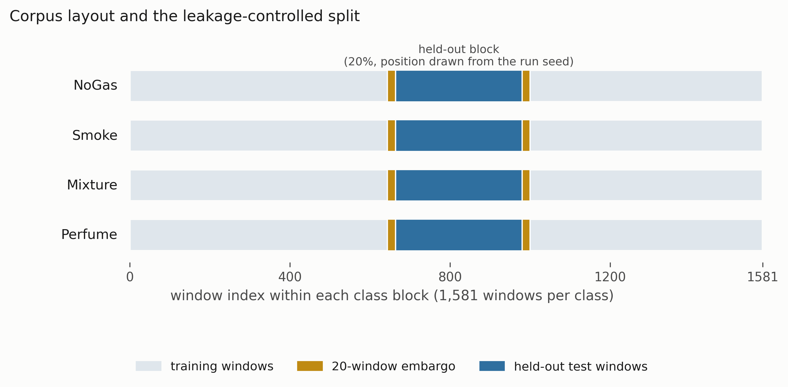

**Fig. 1. Corpus layout and the leakage-controlled split.** Each class occupies a contiguous block of 1,581 windows. A contiguous 20% is held out, with a 20-window embargo on each side, and the position of that block is drawn from the run seed.

### 3.2 The monitoring pipeline

The pipeline, which we call ARXIS, has five parts. At each inference cycle it takes a thermal image *I*ₜ and a sensor window **X**ₜ ∈ ℝ^(20×7) and returns a safety action *a*ₜ ∈ {0, …, 4} plus an explanation *E*ₜ. A **perception** component classifies the thermal image. An **anomaly** component scores the sensor window by reconstruction error against a normal-only model. A **coordination** component assembles the decision state. A **decision** component maps that state to an action. A **reasoning** component writes the operator-facing explanation.

The pipeline is advisory, and we want to be explicit about that. It sits in the alarm-management and operator-support layer and does not actuate anything. The action labeled *Emergency Shutdown* is a recommendation that the operator start the facility's existing ESD procedure. It does not command a trip. The safety instrumented function stays independent, deterministic and separately verified, which keeps the arrangement consistent with the independence expected of separate protection layers under layer-of-protection analysis. We are deliberately not making a claim about what IEC 61511 (IEC 2016) does or does not permit for learned components, since that is a certification question outside the scope of this study. The architectural point is narrower and does not depend on it: the model recommends an action, it does not command a trip, and the protective function is implemented, verified and actuated independently of anything reported here. All results below were obtained with the pipeline in that position, and removing it entirely leaves the facility's protective function intact. We treat this as a design requirement rather than a caveat. A single learned component selecting across both the alarm layer and the shutdown layer would collapse two protection layers into one common-cause element, and we do not see a defensible way around that.

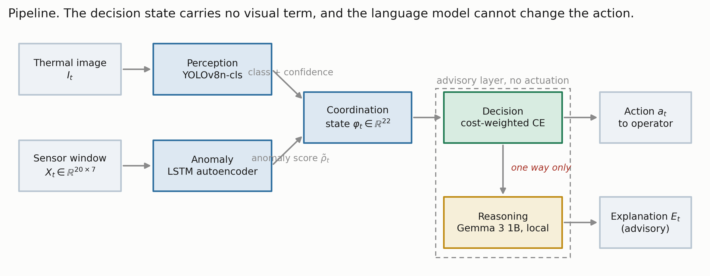

**Fig. 2. The pipeline.** Thermal evidence reaches the perception and explanation paths but never the decision state, and the language model sits downstream of an action it cannot alter.

| Action | Label | Operational response |
|---|---|---|
| 0 | Monitor | Routine monitoring, no operator notification |
| 1 | Increase sampling | Elevated scan frequency and event logging |
| 2 | Request verification | Secondary sensor check and event logging; no alarm is raised |
| 3 | Raise alarm | Automated alarm, incident logging, field dispatch |
| 4 | Emergency shutdown | Recommend initiating the facility ESD procedure |

**Table 3. Safety-action space and its alarm boundary.** Actions 3 and 4 are alarm-grade: each places a notification in front of an operator. Actions 1 and 2 do not, and every metric in Section 3.5 follows that boundary exactly, counting escalation as *a* ≥ 3 and under-escalation as *a* ∈ {1, 2}. The boundary is a modeling choice about this implementation rather than a claim about how a verification request must be handled in general, and moving it would change several results in Sections 4.4 and 4.7.

### 3.3 Component models

**Perception.** Thermal images are classified with YOLOv8n-cls (Jocher et al. 2023), the smallest classification variant in the family: images resized to 224 by 224, pretrained initialization, AdamW at 10⁻³ with cosine annealing, weight decay 10⁻⁴, batch size 32, 50 epochs, with random flip, rotation and brightness augmentation, on an 80/20 stratified split of the 6,400 frames. The full thermal set was used: the classifier was trained and validated on it, and the trained weights are among the released artifacts, so the perception component reported here is the one the assembled pipeline runs.

What we did not do is carry the sensor-side partitioning discipline across to the images. The image split is randomized over frames captured consecutively within a single session, so it is exposed to the same leakage mechanism the block-wise holdout was built to avoid, and adjacent thermal frames are close to duplicates. The figure in Section 4.1 should therefore be read as an optimistic upper bound on perception accuracy rather than as an independent estimate, and re-splitting the image set block-wise is work we have not done.

That leaves the two halves of the pipeline evaluated to different standards, which is worth saying plainly rather than leaving a reader to notice. The sensor path is measured under a leakage-controlled protocol whose sensitivity we quantify in Section 4.2; the perception path is not. No claim in this paper rests on the perception number, because the decision state carries no visual term and every safety result below is computed from actions the sensor path selected. But the multimodal system as a whole has not been validated to the standard of Sections 4.2 through 4.8, and we would not want it read that way.

**Anomaly detection.** An LSTM autoencoder with a single-layer encoder and decoder, hidden dimension 32 and a linear output, trained on NoGas windows only, following Malhotra et al. (2016). The mean reconstruction error over the full 20-step window is the anomaly score. The threshold τ is the 95th percentile of reconstruction error on NoGas training windows only, and evaluation is on held-out windows (Section 4.1). That distinction turns out to matter a great deal.

**Coordination.** The 22-dimensional decision state is

&nbsp;&nbsp;&nbsp;&nbsp;φₜ = [ ρ̃ₜ , **X**ₜ[−1,:] , **δ**ₜ , **σ**ₜ ] ∈ ℝ²² .................................................(1)

with ρ̃ₜ the normalized anomaly score, **X**ₜ[−1,:] the current seven-channel reading, **δ**ₜ the per-sensor change across the window, and **σ**ₜ the per-sensor standard deviation. There is no visual term in the state. Thermal evidence feeds the perception and explanation paths, not the action.

**Decision.** A feedforward network with a dueling value and advantage head (Wang et al. 2016), mapping φₜ to five action scores, trained by cost-weighted cross-entropy. Not by reinforcement learning, despite the architecture's provenance. Target actions come from a deterministic map *a*\*(·) from class to acceptable action set: NoGas to {0}, Smoke to {3}, Mixture to {4}, Perfume to {1, 2}. Each sample carries a loss weight *w*(*g*ₜ) equal to *c*_miss for hazardous classes and *c*_false otherwise, with *C* = *c*_miss / *c*_false. The objective is

&nbsp;&nbsp;&nbsp;&nbsp;*L*(θ) = − (1/*N*) Σₜ *w*(*g*ₜ) · log *p*_θ( *a*\*(*g*ₜ) | φₜ ) ..................................(2)

where *p*_θ is the softmax over action scores. The deployed configuration uses *C* = 8:1, and Section 4.5 sweeps the rest.

Two consequences of Eq. 2 bound what can honestly be claimed from any of this, and a reader will derive them anyway, so we may as well.

The target action is a deterministic function of the class label. Decision accuracy comes out as four-class classification accuracy composed with a fixed map, not a separate quantity measured on a separate task. What differs between the "decision" framing and the "classification" framing is the error metric, not the task, and the error metric is what this paper is about.

A rule that applies *a*\*(·) to the true label reaches 100% decision accuracy by construction. Such a rule consumes the very label it is supposed to infer, so it is not deployable. Where it appears below we call it a label-function reference, never a baseline. The deployable version of the same idea is the depth-3 threshold rule described next.

**Reasoning.** Explanations are generated locally with Gemma 3 1B served through Ollama (Gemma Team 2025), prompted with the gas class, classification confidence, normalized anomaly score and threshold, and the selected action, capped at 150 tokens. Nothing leaves the device. The explanation is advisory and sits off the safety-critical path: the action is fixed by the decision component and the generated text cannot change it. That separation was deliberate, on the reasoning that a fluent explanation inconsistent with the decision is a hazard in a control room rather than an aid. We should be clear that the explanation component is described here as part of the system and is not evaluated anywhere in this paper. No result below depends on it.

### 3.4 Comparators

Eleven comparators, one protocol. The cost-weighted policy of Eq. 2; an unweighted network of identical topology; a multilayer perceptron (256-256-128); cost-sensitive gradient boosting (300 trees); an RBF support-vector classifier; a random forest (300 trees); a recurrent network over K = 10 consecutive states; conservative Q-learning with a TD(0) bootstrap and a conservative penalty on non-behavior actions; k-nearest neighbours with k = 5; a threshold rule, meaning a depth-3 decision tree restricted to the seven raw current-sensor channels, which is interpretable, deployable and about as close to current practice as we could make it; and CUSUM (Page 1954), a one-sided cumulative-sum detector on the anomaly score, with μ₀ and σ estimated from NoGas training windows and the decision threshold set on the training partition. CUSUM is two-class by construction. It emits only *Monitor* and *Raise alarm*, so it cannot separate Smoke from Mixture and its decision accuracy is not comparable with the multiclass models. Over five seeds it scores 0.4994 ± 0.0004 on decision accuracy, and a reader should not take that as evidence that the detector failed; it is an artifact of scoring a two-state output against a four-class target map. Its missed-hazard rate of 0.0013 and escalation adequacy of 0.9987 are directly comparable, because those definitions do not depend on how many classes a model can express.

Not every comparator appears in every experiment, so the subsets are worth stating plainly, since they differ and a reader should not read across them as though they did not. Ten of the eleven appear in the 30-run in-distribution comparison of Section 4.3, alongside the ordinal cost objective introduced in Section 4.5. CUSUM is left out of that table for the reason just given, and its five-seed figures are the ones quoted above. The leave-one-class-out grid uses the same eleven rows, CUSUM excluded again because a two-state output makes its escalation column degenerate by construction. The degradation campaign uses six, fixed before any of its results were seen: one cost-weighted network, its unweighted twin, one plain feedforward model, two tree ensembles and the interpretable rule. The action-selection matrices and the anomaly-input probe use seven, adding the kernel and nearest-neighbor models to that set and dropping the unweighted network. Calibration uses only the cost-weighted policy, because the four estimators being compared are properties of a single model's confidence rather than of the model inventory, and the ablation likewise holds the architecture fixed so that the feature set is the only thing varying.

### 3.5 The metric set

Five quantities rather than one. This set is the methodological proposal.

**Decision accuracy.** The share of test windows assigned an action in *a*\*(*g*ₜ). Reported for continuity with prior work. It is not a safety metric and we do not treat it as one. Of the five quantities below, missed-hazard rate and escalation adequacy are safety-relevant in the sense that each corresponds to a distinct operational failure; the high-severity false-alarm rate is an alarm-management quantity with safety consequences at sufficient rate; and decision accuracy is neither. We should also be clear that these four together are a proposed subset of what matters operationally, not a definition of safety.

**Missed-hazard rate.** This is the share of hazardous windows, Smoke and Mixture together, assigned the passive *Monitor* action. Only *a* = 0 counts. Assigning a hazardous window to *Raise Alarm* when *Emergency Shutdown* was the target is not a miss, because an operator still gets notified. The limitation is that assigning a hazardous window to *Increase Sampling* or *Request Verification* is also not a miss, even though nobody is notified. Section 4.4 shows that this is not an academic worry, which is why the next metric exists.

**Escalation adequacy.** Here we count the share of hazardous windows assigned an alarm-grade action (*a* ≥ 3), which is what decides whether an operator hears about the hazard. We also report under-escalation, the share receiving *a* ∈ {1, 2}.

**High-severity false-alarm rate.** The share of clean windows that gets assigned *a* ≥ 3. Worth noting that the project's original evaluation code divided false alarms by the number of alerts rather than the number of clean windows; the two agree only at zero, which is why the discrepancy went unnoticed. Everything here uses the per-clean-window definition. Section 4.7 also expresses it as alarms per 1,000 clean windows, because a bare rate is not comparable with the envelopes an operator actually works inside (EEMUA 2013; ISA 2016).

**Bounds on every zero.** An observed zero is not a demonstrated zero. All zero-count claims carry a one-sided 95% Clopper-Pearson upper bound (Clopper and Pearson 1934). Pooled across five seeds this study sees 3,160 hazardous and 1,580 clean test windows, so a zero supports "at most 0.095%" and "at most 0.189%" respectively. Getting below 10⁻³ would need something like 2,995 consecutive zero-miss observations, which puts the usual "0.0000" in a table into perspective.

### 3.6 Protocol and statistics

Two protocols are used, and the distinction matters for how the results should be read.

The **five-seed protocol** (42, 1337, 7, 2024, 99), each seed carrying its own block position, is used for the experiments that vary something other than the model: the leave-one-class-out grid, the perturbation suite, the ablation, the calibration study and the anomaly-input probe. It is adequate there because the comparison of interest is between conditions, not between models.

The **model comparison itself is run 30 times**, with seed, held-out block position and a hyperparameter draw all varying per run (Bouthillier et al. 2021). Five paired observations cannot support a model ranking: the two-sided Wilcoxon signed-rank test has a minimum attainable *p*-value of 2^(1−n) = 0.0625 at *n* = 5, so no comparison can reach α = 0.05 at any effect size, and reporting one would be reporting the design rather than the data. With 30 runs we can do better than a disclaimer. We use the Bayesian correlated *t*-test of Benavoli et al. (2017) with correlation ρ = *n*_test/(*n*_train + *n*_test) = 0.202, and a region of practical equivalence of ± 1 accuracy point, chosen because a difference smaller than that would not change a procurement decision on this corpus. That returns three posterior probabilities per comparison: that one model is practically better, that the other is, and that the two are practically equivalent. The last of those is a positive statement, which a null hypothesis test cannot give.

One assumption in that test deserves to be stated rather than inherited quietly. Benavoli et al. (2017) derive the correlation term for correlated resampling, canonically *k*-fold cross-validation, where runs are correlated because their training sets overlap, and where ρ = *n*_test/*n*_total is itself a working approximation rather than an identity. Our design is not *k*-fold. Seed, held-out block position and a hyperparameter draw all vary per run, which is the fuller variance accounting Bouthillier et al. (2021) argue for. The training partitions still overlap heavily, roughly 80% of the same windows on every run, so a positive correlation is certainly present and treating the runs as independent would be anti-conservative. But the particular value 0.202 is carried across from a design that is not quite ours. We therefore report the comparison at a range of ρ in Section 4.3 rather than at a single value, and we would rather a reader see how much rides on it than take our word that it is small.

Determinism guards are enabled and execution is single-threaded throughout.

---

## 4. Results

### 4.1 Component behavior

**Perception.** The thermal classifier reached 98.8% top-1 accuracy on 1,280 held-out validation images (**Table 4**), with perfect recall for Smoke and Mixture. The 15 misclassifications all sat on the NoGas and Perfume boundary.

| Gas class | Precision | Recall | F1 | Accuracy (%) |
|---|---|---|---|---|
| Mixture | 1.000 | 1.000 | 1.000 | 100.0 |
| NoGas | 0.990 | 0.963 | 0.976 | 96.3 |
| Perfume | 0.972 | 0.991 | 0.981 | 99.1 |
| Smoke | 0.991 | 1.000 | 0.995 | 100.0 |
| Overall | 0.988 | 0.988 | 0.988 | 98.8 |

**Table 4. Perception component, 1,280 held-out validation images.** Obtained under a randomized image split rather than the block-wise protocol used on the sensor side (Section 3.3), so read as an optimistic upper bound rather than an independent estimate.

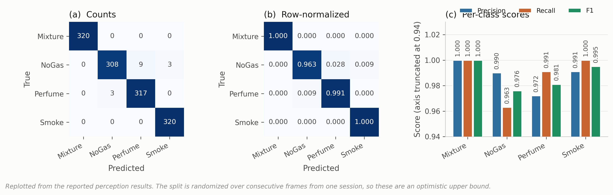

**Fig. 3. Thermal classifier behavior on 1,280 held-out validation images.** (a) Counts, (b) row-normalized, (c) per-class scores. All 15 errors fall on the NoGas and Perfume boundary; neither hazardous class is confused with a non-hazardous one, which is what matters once the class label is mapped to an action. The split is randomized over consecutive frames from a single session, so these values should be read as an optimistic bound rather than an independent estimate.

**Anomaly detection.** Two questions decide how much weight this component can carry, and both are easy to answer wrongly.

*Does the score track hazard?* Mean reconstruction error by class comes out at NoGas 0.736, Perfume 1.543, Mixture 117.72 and Smoke 229.25 (Fig. 4a). Hazardous conditions separate from benign ones by two orders of magnitude, so the score is usable as a hazard indicator. It is not monotone in target severity, though: Mixture carries the higher target action, *Emergency Shutdown*, yet scores well below Smoke. The score is best read as evidence of abnormality rather than as a severity estimate, and no result in this paper leans on it being the latter.

*Does the partition used to fit the threshold matter?* Considerably, and in a way that is worth showing rather than asserting. Setting τ at the 95th percentile of all NoGas windows and then evaluating on those same windows returns AUC 0.962 at a false-positive rate of exactly 5.000%, which is simply the nominal value a 95th-percentile threshold produces on the sample that defined it. That number measures the definition, not the detector. Fitting τ on NoGas training windows only and evaluating on held-out windows gives **ROC-AUC 0.9928 ± 0.0053, TPR 0.7363 ± 0.0949 and FPR 0.0000 ± 0.0000** across five seeds (Fig. 4b). Discrimination improves and no false positive is observed, while sensitivity falls by roughly seven points. The held-out figures are the ones we report, and the in-sample pair is shown alongside in Fig. 5a only to make the size of the difference visible.

The zero deserves the same treatment we give every other zero in this paper. No false positive was observed on the held-out NoGas windows; across the five partitions that is 1,580 windows, which bounds the underlying rate at 0.189% with 95% confidence and no lower.

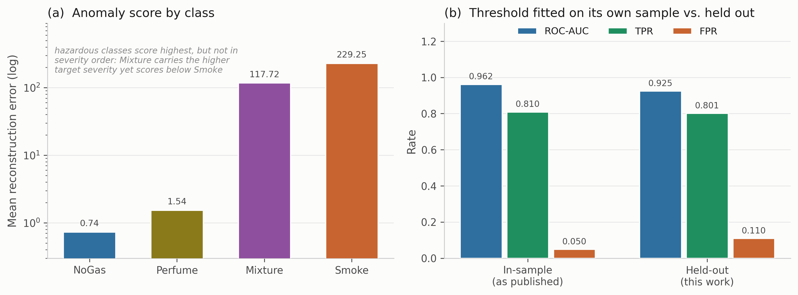

**Fig. 4. Anomaly component.** (a) Mean reconstruction error by class, log scale. (b) Operating point with the threshold fitted on its own sample, against the threshold fitted on training windows and evaluated on held-out windows.

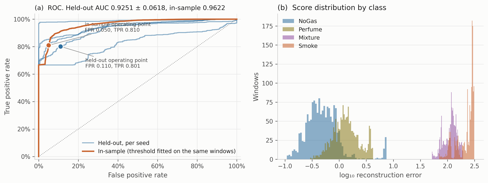

**Fig. 5. Anomaly detector in detail.** (a) ROC curves, one per seed for the held-out evaluation, against the in-sample curve, with both operating points marked. (b) Score distributions by class on a log axis. The gap between the benign pair and the hazardous pair is close to two decades, while NoGas and Perfume overlap substantially, which is where the residual errors come from.

### 4.2 How much of a reported accuracy is window overlap

Section 3.1 justifies the block-wise split on the grounds that a random split over overlapping sliding windows places near-duplicates in both partitions. That argument is standard (Dennler et al. 2022) but we had not seen it quantified on this corpus, and an argument of that kind is cheap to make and worth measuring. Six models were trained under four partitioning protocols: a uniformly random 80/20 split over all windows; a contiguous per-class block with no separation band; the same block with the 20-window embargo used everywhere else in this paper; and a stricter temporal protocol that trains on the first 60% of each class block, tests on the last 20% and discards the middle 20% entirely (**Table 5**, Fig. 6).

| Model | Random split | Blocked, no embargo | Blocked + embargo | Train early, test late |
|---|---|---|---|---|
| Cost-weighted policy | 0.9959 | 0.9671 | 0.9623 | 0.9478 |
| Multilayer perceptron | 0.9940 | 0.9616 | 0.9612 | 0.9726 |
| Gradient boosting | 0.9940 | 0.9636 | 0.9634 | 0.6858 |
| Random forest | 0.9935 | 0.9772 | 0.9769 | 0.7080 |
| k-nearest neighbors | 0.9929 | 0.9524 | 0.9521 | 0.9566 |
| Threshold rule | 0.9223 | 0.9294 | 0.9297 | 0.6349 |
| **Mean** | **0.9821** | **0.9585** | **0.9576** | **0.8176** |

**Table 5. Decision accuracy under four partitioning protocols,** five seed-varying runs each.

A random split adds between 1.66 and 4.08 accuracy points for every learned model, 3.09 points on average across the five of them, and 2.45 points averaged over all six including the threshold rule. Reported at four significant figures on a saturated benchmark, that is the difference between 0.99 and 0.96, which is roughly the spread that separates published results on this corpus from one another. We would not claim this explains any particular published number, and we have not re-run anyone else's method. What it does establish is that on this corpus the partitioning protocol moves accuracy by more than the models do, so comparisons across studies that use different protocols carry little information.

Two details are worth more than the headline. First, **the embargo contributes almost nothing**: 0.9585 without it against 0.9576 with it. The block structure does the work, and the 20-window gap we were careful about turns out to be close to a rounding error. We report that because we expected the opposite. Second, **the threshold rule is the one model a random split does not help**, losing 0.74 points instead of gaining. It reads only the seven current sensor values, so it has no capacity to exploit the near-duplication that a random split introduces; the learned models do, and they use it.

The last column is a different test and a harsher one. Training on early windows and testing on late ones, with a gap between, costs gradient boosting 27.8 points, the random forest 26.9 and the threshold rule 29.5, while the perceptron and k-nearest neighbors barely move. Within-session drift is confounded with position in each class block, so this protocol asks a question closer to deployment than anything else here, and the models disagree about it sharply.

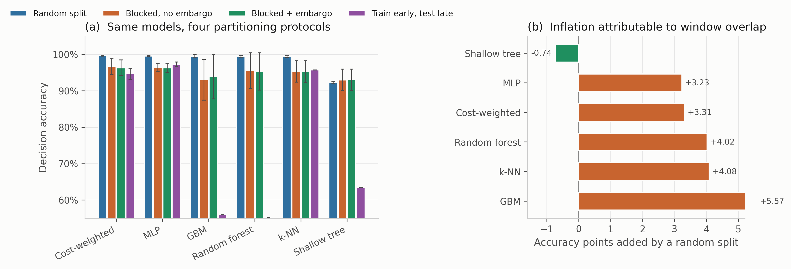

**Fig. 6. Protocol sensitivity.** (a) Decision accuracy for six models under four partitioning protocols, mean ± 1 SD over five runs. (b) Accuracy points added by a random split relative to the blocked, embargoed split used throughout this paper. Only the threshold rule, which reads no temporal features, fails to benefit.

### 4.3 In distribution, the models are not distinguishable

Every comparator was trained 30 times, with the held-out block position, the initialization seed and a hyperparameter draw all varying per run, and evaluated on the corresponding held-out partition (**Table 6**, Fig. 7).

| Model | Decision accuracy | SD | Missed-hazard | Escalation | High-severity FA | Expected cost | P(equivalent to cost-weighted) |
|---|---|---|---|---|---|---|---|
| Random forest | **0.9746** | 0.0222 | 0.0000 | 1.000 | 0.0000 | **0.0404** | 0.349 |
| Recurrent (LSTM) | 0.9648 | 0.0245 | 0.0000 | 0.999 | 0.0000 | 0.0656 | 0.732 |
| Gradient boosting | 0.9627 | 0.0252 | 0.0063 | 0.992 | 0.0000 | 0.0911 | 0.591 |
| Unweighted network | 0.9618 | 0.0261 | 0.0000 | 1.000 | 0.0000 | 0.0608 | **0.960** |
| Multilayer perceptron | 0.9618 | 0.0276 | 0.0003 | 1.000 | 0.0000 | 0.0625 | **0.938** |
| **Cost-weighted policy** | 0.9608 | 0.0317 | 0.0000 | 1.000 | 0.0000 | 0.0631 | reference |
| Conservative Q-learning | 0.9562 | 0.0304 | 0.0000 | 1.000 | 0.0000 | 0.0792 | 0.708 |
| Support-vector classifier | 0.9506 | 0.0268 | 0.0000 | 1.000 | 0.0000 | 0.0884 | 0.448 |
| k-nearest neighbors | 0.9497 | 0.0190 | 0.0000 | 1.000 | 0.0000 | 0.0855 | 0.416 |
| Threshold rule | 0.9179 | 0.0435 | 0.0000 | 1.000 | 0.0000 | 0.1226 | 0.012 |
| Ordinal cost objective | 0.7472 | 0.0054 | 0.0000 | 1.000 | 0.0000 | 0.2585 | 0.000 |

**Table 6. Model comparison over 30 randomized runs.** Expected cost is the mean of the cost matrix defined in Section 4.5 and is reported so the comparison is not carried entirely by accuracy. The final column is the posterior probability of practical equivalence to the cost-weighted policy under a Bayesian correlated *t*-test with a region of practical equivalence of ± 1 accuracy point.

Three things follow, and the third is the one the paper needs.

The ten comparators other than the ordinal objective span 5.66 accuracy points, from 0.9179 to 0.9746. Highest accuracy and lowest expected cost belong to the **random forest**; the cost-weighted policy places sixth. The **depth-3 threshold rule on seven raw sensor values** sits 5.7 points behind the best learned model, which is a wider gap than the five-seed protocol suggested and worth stating plainly rather than glossing.

The safety metrics again fail to discriminate. Every comparator except gradient boosting records no observed missed hazard and escalation adequacy of 1.000, and no comparator produces a single high-severity false alarm across 30 runs. Pooled over 30 runs that is 18,960 hazardous and 9,480 clean windows, bounding the underlying rates at 0.016% and 0.032% respectively.

With 30 runs we can now say something positive rather than merely declining to rank. The cost-weighted policy is **practically equivalent to the unweighted network with posterior probability 0.960**, and to the multilayer perceptron with probability 0.938. Removing the cost weighting entirely, in other words, is very likely to make no difference that matters on this corpus. Equivalence to the recurrent network (0.732), conservative Q-learning (0.708) and gradient boosting (0.591) is weaker but still the most probable outcome in each case. Two comparisons resolve: the random forest is probably better (posterior 0.631) and the threshold rule is probably worse (0.988). This is a different and more useful statement than "no significant difference was detected", and it is only available because the run count was raised.

**How much of that depends on the correlation term.** Section 3.6 flags that ρ = 0.202 is borrowed from a cross-validation setting rather than derived for this one, so we swept it from 0, which treats the runs as independent, up to 0.5, which assumes far more correlation than 30 randomized partitions plausibly carry (**7**).

| Comparison | ρ = 0 | ρ = 0.10 | ρ = 0.202 | ρ = 0.30 | ρ = 0.50 |
|---|---|---|---|---|---|
| Unweighted network | 1.000 | 0.994 | **0.960** | 0.901 | 0.740 |
| Multilayer perceptron | 1.000 | 0.989 | **0.938** | 0.866 | 0.691 |
| Recurrent (LSTM) | 0.984 | 0.847 | 0.732 | 0.638 | 0.476 |
| Conservative Q-learning | 0.971 | 0.817 | 0.709 | 0.620 | 0.466 |
| Gradient boosting | 0.971 | 0.748 | 0.591 | 0.488 | 0.341 |
| Support-vector classifier | 0.471 | 0.477 | 0.448 | 0.408 | 0.318 |
| k-nearest neighbors | 0.388 | 0.436 | 0.417 | 0.381 | 0.298 |
| Random forest | 0.164 | 0.316 | 0.349 | 0.346 | 0.298 |
| Threshold rule | 0.000 | 0.001 | 0.011 | 0.032 | 0.083 |
| Ordinal cost objective | 0.000 | 0.000 | 0.000 | 0.000 | 0.000 |

**Table 7. Posterior probability of practical equivalence to the cost-weighted policy against the assumed correlation ρ.** The deployed value is 0.202. Raising ρ widens the posterior and moves mass out of the region of practical equivalence, so the probabilities fall monotonically; what does not change is which of the three outcomes is most probable in each row.

The direction of every comparison is stable across the whole range. The random forest remains the more probable winner at every ρ, the threshold rule and the ordinal objective remain the more probable losers at every ρ, and the unweighted network and the perceptron remain practically equivalent to the reference as the single most probable outcome even at ρ = 0.5, where the posterior is far wider than this design warrants. What does move is strength: the headline 0.960 for the unweighted network falls to 0.740 under the most pessimistic assumption we tried. So the qualitative claim, that removing the cost weighting probably changes nothing that matters, survives the assumption; the precise number attached to it does not, and should be read as conditional on ρ.

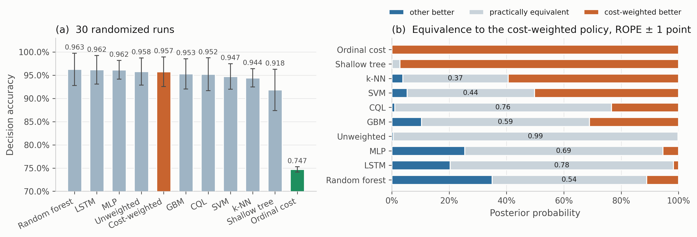

**Fig. 7. Model comparison over 30 randomized runs.** (a) Decision accuracy, mean ± 1 SD, with the cost-weighted policy highlighted and the ordinal cost objective of Section 4.6 shown in green. (b) Posterior probabilities from the Bayesian correlated *t*-test against the cost-weighted policy, with a region of practical equivalence of ± 1 accuracy point.

Looking at where the actions land makes the saturation concrete (Fig. 8). Every comparator sends essentially all Smoke windows to *Raise alarm* and all Mixture windows to *Emergency shutdown*, and the only visible spread is on the NoGas and Perfume boundary, where models divide between *Monitor* and *Increase sampling* in slightly different proportions.

One detail there is a property of the action space rather than of any model, and it constrains what this study can say about intermediate responses. **Action 2, *Request verification*, is never selected, by any of the seven comparators in Fig. 8, on any run**, and the reason is structural rather than incidental. The target map sends Perfume to action 1, so action 2 is never a positive training target and cannot be scored correct under any model trained against that map. The nominal five-level ladder is in effect a four-level one, and nothing here measures how a model would use an intermediate verification step if one were reachable. We would not call that a failure of the models; it is an unresolved question in the action design. A verification action triggered by predictive uncertainty rather than by class identity is the obvious candidate, and it is not implemented.

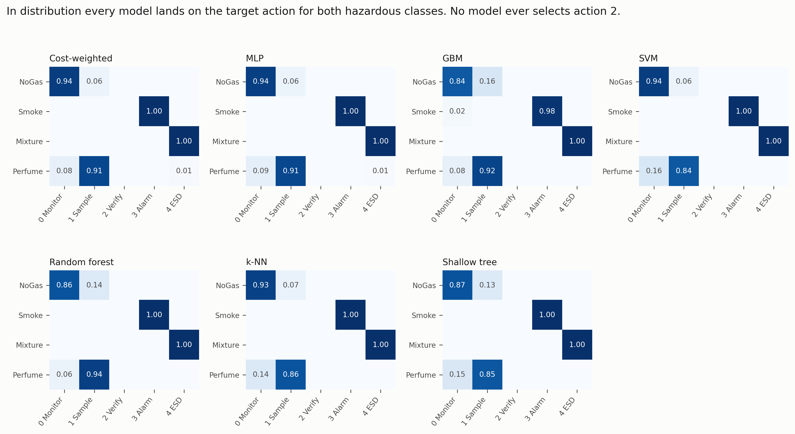

**Fig. 8. Action-selection matrices in distribution,** averaged over five seed-varying partitions. Rows are gas classes, columns are actions. The empty *Request verification* column is identical in every panel.

### 4.4 Out of distribution, the picture falls apart

Each hazardous class was withheld in turn, models retrained on the remaining three, then evaluated on every window of the withheld class. Feature scaling and anomaly normalization were fitted on the three training classes only, so no statistic of the withheld class leaks into training. (Our first pass fitted the scaler on all four, and we caught it only on a re-read; the numbers below are from the corrected run.) Held-out decision accuracy is zero by construction, since withholding a class removes its target action from the training label set and the model simply cannot emit it. What the model does instead is the interesting part. **Table 8** and Figs. 9 to 11 report it.

| Held-out | Model | Missed-hazard | 95% CP bound | **Escalation (a ≥ 3)** | **Under-escalation (a ∈ {1,2})** |
|---|---|---|---|---|---|
| Smoke | Cost-weighted policy | 0.0000 | ≤0.04% | 1.000 ± 0.000 | 0.000 |
| Smoke | Unweighted network | 0.0000 | ≤0.04% | 1.000 ± 0.000 | 0.000 |
| Smoke | Gradient boosting | 0.0000 | ≤0.04% | 1.000 ± 0.000 | 0.000 |
| Smoke | Random forest | 0.0000 | ≤0.04% | 1.000 ± 0.000 | 0.000 |
| Smoke | Conservative Q-learning | 0.0000 | ≤0.04% | 1.000 ± 0.000 | 0.000 |
| Smoke | Threshold rule | 0.0000 | ≤0.04% | 1.000 ± 0.000 | 0.000 |
| Smoke | Ordinal cost objective | 0.0000 | ≤0.04% | 0.982 ± 0.007 | 0.018 |
| Smoke | Support-vector classifier | 0.0042 | ≤0.56% | 0.928 ± 0.023 | 0.068 |
| Smoke | Recurrent (LSTM) | 0.0083 | ≤1.02% | 0.991 ± 0.009 | 0.000 |
| Smoke | k-nearest neighbors | 0.0116 | ≤1.38% | 0.943 ± 0.005 | 0.045 |
| Smoke | **Multilayer perceptron** | **0.0949** | **≤10.05%** | 0.902 ± 0.130 | 0.003 |
| Mixture | Gradient boosting | 0.0000 | ≤0.04% | **1.000 ± 0.000** | 0.000 |
| Mixture | Random forest | 0.0000 | ≤0.04% | **0.990 ± 0.010** | 0.010 |
| Mixture | Conservative Q-learning | 0.0000 | ≤0.04% | **0.506 ± 0.206** | 0.494 |
| Mixture | Ordinal cost objective | 0.0000 | ≤0.04% | **0.393 ± 0.235** | 0.607 |
| Mixture | Cost-weighted policy | 0.0000 | ≤0.04% | **0.245 ± 0.199** | 0.755 |
| Mixture | Unweighted network | 0.0003 | ≤0.08% | **0.217 ± 0.211** | 0.783 |
| Mixture | Support-vector classifier | 0.0003 | ≤0.08% | **0.005 ± 0.008** | **0.995** |
| Mixture | Recurrent (LSTM) | 0.0053 | ≤0.69% | **0.678 ± 0.112** | 0.316 |
| Mixture | Multilayer perceptron | 0.0070 | ≤0.87% | **0.242 ± 0.121** | 0.751 |
| Mixture | k-nearest neighbors | 0.0254 | ≤2.85% | **0.205 ± 0.072** | 0.770 |
| Mixture | Threshold rule | 0.2487 | ≤25.68% | 0.564 ± 0.399 | 0.188 |

**Table 8. Leave-one-class-out evaluation.** *n* = 1,581 windows per class per seed; bounds pooled over 7,905 evaluations. Scaling fitted on the three training classes only.

**In-distribution accuracy does not order out-of-distribution missed-hazard rate.** On withheld Smoke the multilayer perceptron, which sat fifth of ten by point accuracy in Table 6 and was practically equivalent to the reference there with posterior probability 0.938, assigns the passive *Monitor* action to 9.49% of unseen hazardous windows, with a 95% bound of 10.05%. Seven other models are bounded at 0.038%. That is a separation of more than two orders of magnitude, entirely invisible in Table 6, and the correlation between the two is close to nil (Pearson r = +0.13 for missed hazard on unseen Smoke, r = +0.25 for escalation on unseen Mixture, over the ten comparators of Table 6, Fig. 9). No accuracy-based selection procedure would have steered a team away from the failing model.

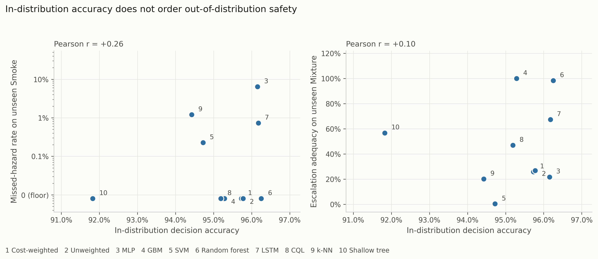

**Fig. 9. In-distribution accuracy against out-of-distribution safety.** Each point is one of the ten comparators in Table 6, plotted at its 30-run decision accuracy. The ordinal cost objective is left out because it was built to trade accuracy for escalation, so including it would answer the question by construction. If accuracy carried information about safety behavior these panels would show a trend, and they do not.

**Missed-hazard rate is not enough on its own, and this is the sharper of the two results.** On withheld Mixture, ten of eleven comparators are bounded below 2.9% on missed hazards and would pass any review conducted on that number. Their escalation adequacy runs from 0.5% to 100%, a factor of about 198. The support-vector classifier misses 0.03% of unseen hazardous windows while escalating 0.5% of them, which means it answers roughly 99.5% of the most hazardous class in the corpus with *Increase Sampling*, that being the only sub-alarm action any model here emits (Section 4.3). The miss metric records that as a clean sheet. The cost-weighted policy escalates 24.5% and under-escalates 75.5%. Gradient boosting, carrying none of the pipeline's safety machinery, escalates all of them.

Which metric you pick, rather than which model you pick, is what decides whether a model looks safe. A metric set reporting missed-hazard rate alone would rank the support-vector classifier above gradient boosting on this evidence, and would be wrong by a factor of 198 on the quantity that decides whether anyone is notified.

Two further patterns are worth noting now that every comparator is in the grid. The models that escalate fully on both unseen hazards are the two tree ensembles, but the ordering in between is not a simple split between trees and networks: the recurrent network reaches 0.678 on unseen Mixture and conservative Q-learning 0.506, both well above the cost-weighted policy at 0.245 and the perceptron at 0.242. And the deployable threshold rule fails safe on unseen Smoke while failing badly on unseen Mixture, at 24.87% missed (bound 25.68%). No comparator is uniformly best. That is itself an argument for reporting the full set rather than picking a favourite metric and defending it.

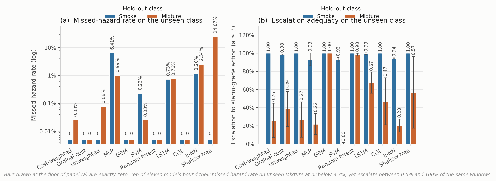

**Fig. 10. Behavior on a hazardous class withheld from training,** eleven comparators, mean over five seed-varying partitions. (a) Missed-hazard rate, drawn on a logarithmic axis because the values span three decades and a linear axis renders a 9.49% failure and a 0.03% one at visually indistinguishable heights. Bars at the floor line are observed zeros, bounded at 0.038%. (b) Escalation adequacy with ± 1 SD across seeds. The two panels disagree about which models are acceptable, which is the point of showing them together.

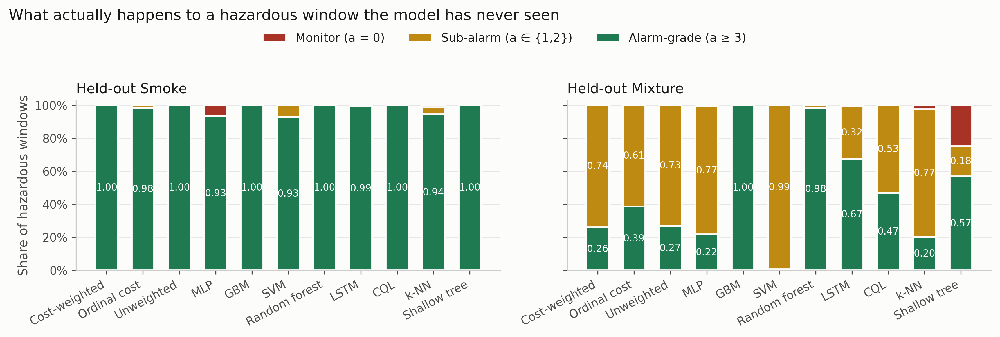

**Fig. 11. Where hazardous windows actually go.** Each bar decomposes the response to an unseen hazardous class into alarm-grade, sub-alarm and passive. The support-vector column under held-out Mixture is almost entirely sub-alarm, and its missed-hazard rate is 0.0003.

### 4.5 Cost asymmetry moves accuracy and nothing else

The loss-weight ratio *C* from Eq. 2 was swept across nine values with everything else fixed (**Table 9**, Fig. 12).

| Cost ratio *C* | Decision accuracy | SD | Missed-hazard | Escalation | High-severity FA |
|---|---|---|---|---|---|
| 1:1 (symmetric) | 0.9562 | 0.0386 | 0.0000 | 1.000 | 0.0000 |
| 2:1 | 0.9532 | 0.0418 | 0.0000 | 1.000 | 0.0000 |
| 4:1 | 0.9570 | 0.0390 | 0.0000 | 1.000 | 0.0000 |
| 6:1 | **0.9655** | 0.0272 | 0.0000 | 1.000 | 0.0000 |
| 8:1 (deployed) | 0.9623 | 0.0214 | 0.0000 | 1.000 | 0.0000 |
| 10:1 | 0.9589 | 0.0338 | 0.0000 | 1.000 | 0.0000 |
| 12:1 | 0.9533 | 0.0346 | 0.0000 | 1.000 | 0.0000 |
| 16:1 | 0.9427 | 0.0463 | 0.0000 | 1.000 | 0.0000 |
| 20:1 | 0.8389 | 0.1189 | 0.0000 | 1.000 | 0.0000 |
| *Label function* | *1.0000* | *0.0000* | *0.0000* | *1.000* | *0.0000* |

**Table 9. Cost-asymmetry sweep, five seeds per configuration.** The label-function row applies *a*\*(·) to the true class label. It reaches the ceiling by construction, consumes the label it is meant to infer, and is not a deployable baseline.

Missed-hazard rate is zero and escalation adequacy is 1.000 at every ratio, the symmetric 1:1 configuration included. Accuracy climbs to a maximum of 0.9655 at 6:1, sits at 0.9623 at the deployed 8:1, then falls away to 0.8389 at 20:1, twelve points below the peak with variance up roughly fourfold.

So the asymmetry produced no measurable safety benefit here and, past 6:1, cost accuracy. The reason looks structural rather than accidental. Because the target action is a deterministic function of a well-separated class label, and because a miss under this definition requires assigning a hazardous window to the class furthest from it in feature space, the miss rate is already sitting on the floor before any weighting is applied. There is nothing for the asymmetry to reshape.

We would not read that as evidence against cost-sensitive learning in general. The literature is clear that it works where the error surface is non-trivial (Elkan 2001). What this benchmark shows is that it cannot demonstrate the effect, and by extension that no saturated, well-separated benchmark can. Validating a safety objective seems to need either a corpus where hazardous and benign states genuinely overlap, or a metric under which sub-alarm responses carry cost. Section 4.4 supplies the second, and under it the cost-weighted policy is not the leader.

One more thing about the deployed configuration, which we have now resolved rather than deferred. C = 8:1 is not the accuracy optimum and was originally chosen on test-partition dispersion, which is not a defensible criterion. Re-selecting it needs a validation partition, and the obvious construction fails in an instructive way: a uniformly random validation subset carved from the training partition scores between 0.9948 and 0.9994 for every ratio from 1:1 to 8:1, because it inherits exactly the window overlap Section 4.2 measures. Those five configurations differ by up to 0.6 accuracy points on the test set and by 0.005 on this validation split, which is not enough to separate them; the criterion only registers anything at all once the ratio is large enough to destabilize training outright. Carving the validation band contiguously from the end of each class block instead, with the same 20-window embargo, restores discrimination and selects **C = 2:1** (validation 0.9606, test 0.9430), with 6:1 close behind at 0.9604. The deployed 8:1 is not selected under either criterion. We report the sweep in Table 9 as the substantive result and treat the selection question as settled against 8:1.

**An ordinal objective, since the evidence points at one.** Section 5.3 argues that Eq. 2 prices all wrong actions alike, so under-escalating a hazardous window and over-escalating it cost the same. That is a testable claim, so we tested it. We replaced the sample-weighted cross-entropy with direct minimization of expected cost under a matrix that prices distance and direction along the action ladder: for a hazardous class, silence costs 10, a sub-alarm response 5, and notifying at the wrong tier 1; for clean air, a high-severity alarm costs 4 against 1 for a nuisance action; for the VOC class, silence costs 2 and a high-severity alarm 3. The numbers are coarse and the structure, not their exact values, is what the experiment tests. We should set expectations for what follows before reporting it. This is a single untuned matrix, chosen by hand for its shape and never optimized, run once. It is offered as a test of a mechanism, not as a model we are proposing, and the result below should be read as evidence about the class of objective rather than as a performance claim for this particular member of it.

It works on the quantity it targets. On unseen Mixture the ordinal objective escalates **0.393 ± 0.235** of hazardous windows against 0.245 ± 0.199 for the cost-weighted policy, a relative improvement of about 60% while still recording no observed miss (Table 8). It is the only change to the objective anywhere in this study that moved escalation adequacy at all.

It also costs more than it returns, at least as specified. In-distribution accuracy falls to 0.7472 ± 0.0054, some 21 points below the cost-weighted policy, and expected cost under the matrix the objective itself minimizes rises from 0.0631 to 0.2585. The mechanism is visible in the action distribution: the model stops emitting *Monitor* for clean air and sends it to *Increase sampling* instead, because the matrix prices that error at 1 against 10 for a missed hazard, and the NoGas and Perfume classes overlap precisely where that trade is decided. The result is a system in a permanent state of mildly elevated sampling.

So what has been demonstrated is narrow, and we would rather bound it ourselves than have a reader do it. The mechanism is confirmed: pricing direction along the action ladder moves escalation, where scalar reweighting did not. What has not been demonstrated is a cost matrix worth deploying. A matrix that buys 15 points of escalation on an unseen hazard by paying 21 points of accuracy on clean air is not one we would put in front of an operator, and the optimum over the space of such matrices is not something a single untuned draw can locate. This is a methodological result about a family of objectives, not a new best model, and the row it occupies in Tables 6 and 8 should be read that way rather than as a competitor to the rows above it. Tuning the ratio between the hazardous-class and clean-air penalties is the obvious next step, and we have not taken it.

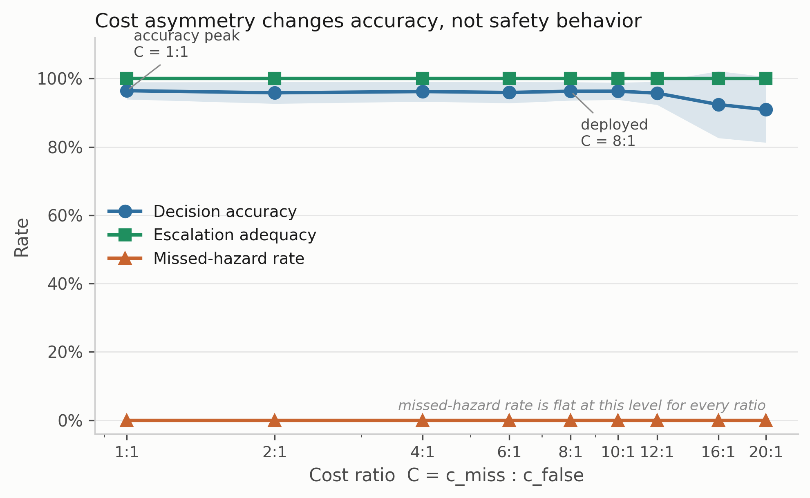

**Fig. 12. Cost-asymmetry sweep.** Shading is ± 1 SD across five seed-varying partitions.

### 4.6 What the decision state actually contributes

The decision state was ablated by feature group with the architecture and protocol held fixed (**Table 10**, Fig. 13).

| Decision state | *d* | Decision accuracy | SD | Δ vs. full | Missed-hazard | Escalation |
|---|---|---|---|---|---|---|
| Full state | 22 | 0.9612 | 0.0110 | reference | 0.0000 | 1.000 |
| Without per-sensor σ | 15 | 0.9601 | 0.0357 | −0.11 pp | 0.0000 | 1.000 |
| Without anomaly score | 21 | 0.9574 | 0.0206 | −0.38 pp | 0.0000 | 1.000 |
| Without per-sensor δ | 15 | 0.9399 | 0.0413 | −2.14 pp | 0.0000 | 1.000 |
| Without δ and σ | 8 | 0.8875 | 0.0730 | −7.37 pp | 0.0000 | 1.000 |
| Current readings only | 7 | 0.8845 | 0.0764 | −7.67 pp | 0.0000 | 1.000 |
| Anomaly score only | 1 | 0.7513 | 0.1349 | −21.00 pp | 0.0000 | 1.000 |

**Table 10. Decision-state ablation, five seeds.**

Temporal features carry the accuracy. Dropping both δ and σ costs 7.37 points, and a single anomaly score on its own still manages 75.1%, which surprised us. But missed-hazard rate stays at zero and escalation adequacy stays at 1.000 in every condition, including the one-dimensional state. No feature group in this decision state changes in-distribution safety behavior at all.

That is another instance of the same trap. An ablation reported on accuracy alone would seem to identify which features "drive safety behavior," and it would be measuring something else entirely.

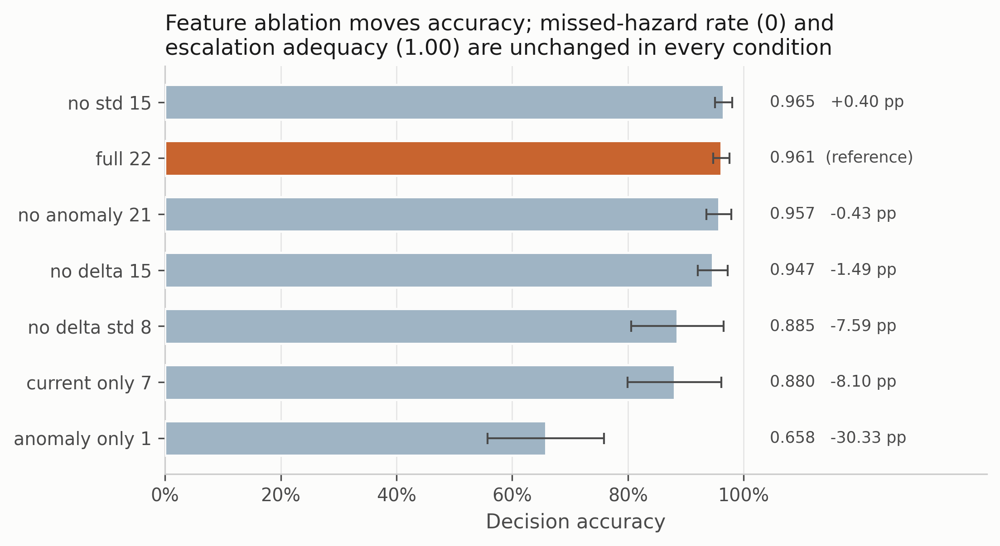

**Fig. 13. Decision-state ablation.** Bars are mean ± SD decision accuracy. Missed-hazard rate and escalation adequacy are constant across every condition.

Retraining without a feature answers whether the feature is necessary. A sharper question, and the one that matters if an upstream component can fail in service, is what a trained model does when that input goes wrong while everything else stays correct. We swept the anomaly score across its full range on every test window, holding the other twenty-one features fixed, and recorded how often the selected action moved (Fig. 14).

The models divide sharply. For the threshold rule the answer is zero by construction, since it reads only the seven raw channels. For k-nearest neighbors, the support-vector classifier and the multilayer perceptron the action moves on under 4% of windows; for the cost-weighted policy on 8.0 ± 5.8% and for the random forest on 16.1 ± 7.6%. Gradient boosting is the outlier at 60.6 ± 7.9%. Whatever the anomaly channel contributes to the other models, it is close to inert at inference time; for gradient boosting it is load-bearing.

The consequence shows up in the safety metrics, and only for that one model. Forcing the anomaly score to zero, which is what a failed or unconnected autoencoder would supply, leaves the missed-hazard rate of every other comparator at zero and moves gradient boosting from 0.0098 to **0.3405**, with escalation adequacy falling from 0.990 to 0.495. A model sitting third by accuracy in Table 6 turns out to have its safety behavior resting on a single upstream input, and nothing in the accuracy column or the ablation table shows it.

We would not over-read a single conditional probe. The override is synthetic, the other features are held at values that in reality would co-vary with the anomaly score, and one corpus is a narrow basis for a claim about any model family. Still, the finding is consistent with two results we already had: gradient boosting is the model that fails silent under sensor loss (Section 4.7) and the one that escalates unseen Mixture perfectly while others do not (Section 4.4). A heavier dependence on the anomaly channel is a plausible common mechanism for all three, and it suggests that dependence on upstream components deserves to be measured rather than assumed, particularly where those components can fail independently of the model consuming them.

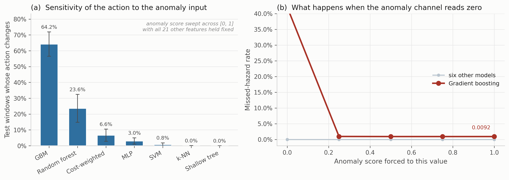

**Fig. 14. Dependence of the selected action on the anomaly input,** five seed-varying partitions. (a) Share of test windows whose action changes at any point as the anomaly score is swept across [0, 1] with all other features held fixed, mean ± 1 SD. (b) Missed-hazard rate against the forced anomaly value. Six comparators are flat; gradient boosting moves from 0.0098 to 0.3405 when the channel reads zero.

### 4.7 Under degradation, three distinct failure modes

Six models were put through additive noise (σ = 0.1 to 0.5), calibration drift (gain and baseline shift of ±10% to ±50%) and channel dropout (*k* = 1 to 7 of 7 sensors), each at graded severity, with all three safety metrics reported (**Table 11**, Figs. 15 and 16).

| Condition | Model | Decision acc. | Missed-hazard | Escalation | High-severity FA | Alarms per 1,000 windows |
|---|---|---|---|---|---|---|
| Clean | Cost-weighted | 0.962 | 0.0000 | 1.000 | 0.0000 | ≤ 1.9\* |
| Clean | Random forest | 0.977 | 0.0000 | 1.000 | 0.0000 | ≤ 1.9\* |
| Clean | Threshold rule | 0.930 | 0.0000 | 1.000 | 0.0000 | ≤ 1.9\* |
| Drift ±50% | Cost-weighted | 0.916 | 0.0000 | 1.000 | 0.0006 | 0.6 |
| Drift ±50% | Multilayer perceptron | 0.927 | 0.0003 | 0.999 | 0.0000 | 0 |
| Drift ±50% | Gradient boosting | 0.876 | **0.0775** | 0.890 | 0.0000 | 0 |
| Noise σ = 0.5 | Cost-weighted | 0.843 | 0.0000 | 1.000 | 0.1342 | 134 |
| Noise σ = 0.5 | Random forest | 0.889 | 0.0000 | 1.000 | 0.0063 | 6.3 |
| Dropout *k* = 1 | Cost-weighted | 0.883 | 0.0000 | 1.000 | 0.1171 | **117** |
| Dropout *k* = 1 | Threshold rule | 0.723 | 0.0000 | 1.000 | 0.2000 | **200** |
| Dropout *k* = 1 | Random forest | 0.974 | 0.0000 | 1.000 | 0.0000 | 0 |
| Dropout *k* = 3 | Cost-weighted | 0.793 | 0.0000 | 0.992 | 0.1532 | 153 |
| Dropout *k* = 3 | Multilayer perceptron | 0.851 | 0.0218 | 0.975 | 0.0234 | 23 |
| Dropout *k* = 7 | Cost-weighted | 0.318 | 0.0000 | 1.000 | **1.0000** | **1,000** |
| Dropout *k* = 7 | Threshold rule | 0.250 | 0.0000 | 1.000 | **1.0000** | **1,000** |
| Dropout *k* = 7 | Random forest | 0.355 | 0.0000 | 1.000 | 0.6000 | 600 |
| Dropout *k* = 7 | Multilayer perceptron | 0.332 | **0.5266** | 0.473 | 0.2000 | 200 |
| Dropout *k* = 7 | Gradient boosting | 0.381 | **0.6000** | 0.400 | 0.0000 | 0 |

**Table 11. Selected perturbation results**, with the full sweep in Fig. 15. Alarm burden is the high-severity false-alarm rate expressed per 1,000 clean windows, per detector, which keeps it independent of any particular duty cycle. \*The clean-condition burden is the Clopper-Pearson upper bound on an observed zero, not a point estimate.

Three failure modes separate cleanly, and no single metric tells them apart.

*Fail-loud.* The cost-weighted policy and the threshold rule record no observed missed hazards and full escalation right through complete sensor loss, and they do it by escalating everything. False-alarm rate reaches 1.000, meaning every clean window raises a high-severity alarm. Under EEMUA (2013) that is a hazard, not a safe failure. On the missed-hazard metric alone it is a perfect score.

*Fail-silent.* Gradient boosting records no false alarm at any severity and misses 60% of hazards at *k* = 7, escalation collapsing to 0.400. On the false-alarm metric alone, also a perfect score.

*Graceful, then brittle.* The random forest holds zero misses, full escalation and no false alarms out to *k* = 3, then jumps to a 60% false-alarm rate by *k* = 7.

The number that matters operationally is the first onset rather than the endpoint. Losing one sensor of seven takes the cost-weighted policy from zero to 117 high-severity alarms per 1,000 clean windows, and the threshold rule to 200, while the random forest is unaffected (Fig. 16).

Converting a rate into a burden is worth spelling out, because a bare rate is hard to place against the envelopes an operator works inside, whereas an alarm count is not. Any count per unit time needs a duty cycle. The corpus as distributed carries no timestamp column, but the acquisition protocol is documented: readings were logged at 2 s intervals (Narkhede et al. 2022), which puts a detector at 1,800 windows per hour. We still report alarms per 1,000 clean windows as the primary quantity, because that number is a property of the model and the hourly figure is a property of the deployment, but the conversion is now grounded rather than assumed. On that basis the single-sensor-loss figure is about 211 alarms per hour from one instrument. EEMUA (2013) treats something in the region of six alarms per hour as the upper limit of what an entire operator position can absorb. We would not press that comparison further. Model-generated indications are not the same object as a complete plant alarm system, and the conversion assumes a duty cycle we did not measure. What survives without any of those assumptions is the ordering and the magnitude: neither an accuracy table nor a missed-hazard table would have predicted that one lost channel separates these models by two orders of magnitude in alarm production.

The same arithmetic cuts the other way on the clean-condition rows, which is easy to miss. Every model records zero high-severity false alarms on clean data, and that sounds conclusive until the Clopper-Pearson bound is converted too. A zero across 1,580 clean windows supports only "at most 1.9 alarms per 1,000 windows", which under the same illustrative duty cycle would be roughly 3.4 per hour, already over half the EEMUA figure for an entire operator position. "Zero false alarms" is not yet evidence of an acceptable alarm load. Getting there needs observation counts one to two orders of magnitude beyond anything reported here.

We should add that below roughly 60% accuracy none of these models is doing the job in any useful sense. "Zero missed hazards" at 31.8% accuracy is a statement about how a model fails, not about whether it is fit for service.

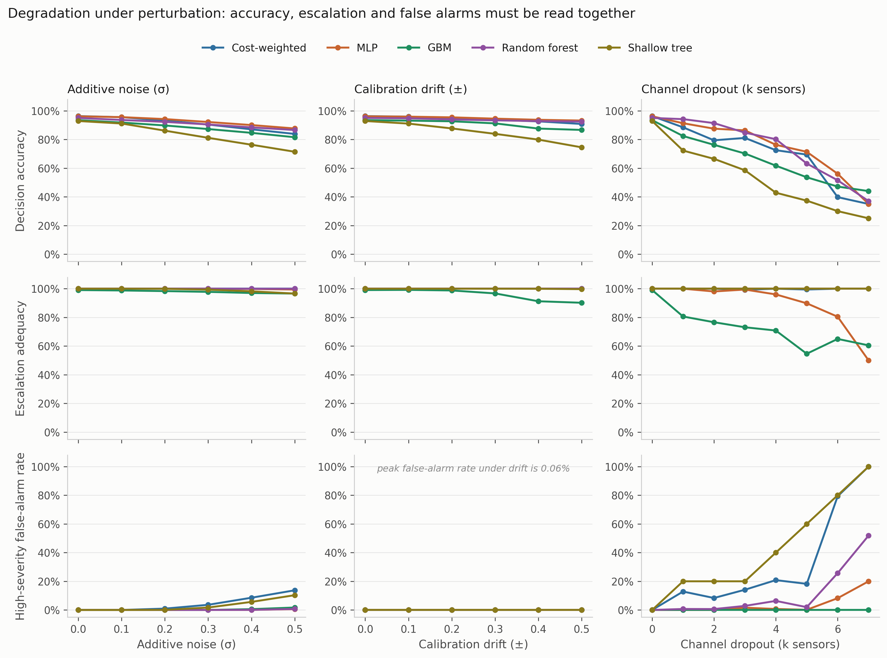

**Fig. 15. Graded perturbation suite.** Rows share a scale so the panels can be compared. Peak false-alarm rate under drift is 0.06%.

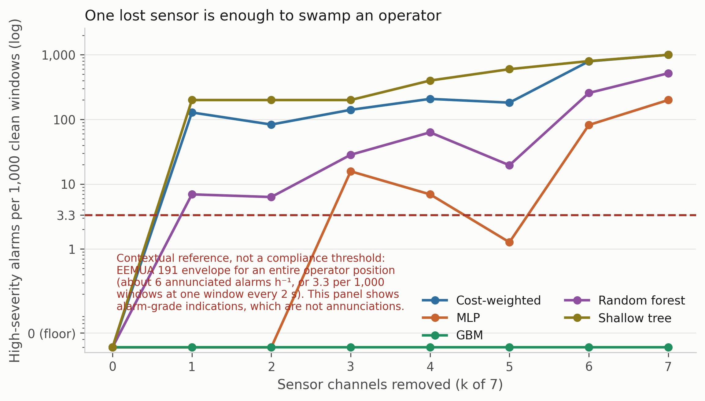

**Fig. 16. False-alarm rate expressed as alarm burden,** per 1,000 clean windows so the quantity does not depend on a duty cycle. The dashed line marks the EEMUA 191 long-term average envelope for a whole operator position, placed at its equivalent for one window every 2 s. Two of the five models cross it as soon as a single sensor is lost, two more cross it by the time three are gone, and gradient boosting never crosses it at any severity, because it fails in the other direction.

### 4.8 Calibration

Confidence matters here because any escalation threshold, and any deferral rule, would be set against it. Four estimators were compared on the corrected pipeline: the raw softmax, MC dropout with 20 passes, temperature scaling, and a five-member deep ensemble built from the same model class and objective as the single model rather than from a different one. Temperature is fitted on a calibration split carved out of training, never on the training logits themselves, and ECE uses equal-mass bins because confidence on this corpus piles up near 1 and equal-width bins leave most of the range empty (**Table 12**, Fig. 17).

| Estimator | ECE | SD | Bootstrap 95% CI | ECE on hazardous windows | Brier | NLL | Accuracy |
|---|---|---|---|---|---|---|---|
| Deep ensemble (5) | **0.0162** | 0.0129 | 0.0107 to 0.0253 | 0.0002 | 0.0552 | 0.1082 | 0.9663 |
| MC dropout (20) | 0.0222 | 0.0184 | 0.0150 to 0.0320 | 0.0002 | 0.0613 | 0.1145 | 0.9619 |
| Raw softmax | 0.0244 | 0.0187 | 0.0166 to 0.0342 | 0.0002 | 0.0628 | 0.1397 | 0.9628 |
| Temperature scaling | 0.0263 | 0.0194 | 0.0178 to 0.0358 | 0.0000 | 0.0640 | 0.1560 | 0.9628 |

**Table 12. Calibration, five seeds.** ECE with 15 equal-mass bins; intervals from 400 bootstrap resamples per seed.

The ensemble comes out lowest and every bootstrap interval overlaps every other, so we would not rank the four with any confidence. Two observations seem more useful than the ordering.

The first is that **overall ECE is driven entirely by the non-hazardous classes**. Restricted to Smoke and Mixture windows, every estimator is calibrated to within 0.02%, and temperature scaling to within rounding. The miscalibration lives on the NoGas and Perfume boundary, which is the same place the perception errors and the anomaly-score overlap live. For a system whose escalation threshold would be set on hazardous-class confidence, that is reassuring, and it is invisible in a single pooled ECE number.

The second is that **temperature scaling made things slightly worse**, which is not what the usual account predicts. The fitted temperature is consistently below 1, at 0.839 ± 0.044 across seeds and never above 0.89, meaning the network is under-confident rather than over-confident on this corpus. Sharpening an already under-confident distribution moves it away from calibration. We suspect the cost weighting rather than the architecture is responsible, though we did not test that directly and would not present it as more than a hypothesis. One methodological point does follow with more confidence. Temperature must be fitted on a partition the network has not memorized; fitting it on training logits produces a temperature above 1 and an apparent improvement that does not transfer, which is a plausible way for this estimator to be over-credited elsewhere. The bin-count sweep in Fig. 17c shows the ordering is stable from 5 to 30 bins, so the result is at least not an artifact of the binning choice.

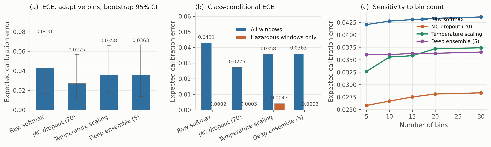

**Fig. 17. Calibration.** (a) ECE with bootstrap intervals. (b) The same, split into all windows against hazardous windows only. (c) Sensitivity to the number of bins.

### 4.9 Standing relative to prior work on this corpus

Published classification accuracies on MultimodalGasData run from 91.7% to 99.7%, and the decision accuracies here sit below most of them. We would rather say that plainly than let a reviewer discover it, because the comparison is not like-for-like in either direction and both directions matter.

Against us: our evaluation uses a block-wise holdout with an explicit embargo, discards boundary-straddling windows, moves the partition with the seed, and fits all scaling on the training partition. The published comparisons appear to use randomized splits over overlapping windows from a single recording session, which is the protocol Dennler et al. (2022) showed conflates recording time with class identity. The figures are not directly comparable, and the direction of the bias is known even if its size on this particular corpus is not.

In our favour: the quantities differ. A classification error and an action error do not carry the same operational weight. Confusing two hazardous classes preserves the need to escalate; assigning a hazardous window to *Monitor* gives up the intervention window. For a like-for-like recognition comparison the relevant number is the thermal classifier's 98.8%, which was obtained under the same kind of randomized split those published figures use and carries the same caveat as a result (Section 3.3). That makes it comparable to them, and it makes all of them comparably optimistic.

Either way, we are not claiming an accuracy advantage and nothing in the contribution rests on one.

---

## 5. Discussion

### 5.1 The dissociation, and where its boundary sits

The central result is a dissociation with a fairly sharp edge to it. In distribution, ten model families spanning tree ensembles, kernel methods, feedforward and recurrent networks, offline reinforcement learning and a three-level decision tree are indistinguishable on every metric we report. Not just accuracy: 5.66 points separate best from worst over 30 randomized runs, and all but one record no observed missed hazards, full escalation and no observed false alarms. A facility choosing among them on in-distribution evidence has no basis for choosing at all, including no basis for preferring a deep model to a decision tree.

Out of distribution the same models separate by more than two orders of magnitude on missed-hazard rate and by roughly 198 times on escalation adequacy, and the orderings do not carry across. The model that fails safe on one unseen hazard under-escalates on another. The two that escalate fully on both are tree ensembles carrying none of the pipeline's safety machinery. The deployable threshold rule is perfect on one unseen hazard and among the worst on the other.

For practice the implication is direct enough. A team selecting a gas-monitoring model on benchmark accuracy, which is what the published literature on this corpus encourages, gets no information about how the chosen model will behave on a release it has not seen. That is the condition the model will eventually face, and on this evidence it is the only condition in which these models differ at all.

There is a counter-reading worth taking seriously. One could argue that LOCO is an unfairly severe test, since no fielded system is asked to classify a gas absent from its training set, and that the in-distribution agreement is the operationally relevant finding. We are not persuaded, mostly because a MOX array in a facility meets cross-sensitivities and interferent mixtures that were not in anyone's training set fairly routinely. But the objection is reasonable, and a reader who takes it seriously would draw a narrower conclusion from our results than we do.

### 5.2 Why missed-hazard rate is not enough

Having established that accuracy is the wrong metric, the obvious substitute is missed-hazard rate. Our LOCO results suggest that substitution is insufficient in a specific way.

A miss metric that counts only the fully passive response scores a hazardous window answered with *Request Verification* as a success. On withheld Mixture, ten of eleven models satisfy that metric, all bounded below 2.9% at 95% confidence, while escalating anywhere from 0.5% to 100% of the same windows. An operator running the support-vector configuration would hear nothing for about 99.5% of windows of the most hazardous class in the corpus, and the safety metric would report a clean run.

This looks to us like the most transferable finding here, and it is not specific to gas monitoring. Wherever a graded response hierarchy is learned, a metric defined on the most extreme failure can be satisfied by systematic under-response one rung above it. The fix is to define the metric at the operationally meaningful threshold, which here is whether an operator gets notified, rather than at the worst conceivable outcome.

Section 4.7 shows the mirror-image trap just as clearly. Under complete sensor loss the cost-weighted policy and the threshold rule score perfectly on missed hazard and escalation by escalating everything, raising a high-severity alarm on every clean window. Gradient boosting scores perfectly on false alarms by missing 60% of hazards. Each of the three metrics, taken alone, certifies a different model as safe. Only together do they describe what the system is actually doing.

### 5.3 What the cost asymmetry did, and what it did not

The sweep returns no effect on missed-hazard rate or escalation adequacy at any ratio from 1:1 to 20:1, with an accuracy penalty above 6:1. That is worth sitting with rather than setting aside, because the asymmetric objective was the mechanism by which the pipeline was supposed to be safe.

The explanation appears structural, and it generalizes: on a saturated, well-separated benchmark a safety objective cannot really be validated, because the unsafe behavior it exists to suppress does not occur in the first place. Showing that a cost asymmetry works needs either a corpus where hazardous and benign states genuinely overlap, or a metric under which sub-alarm responses carry cost. Section 4.4 supplies the second, and there the cost-weighted policy escalates 24.5% of unseen Mixture windows against gradient boosting's 100%.

A fair question at this point is what the learned policy contributes at all. On this evidence, in nominal conditions, nothing a depth-3 decision tree does not contribute, at 4.3 fewer accuracy points and identical safety behavior. Its advantages are narrow and specific: full escalation on unseen Smoke where the perceptron misses 9.49%, and no observed missed hazard under 50% calibration drift where gradient boosting misses 7.75%. Each of those is bought with a false-alarm cost under sensor loss that the tree ensembles do not pay. We would rather present it that way than as a general improvement.

There is a further point about the objective itself that we think matters more than the sweep. Eq. 2 weights samples by class hazard but treats all incorrect actions identically. Under-escalating a hazardous window to *Request Verification* and over-escalating it to *Emergency Shutdown* incur exactly the same loss. That is not a cost asymmetry in the sense the safety argument needs, and it is the most plausible mechanical explanation we have for the escalation behavior in Section 4.4. An ordinal objective, or a full cost matrix in which both distance and direction along the action ladder carry cost, is the design the evidence points toward, so we implemented one and report it in Section 4.5. It moved the target quantity, raising escalation on unseen Mixture from 0.245 to 0.393, and it is the only change to the objective anywhere in this study that moved that quantity at all. It also cost 21 accuracy points in distribution, which we read as a statement about our first choice of matrix rather than about the idea. We are not putting it forward as a model to adopt: one untuned matrix establishes that the lever exists and moves in the expected direction, and nothing more than that. Tuning the ratio between the hazardous-class and the clean-air penalties is the obvious next step, and it is the one we would take.

### 5.4 What this means for deployment

Three conclusions held across every configuration, and they are probably the most portable engineering content here.

Language models belong outside the decision path. That is a safety argument rather than an empirical one: a model whose output cannot be verified against the decision it describes should not be able to change that decision, however fast it runs. We have not measured whether the explanation component would meet any particular timing budget, and nothing here should be read as evidence that it would.

Sensor-loss behavior is an alarm-management decision rather than a modeling one. Losing one sensor of seven moved the cost-weighted policy from zero to 117 high-severity alarms per 1,000 clean windows and left the random forest at zero. Whether that is tolerable is a judgment about operator load, and it cannot be made from an accuracy table.

Qualification has to include sensor loss. Single-channel dropout is the most likely fault a fixed detector will actually experience, and it separates models that look identical on every clean-condition metric. Any acceptance test built only on clean data would pass all of them.

### 5.5 What we are not claiming

None of this establishes that the pipeline detects hydrocarbons, since the corpus contains none. None of it establishes that any model here is fit for service: the largest observation count supporting any zero-count claim is 18,960 hazardous windows pooled over 30 runs, which bounds a miss rate at 0.016% and no lower, and the leave-one-class-out bounds rest on 7,905 evaluations apiece, which reach only 0.038%. Nothing here validates the coordination and explanation components, which are apparatus, are not experimentally isolated, and support no result we report. And the models are ranked only where the equivalence analysis of Section 4.3 actually resolves a comparison, which it does for two of ten.

What the study does support is narrower and, we think, more useful: the evaluation conventions of this literature are not fit for the purpose the literature claims for them, and a metric set costing a few extra columns per experiment reverses model-selection decisions on this corpus.

---

## 6. Limitations and Threats to Validity

**Analyte validity.** Incense smoke, alcohol-based vapor and a mixture of the two. These are surrogates. Nothing here establishes detection performance for methane or heavier hydrocarbons, and external validity to petroleum facility monitoring is argued from the shared MOX transduction mechanism rather than shown.

**Single session, single device.** All 6,400 samples come from one acquisition session on one device. Sensor ageing, device-to-device variability, seasonal ambient swings, wind, hydraulic transients and long-term drift are all absent. Cross-session and cross-device validation is the most important experiment still outstanding.

**Statistical power.** The model comparison of Section 4.3 uses 30 randomized runs and a Bayesian correlated *t*-test, which is enough to state practical equivalence positively and to resolve two of the ten comparisons. Every other experiment here runs on five seeds, where a Wilcoxon signed-rank test has a minimum attainable two-sided *p* of 0.0625 and therefore cannot reach α = 0.05 at any effect size. No ranking should be read into the five-seed tables, and the differences they show between conditions are reported as differences rather than as tested effects.

**Metric scope.** Missed-hazard rate counts only the fully passive action, which is why escalation adequacy is reported beside it. The graded expected-cost formulation in Section 4.5 is a first attempt at the better alternative and not a finished one: the matrix entries were chosen by hand for their structure, never tuned, and the accuracy they cost is a consequence of that choice rather than of the formulation.

**Perception split, and the asymmetry it creates.** The thermal images were collected and used, and the classifier trained on them is part of the pipeline that produced every result here. Its split, however, is randomized over consecutive frames from one session, so it is exposed to the leakage mechanism the sensor-side protocol excludes, and 98.8% is an optimistic upper bound rather than an independent estimate. The consequence is that the two paths through the pipeline are held to different evidential standards. No conclusion in this paper rests on the perception number, since the decision state carries no visual term, but the multimodal system as a whole should not be read as validated to the standard applied to the sensor path. Re-splitting the images block-wise, and re-reporting perception accuracy under that protocol, is the outstanding piece of work. Section 4.2 suggests what to expect: on the sensor side the same change cost between 1.66 and 4.08 accuracy points.

**Anomaly severity ordering.** The anomaly score separates hazardous from benign conditions by two orders of magnitude but is not monotone in target severity, since Mixture scores below Smoke. Read it as evidence of abnormality only.

**The anomaly-input probe is a conditional intervention.** Section 4.6 forces the anomaly feature to fixed values while the other twenty-one are held at their observed values. In service those quantities co-vary, so the probe isolates a dependence rather than reproducing a realistic failure. It shows that one model's safety behavior is sensitive to a single upstream input; it does not establish how that input would fail, or how often.

**No hardware evaluation.** Nothing here establishes that the pipeline runs inside any particular latency, memory or power budget, because no deployment was carried out. Claims about on-device feasibility would need a hardware campaign this study does not have, and the explanation component in particular is described but never timed or evaluated.

**Modality scope.** The action policy consumes sensor dynamics and the anomaly score only. Visual evidence informs the perception and explanation paths, not the action.

**Coordination and explanation layers.** The components that coordinate, critique and supervise the pipeline, and the language model that writes the operator-facing explanation, are apparatus. None of them is experimentally isolated and no claim in this paper depends on any of them.

**Perturbation realism.** Drift is modeled as a per-channel gain and baseline shift applied at test time, and dropout as channel zeroing. Neither reproduces the temporal character of real MOX ageing, and a reviewer would be right to treat the drift results as indicative rather than predictive.

---

## 7. Conclusions

We evaluated a gas-monitoring pipeline against a broader metric set than accuracy alone, on a public MOX benchmark of laboratory surrogates, under a leakage-controlled block-wise holdout with seed-varying partitions.

1. **In distribution the metric set does not discriminate.** Across 30 randomized runs, ten comparators spanning very different inductive biases lie within 5.66 accuracy points, and all but one record no observed missed hazards, escalation adequacy of 1.000 and no observed high-severity false alarms, each bounded by the sample size rather than demonstrated to be zero. Removing the cost weighting is practically equivalent to keeping it, with posterior probability 0.960 under a region of practical equivalence of one accuracy point.

2. **Out of distribution, accuracy ranking carries almost no information about safety.** Withholding one hazardous class separates the same models by more than two orders of magnitude on missed-hazard rate, 9.49% against a 0.038% bound, with a correlation to in-distribution accuracy of r = +0.13.

3. **Missed-hazard rate is necessary and not sufficient.** On a second unseen hazardous class, ten of eleven comparators are bounded below 2.9% on missed hazards while escalating between 0.5% and 100% of the same windows, a factor of about 198 on the quantity that decides whether an operator is notified, and invisible to a miss metric that counts only the passive action.

4. **Scalar cost asymmetry produced no measurable safety benefit** at any ratio from 1:1 to 20:1, and degraded accuracy above 6:1. Replacing it with an ordinal cost matrix, which prices under- and over-escalation differently, did move the target quantity: escalation on an unseen hazardous class rose from 0.245 to 0.393. It also cost 21 accuracy points and raised expected cost fourfold, so we report it as a direction that works rather than a design that is ready.

5. **The partitioning protocol moves accuracy by more than the models do.** A random split over overlapping windows adds between 1.66 and 4.08 accuracy points relative to a blocked, embargoed split, and a stricter protocol that trains on early windows and tests on late ones costs three of six models between 27 and 29 points. Comparisons across studies that use different protocols therefore carry little information about relative merit.

6. **Under graded sensor loss three distinct failure modes appear, and each single metric certifies a different model as safe.** Fail-loud models raise a high-severity alarm on every clean window while recording no observed missed hazard at all. Fail-silent models record no false alarm at all while missing 60% of hazards. Losing one sensor of seven moves the cost-weighted policy from zero to 117 alarms per 1,000 clean windows and leaves the random forest untouched.

Put together, these results argue for reporting missed-hazard rate with a confidence bound, escalation adequacy, false-alarm burden in alarm-management units, and the degradation of all three under graded sensor loss and drift, alongside accuracy rather than instead of it. On the evidence here an evaluation reporting accuracy alone would have said nothing useful about any of these behaviors, and each safety metric taken on its own would have picked a different model.

Where we would go next, roughly in order: cross-session and cross-device validation; evaluation on a corpus containing a controlled hydrocarbon release; a tuned version of the ordinal cost matrix of Section 4.5, since the untuned one buys escalation at a price we would not pay; class-conditional conformal prediction (Angelopoulos and Bates 2023) to turn observed zero-miss counts into distribution-free coverage guarantees on the hazardous class; and a systematic treatment of upstream-component failure, since Section 4.6 shows at least one comparator whose missed-hazard rate moves by a factor of thirty-five when a single input is wrong, and we tested only one such input.

---

## Nomenclature

| Symbol | Definition |
|---|---|
| *a* | safety action, *a* ∈ {0, 1, 2, 3, 4} |
| *a*\*(·) | acceptable target-action map from gas class to action set |
| *C* | cost ratio, *C* = *c*_miss / *c*_false |
| *c*_miss, *c*_false | loss weights for hazardous and non-hazardous training samples |
| *E*ₜ | operator-facing explanation at cycle *t* |
| *G* | embargo length between training and test partitions, in windows |
| *g*ₜ | ground-truth gas class for window *t* |
| *h* | CUSUM decision threshold |
| *I*ₜ | thermal image at cycle *t* |
| *k* | number of sensor channels removed (dropout severity) |
| *L*(θ) | cost-weighted cross-entropy objective, Eq. 2 |
| *N* | number of training samples |
| *n* | number of observations or paired runs |
| *p*_θ | action probability distribution under parameters θ |
| *S*ₜ | CUSUM statistic at step *t* |
| **X**ₜ | seven-channel sensor window, **X**ₜ ∈ ℝ^(20×7) |
| **δ**ₜ | per-sensor change across the window |
| θ | model parameters |
| μ₀ | CUSUM baseline mean, estimated on NoGas training windows |
| ρ̃ₜ | normalized reconstruction-error anomaly score |
| **σ**ₜ | per-sensor standard deviation across the window |
| σ | additive-noise standard deviation (Section 4.7) |
| τ | anomaly detection threshold |
| φₜ | 22-dimensional decision state, Eq. 1 |

**Subscript.** *t*, inference cycle or window index.

**Abbreviations.** CP, Clopper-Pearson; ECE, expected calibration error; ESD, emergency shutdown; FA, false alarm; LOCO, leave-one-class-out; MOX, metal-oxide semiconductor; ROC-AUC, area under the receiver operating characteristic curve; SD, standard deviation; SIS, safety instrumented system; VOC, volatile organic compound.

---

## Acknowledgments

This work was supported by the Subsurface Energy and Digital Innovation Center (SEDI) at the University of Wyoming. The MultimodalGasData corpus is used under CC BY 4.0, and we thank Narkhede et al. for putting it in the public domain.

## Author Contributions

**B. C. Nweke:** conceptualization, methodology, software, investigation, formal analysis, data curation, visualization, writing of the original draft. **G. Ramezan:** conceptualization, methodology, writing, review and editing. **S. Saraji:** conceptualization, supervision, project administration, resources, writing, review and editing.

## Declaration of Competing Interest

The authors declare no known competing financial interests or personal relationships that could have appeared to influence the work reported here.

## Data and Code Availability

The MultimodalGasData corpus is publicly available (Narkhede et al. 2022) under CC BY 4.0. Experiment drivers, the safety-metric module, the additional baselines, model checkpoints and the result files behind Tables 4 through 12 are available from the corresponding author. See Appendix A.

---

## References

Adegboye, M. A., Fung, W. K., and Karnik, A. 2019. Recent Advances in Pipeline Monitoring and Oil Leakage Detection Technologies: Principles and Approaches. *Sensors* 19 (11): 2548. https://doi.org/10.3390/s19112548.

Angelopoulos, A. N. and Bates, S. 2023. Conformal Prediction: A Gentle Introduction. *Foundations and Trends in Machine Learning* 16 (4): 494–591. https://doi.org/10.1561/2200000101.

Benavoli, A., Corani, G., Demšar, J. et al. 2017. Time for a Change: A Tutorial for Comparing Multiple Classifiers Through Bayesian Analysis. *Journal of Machine Learning Research* 18 (77): 1–36.

Bouthillier, X., Delaunay, P., Bronzi, M. et al. 2021. Accounting for Variance in Machine Learning Benchmarks. *Proc., Machine Learning and Systems (MLSys)* 3: 747–769.

Bustnes, T. E., Rousselet, M., and Berland, S. 2011. Leak Detection Performance of a Commercial Real-Time Transient Model. Paper presented at the PSIG Annual Meeting, Napa Valley, California, 24–27 May. PSIG-1114.

Clopper, C. J. and Pearson, E. S. 1934. The Use of Confidence or Fiducial Limits Illustrated in the Case of the Binomial. *Biometrika* 26 (4): 404–413. https://doi.org/10.1093/biomet/26.4.404.

Dehnaw, A. M., Lu, Y.-J., Shih, J.-H. et al. 2024. Deep Neural Network Optimization for Efficient Gas Detection Systems in Edge Intelligence Environments. *Processes* 12 (12): 2638. https://doi.org/10.3390/pr12122638.

Dennler, N., Rastogi, S., Fonollosa, J. et al. 2022. Drift in a Popular Metal Oxide Sensor Dataset Reveals Limitations for Gas Classification Benchmarks. *Sensors and Actuators B: Chemical* 361: 131668. https://doi.org/10.1016/j.snb.2022.131668.

EEMUA. 2013. *Alarm Systems: A Guide to Design, Management and Procurement*, third edition. EEMUA Publication 191. London: Engineering Equipment and Materials Users Association.

El Barkani, M., Benamar, N., Talei, H. et al. 2024. Gas Leakage Detection Using Tiny Machine Learning. *Electronics* 13 (23): 4768. https://doi.org/10.3390/electronics13234768.

Elkan, C. 2001. The Foundations of Cost-Sensitive Learning. *Proc., 17th International Joint Conference on Artificial Intelligence (IJCAI)*, Seattle, Washington, 4–10 August, 973–978.

Faleh, R. and Kachouri, A. 2023. A Hybrid Deep Convolutional Neural Network-Based Electronic Nose for Pollution Detection. *Chemometrics and Intelligent Laboratory Systems* 237: 104825. https://doi.org/10.1016/j.chemolab.2023.104825.

Goel, P., Datta, A., and Mannan, M. S. 2017. Industrial Alarm Systems: Challenges and Opportunities. *Journal of Loss Prevention in the Process Industries* 50: 23–36. https://doi.org/10.1016/j.jlp.2017.09.001.

Gemma Team, Google DeepMind. 2025. Gemma 3 Technical Report. arXiv:2503.19786 (preprint, submitted 25 March 2025).

Han, P. and Kim, M. 2014. Optimizing Leak Detection Performance. Paper presented at the PSIG Annual Meeting, Baltimore, Maryland, 6–9 May. PSIG-1407.

IEC. 2016. *Functional Safety, Safety Instrumented Systems for the Process Industry Sector, Part 1*, IEC 61511-1:2016. Geneva: International Electrotechnical Commission.

ISA. 2016. *Management of Alarm Systems for the Process Industries*, ANSI/ISA-18.2-2016. Research Triangle Park, North Carolina: International Society of Automation.

Jessen, H. and Roshchin, M. 2025. Agentic AI Revolution Across O&G Value Streams: New Strategy Through ENERGYai Examples. Paper SPE-229240-MS presented at the Abu Dhabi International Petroleum Exhibition and Conference, Abu Dhabi, UAE, 3–6 November.

Jocher, G., Chaurasia, A., and Qiu, J. 2023. YOLOv8 by Ultralytics. https://github.com/ultralytics/ultralytics.

Korjani, M., Conley, D., and Smith, M. 2024. Temporal Deep Learning Image Processing Model for Natural Gas Leak Detection Using OGI Camera. Paper OTC-34756-MS presented at the Offshore Technology Conference Asia, Kuala Lumpur, Malaysia, 27 February–1 March.

Laberge, J. C., Bullemer, P., Tolsma, M. et al. 2014. Addressing Alarm Flood Situations in the Process Industries Through Alarm Summary Display Design and Alarm Response Strategy. *International Journal of Industrial Ergonomics* 44 (3): 395–406. https://doi.org/10.1016/j.ergon.2013.11.008.

Liang, J., Liang, S., Zhang, H. et al. 2023. Leak Detection in Natural Gas Pipelines Based on Unsupervised Reconstruction of Healthy Flow Data. *SPE Prod & Oper* 38 (3): 513–526. SPE-214686-PA. https://doi.org/10.2118/214686-PA.

Malhotra, P., Ramakrishnan, A., Anand, G. et al. 2016. LSTM-Based Encoder-Decoder for Multi-Sensor Anomaly Detection. arXiv:1607.00148 (preprint, submitted 1 July 2016).

Murvay, P.-S. and Silea, I. 2012. A Survey on Gas Leak Detection and Localization Techniques. *Journal of Loss Prevention in the Process Industries* 25 (6): 966–973. https://doi.org/10.1016/j.jlp.2012.05.010.

Narkhede, P., Walambe, R., Mandaokar, S. et al. 2021. Gas Detection and Identification Using Multimodal Artificial Intelligence Based Sensor Fusion. *Applied System Innovation* 4 (1): 3. https://doi.org/10.3390/asi4010003.

Narkhede, P., Walambe, R., Chandel, P. et al. 2022. MultimodalGasData: Multimodal Dataset for Gas Detection and Classification. *Data* 7 (8): 112. https://doi.org/10.3390/data7080112.

Page, E. S. 1954. Continuous Inspection Schemes. *Biometrika* 41 (1/2): 100–115. https://doi.org/10.1093/biomet/41.1-2.100.

Sabbagh, V. B., Lima, C. B. C., and Xexéo, G. 2024. Comparative Analysis of Single and Multiagent Large Language Model Architectures for Domain-Specific Tasks in Well Construction. *SPE J.* 29 (12): 6869–6882. SPE-223612-PA. https://doi.org/10.2118/223612-PA.

Santiago, C. J. S., Shumaker, N., and Weir, A. 2025. Integrating Data-Driven Insights with Domain Expertise Using Agentic Conversational Analytics. Paper SPE-228143-MS presented at the SPE Annual Technical Conference and Exhibition, Houston, Texas, 20–22 October.

Sharma, A., Khullar, V., Kansal, I. et al. 2024. Gas Detection and Classification Using Multimodal Data Based on Federated Learning. *Sensors* 24 (18): 5904. https://doi.org/10.3390/s24185904.

Vergara, A., Vembu, S., Ayhan, T. et al. 2012. Chemical Gas Sensor Drift Compensation Using Classifier Ensembles. *Sensors and Actuators B: Chemical* 166–167: 320–329. https://doi.org/10.1016/j.snb.2012.01.074.

Wang, Z., Schaul, T., Hessel, M. et al. 2016. Dueling Network Architectures for Deep Reinforcement Learning. *Proc., 33rd International Conference on Machine Learning (ICML)*, New York City, 19–24 June, 1995–2003.

Zhang, E. and Zhang, E. 2025. Gas Pipeline Leakage Detection Based on Multiple Multimodal Deep Feature Selections and Optimized Deep Forest Classifier. *Frontiers in Environmental Science* 13: 1569621. https://doi.org/10.3389/fenvs.2025.1569621.

Zhang, J., Hoffman, A., Murphy, K. et al. 2013. Review of Pipeline Leak Detection Technologies. Paper presented at the PSIG Annual Meeting, Prague, Czech Republic, 16–19 April. PSIG-1303.

---

## Appendix A. Reproducibility

**Pipeline.** Windows of length 20 formed over the raw corpus, with windows spanning a class boundary discarded, giving 6,324 windows at 1,581 per class. The anomaly feature is the mean reconstruction error of the full 20-step window under the pretrained NoGas autoencoder. The block-wise holdout reserves a contiguous 20% of each class block for test, separated from both training segments by a 20-window embargo, with the held-out block's position drawn from the run seed. Feature standardization and anomaly-percentile normalization are fitted on the training partition only. In the leave-one-class-out experiment they are fitted on the three training classes only, so no statistic of the withheld class enters training.

**Protocol.** Two protocols, as set out in Section 3.6. The model comparison of Section 4.3 uses 30 randomized runs (seeds 1000 to 1029) varying block position, initialization and a hyperparameter draw. Everything else uses five seeds (42, 1337, 7, 2024, 99), each with its own partition. PyTorch determinism guards enabled, single-threaded execution. Each experiment in Sections 4.1 to 4.8 was executed in a single uninterrupted run.

**Artifacts.** `retrain/safety_metrics.py` (metric set and Clopper-Pearson bounds); `retrain/new_baselines.py` (k-NN, threshold rule, CUSUM); `retrain/run_all_v2.py` (model comparison, cost sweep, perturbation, ablation, anomaly evaluation); `retrain/run_loco_v3.py` (leave-one-class-out with three-class scaling); `retrain/run_calib_actions_v2.py` (calibration, action-selection matrices, ROC curves); `retrain/run_anomaly_influence.py` (anomaly-input sensitivity); `retrain/run_final.py` (30-run comparison with the Bayesian equivalence test, extended leave-one-class-out, ordinal cost objective, cost-ratio selection); `retrain/run_leakage.py` (partitioning-protocol comparison and blocked validation); `retrain/run_rho_sensitivity.py` (sweep of the correlation term in the Bayesian test); `retrain/make_figs_v2.py` (Figs. 1 to 17); `verify_v9.py`, which parses the tables in this manuscript and checks every quoted value against the result files below. Results in `retrain/results_v2/`: `v2_zoo.csv`, `v2_zoo_sig.json`, `v2_loco.csv`, `v2_costsweep.csv`, `v2_perturb.csv`, `v2_ablation.csv`, `v2_anomaly.json`, `v2_calibration.csv`, `v2_calibration_perseed.csv`, `v2_calibration_binsweep.csv`, `v2_action_matrix.csv`, `v2_roc.json`, `v2_anomaly_influence.csv`, `v3_leakage.csv`, `v3_powered.csv`, `v3_powered_bayes.json`, `v3_loco_all.csv`, `v3_cost_validation.csv`, `v3_cost_blocked_validation.csv`, `v3_rho_sensitivity.json`.

**Figure palette.** Categorical colors were checked against colorblind-separation, chroma, lightness and contrast criteria. The green and orange pair sits in the marginal separation band, so every categorical mark also carries a direct value label as a second channel of encoding.
